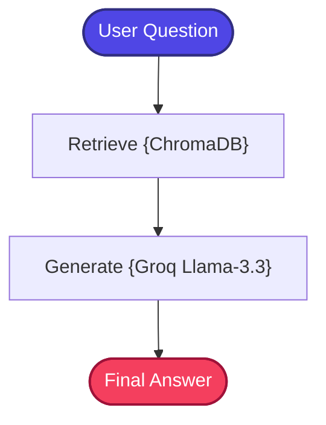

# Standard RAG (Fundamentals Phase)

A stateful, zero-cost, and production-structured implementation of the **Standard Retrieval-Augmented Generation (Standard RAG)** pattern.

---

## 📖 What is Standard RAG?

Standard RAG (sometimes called Naive RAG) is the foundational architecture of retrieval-augmented generation. It solves the static knowledge limitations of Large Language Models (LLMs) by retrieving external context in real-time to generate factually grounded answers.

Instead of relying solely on an LLM's pre-trained parametric knowledge (which can be outdated, incomplete, or hallucinated), Standard RAG augments the generation process with a retrieval step that fetches relevant document chunks from an external knowledge base. The retrieved context is then injected into the prompt, enabling the LLM to produce answers that are grounded in verified source material.

### The Core Pipeline

```text
User Query → Vector Search (ChromaDB) → Retrieved Context → LLM Generation → Answer
```

### What Problem Does It Solve?

- **Hallucination Reduction**: Grounds model responses in verified source materials rather than relying on parametric memory alone.
- **Real-Time Knowledge Access**: Allows LLMs to answer questions using private or newly updated documents without requiring costly fine-tuning.
- **Domain-Specific Expertise**: Provides dynamic context matching from specific internal data sources that the base model was never trained on.

---

## 🏗️ Architecture & State Workflow

Unlike linear pipelines, this implementation models RAG as a state-based workflow using **LangGraph**. The workflow propagates state variables (user question, retrieved document context, and generated answer) across discrete execution nodes.



### Flow Breakdown
1.  **Retrieve Node**: Semantic vector query searches the local **ChromaDB** index to find the top 3 (`k=3`) closest document chunks using the user's question.
2.  **Generate Node**: Compiles the retrieved document contents and the user query into a clean, system-instructed prompt and invokes **Groq's** fast-tier `llama-3.3-70b-versatile` to produce a fact-grounded response.

---

## ⚙️ Key Components

| Component | File | Role |
| :--- | :--- | :--- |
| **State Schema** | `src/state.py` | Defines the `GraphState` TypedDict that carries `question`, `context`, and `answer` across all nodes |
| **Document Ingestion** | `src/ingestion.py` | Loads documents, splits them into chunks using `RecursiveCharacterTextSplitter`, and indexes them into ChromaDB with local `BAAI/bge-small-en-v1.5` embeddings |
| **Retriever** | `src/retriever.py` | Wraps the ChromaDB vector store as a LangChain retriever interface for semantic similarity search (`k=3`) |
| **Prompt Templates** | `src/prompts.py` | Contains the fact-grounded system instruction template that constrains the LLM to answer only from retrieved context |
| **Workflow Graph** | `src/graph.py` | Builds and compiles the LangGraph `StateGraph` connecting Retrieve → Generate nodes |
| **Application Entry** | `app.py` | Interactive CLI loop that accepts user questions and invokes the compiled graph |

---

## 🔄 How It Works

1. **Document Ingestion** — Raw documents are loaded from the shared `_data/` directory, split into overlapping chunks (default: 500 characters with 100-character overlap), and embedded using the local `BAAI/bge-small-en-v1.5` model. The resulting vectors are stored in a persistent ChromaDB collection.

2. **Query Embedding** — When a user submits a question, the same embedding model encodes the query into a dense vector representation.

3. **Semantic Retrieval** — ChromaDB performs a cosine similarity search, returning the top 3 document chunks whose embeddings are most similar to the query vector.

4. **Prompt Assembly** — The retrieved chunks are concatenated and inserted into a structured system prompt alongside the user's original question. The prompt explicitly instructs the LLM to use only the provided context.

5. **LLM Generation** — The assembled prompt is sent to Groq's `llama-3.3-70b-versatile` with `temperature=0` for deterministic, factual generation.

6. **Response Delivery** — The generated answer is returned to the user through the CLI interface.

---

## 📁 Project Structure

The project code is fully modularized and clean:

```bash
01_Standard_RAG/
│
├── app.py               # Main CLI interactive loop entrypoint
├── requirements.txt     # Local project packages
│
│
└── src/
    ├── __init__.py      # Package initialization
    ├── state.py         # GraphState schema using TypedDict
    ├── prompts.py       # Fact-grounded system prompts
    ├── ingestion.py     # Document splitter and DB builder
    ├── retriever.py     # Chroma vector search retriever interface
    └── graph.py         # LangGraph workflow builder and compiler
```

---

## ✅ Advantages

- **Simplicity**: Minimal components make it easy to understand, implement, and debug — the ideal starting point for any RAG system.
- **Zero External Cost**: Uses local `BAAI/bge-small-en-v1.5` embeddings and a local ChromaDB instance, requiring only a Groq API key for LLM inference.
- **Low Latency**: Single retrieval pass followed by a single LLM call results in fast response times.
- **Deterministic Output**: Temperature set to `0` ensures consistent, reproducible responses for the same query.
- **Modular Architecture**: Clean separation of concerns makes it straightforward to swap embedding models, vector stores, or LLMs.

## ⚠️ Limitations

- **Single-Pass Retrieval**: Performs only one retrieval step — if the initial search misses relevant documents, there is no self-correction mechanism.
- **No Query Refinement**: Uses the raw user query as-is; ambiguous, vague, or poorly worded queries may yield poor retrieval results.
- **Flat Chunk Isolation**: Each chunk is embedded independently without awareness of its parent document context, which can lead to semantic ambiguity.
- **No Relevance Validation**: Retrieved documents are blindly passed to the LLM without assessing their actual relevance to the query.
- **Lexical Blind Spots**: Pure semantic search may miss exact keyword matches (product IDs, error codes, acronyms) that lexical search would catch.

---

## 🎯 Ideal Use Cases

- **Internal Documentation QA** — Answering questions over company wikis, onboarding materials, or policy documents.
- **Educational Assistants** — Building study tools that retrieve and explain concepts from textbooks or course notes.
- **Simple Knowledge Base Search** — Scenarios where the knowledge base is well-curated and queries are straightforward.
- **RAG Prototyping** — Establishing a baseline before layering on advanced patterns (hybrid search, reranking, self-correction).
- **Single-Domain Fact Lookup** — Quick factual retrieval from a focused, homogeneous document corpus.

---

## ⚖️ Comparison with Standard RAG

Since this **is** the Standard RAG baseline, the table below positions it against more advanced patterns:

| Capability | Standard RAG | Advanced RAG Patterns |
| :--- | :---: | :--- |
| **Retrieval Strategy** | Single semantic pass | Multi-strategy (hybrid, multi-hop, graph traversal) |
| **Query Processing** | Raw user query | Query expansion, rewriting, decomposition |
| **Self-Correction** | ❌ None | ✅ Grading, reflection, retry loops |
| **Context Quality** | Variable (no filtering) | High (reranking, relevance grading) |
| **Complexity** | Low | Medium to High |
| **Latency** | Lowest | Higher (additional processing stages) |
