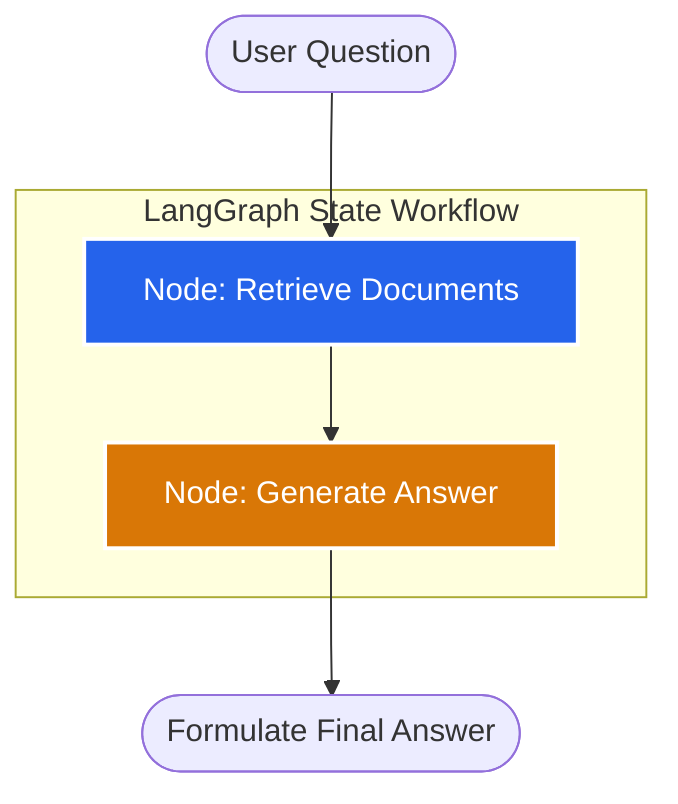

# Standard RAG 

A **100% free, production-ready, and stateful** implementation of a **Standard Retrieval-Augmented Generation (RAG)** pipeline. This project is built using a modern, zero-cost development stack:

*   **Orchestration**: [LangGraph](https://github.com/langchain-ai/langgraph) (for stateful workflow management)
*   **LLM Inference**: [Groq](https://groq.com/) (using the ultra-fast, free-tier `llama-3.3-70b-versatile`)
*   **Embeddings**: [Hugging Face](https://huggingface.co/) (running the highly ranked open-source `BAAI/bge-small-en-v1.5` locally for free)
*   **Vector Store**: [ChromaDB](https://www.trychroma.com/) (local vector database)

---

## 🏗️ Architecture & State Workflow

Unlike linear pipelines, this implementation models RAG as a state-based workflow using **LangGraph**. The workflow moves state variables (question, retrieved context, and answer) across execution nodes.



1.  **Retrieve Node**: Looks up relevant context chunks from the local Chroma database using the query.
2.  **Generate Node**: Compiles the retrieved context and user query into a structured system prompt, sending it to the Groq LLM to compute the answer.

---

## 📁 Directory Layout

```text
rag-langgraph-groq/
│
├── app.py               # Main CLI interactive loop entrypoint
├── requirements.txt     # Python package dependencies
├── .env                 # API Keys and credentials (git-ignored)
│
├── data/
│   └── sample.txt       # Seed raw data files
│
└── src/
    ├── __init__.py      # Package initialization
    ├── state.py         # GraphState dictionary type definition
    ├── prompts.py       # Precise system templates
    ├── ingestion.py     # Document loader, splitter, and DB creator
    ├── retriever.py     # Chroma database query retriever interface
    └── graph.py         # LangGraph workflow compiler
```

---

## ⚡ Quick Start

### 1. Prerequisites
Ensure you have **Python 3.9+** installed on your system.

### 2. Install Dependencies
Navigate into the directory and install packages using your preferred manager:

```bash
pip install -r requirements.txt
```

### 3. Setup Groq API Key
Obtain a free API key from the [Groq Console](https://console.groq.com/). Create a `.env` file in the project root:

```env
GROQ_API_KEY=gsk_your_actual_free_groq_api_key_here
```

### 4. Run the Engine
Execute the interactive terminal client:

```bash
python app.py
```

---

## 💻 Code Architecture Details

### Ingestion (`src/ingestion.py`)
Processes raw text from `data/sample.txt` using LangChain's `RecursiveCharacterTextSplitter` (chunk size: 500, overlap: 50) and generates dense vector embeddings locally using Hugging Face's `BAAI/bge-small-en-v1.5`. ChromaDB automatically handles database persistence natively without deprecated `.persist()` commands.

### Workflow State (`src/state.py`)
Tracks data fields as they pass from one node to another:
```python
from typing import TypedDict, List
from langchain_core.documents import Document

class GraphState(TypedDict):
    question: str
    context: List[Document]
    answer: str
```

### Graph Execution (`src/graph.py`)
Constructs and compiles the state graph:
*   **Retriever**: Extracts the top 3 (`k=3`) closest semantic matching segments.
*   **Generator**: Utilizes Groq's high-capacity model (`llama-3.3-70b-versatile`) with a deterministic temperature (`0`) to output fact-based answers.

---

## 📝 Example Interaction

```text
Vector DB created and saved locally successfully!

========================================
 Free Groq/LangGraph RAG Engine Active
 Type 'exit' to quit.
========================================

Ask Question: What is Groq and what technology does it use?

[Answer]:
Groq provides ultra-fast LLM inference using its proprietary LPU (Language Processing Unit) technology.
--------------------
```
