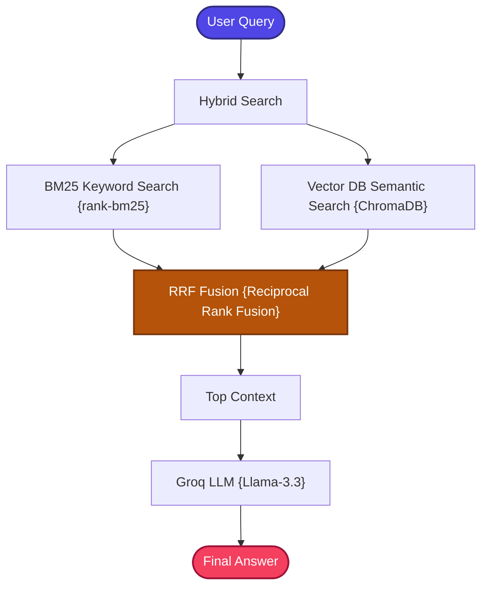

# Hybrid RAG

A stateful, zero-cost, and production-structured implementation of a **Hybrid Retrieval-Augmented Generation (Hybrid RAG)** pipeline.

---

## 📖 What is Hybrid RAG?

Hybrid RAG is a retrieval architecture that combines **two complementary search strategies** — lexical keyword matching and dense semantic search — to overcome the individual weaknesses of each approach.

While Standard RAG relies solely on vector-based semantic search, it frequently fails when matching exact keyword phrases, product IDs, technical error codes, acronyms, or rare terminology. Conversely, pure keyword search (BM25) excels at exact matching but cannot understand paraphrases, synonyms, or abstract intent.

**Hybrid RAG** resolves this by running a dual-engine retrieval system:
1.  **Lexical Search (BM25)**: Performs high-precision, token-based exact word matching using the Okapi BM25 algorithm.
2.  **Dense Semantic Search (Vector DB)**: Captures abstract intent and conceptual similarity via embedding-based retrieval.

Both result sets are merged and reranked using **Reciprocal Rank Fusion (RRF)**, a mathematical algorithm that produces a unified ranking by weighting documents that appear highly across multiple search engines.

### The RRF Formula

$$RRF(d) = \sum_{m \in M} \frac{1}{k + r_m(d)}$$

Where $M$ represents search engines, $r_m(d)$ is the rank of document $d$ in engine $m$, and $k = 60$ is a smoothing constant.

---

## 🏗️ Architecture & State Workflow



### Flow Breakdown
1.  **Dual Search**: The query is split to query a BM25 Okapi model and a local ChromaDB index simultaneously.
2.  **RRF Fusion**: Document ranking positions from both sources are fused using the formula:
    $$RRF(d) = \sum_{m \in M} \frac{1}{k + r_m(d)}$$
    *(where $M$ represents search engines, $r_m(d)$ is the rank of document $d$, and $k = 60$ is a smoothing constant).*
3.  **Generation**: The fused top 3 documents are sent to Groq's high-capacity `llama-3.3-70b-versatile` LLM to compile the final grounded response.

---

## ⚙️ Key Components

| Component | File | Role |
| :--- | :--- | :--- |
| **State Schema** | `src/state.py` | Defines `GraphState` TypedDict carrying question, context, and answer through the workflow |
| **Document Ingestion** | `src/ingestion.py` | Loads and chunks documents, builds the ChromaDB vector index with `BAAI/bge-small-en-v1.5` embeddings |
| **RRF Fusion Engine** | `src/fusion.py` | Implements the Reciprocal Rank Fusion algorithm to merge and rerank results from BM25 and vector search |
| **Hybrid Retriever** | `src/retriever.py` | Coordinates parallel BM25 keyword search and ChromaDB vector search, then delegates to the fusion layer |
| **Prompt Templates** | `src/prompts.py` | Fact-grounded system prompts that instruct the LLM to answer strictly from retrieved context |
| **Workflow Graph** | `src/graph.py` | Builds and compiles the LangGraph StateGraph connecting hybrid retrieval → generation nodes |
| **Application Entry** | `app.py` | Interactive CLI loop for querying the hybrid RAG pipeline |

---

## 🔄 How It Works

1. **Document Ingestion** — Documents are loaded, chunked, and indexed into both ChromaDB (for vector search) and an in-memory BM25 index (for keyword search).

2. **Dual Retrieval** — When a query arrives, it is sent simultaneously to:
   - **BM25 Engine**: Tokenizes the query and scores document chunks by term frequency and inverse document frequency.
   - **Vector Engine**: Embeds the query and retrieves the most semantically similar chunks from ChromaDB.

3. **Reciprocal Rank Fusion** — The ranked results from both engines are merged. Documents that appear highly in both rankings receive the highest fused scores, ensuring both exact keyword matches and semantic relevance are captured.

4. **Context Selection** — The top 3 fused documents are selected as the final retrieval context.

5. **LLM Generation** — The fused context is compiled into a structured prompt and sent to Groq's `llama-3.3-70b-versatile` for factual answer generation.

---

## 📁 Project Structure

```bash
02_Hybrid_RAG/
│
├── app.py               # Main CLI interactive loop entrypoint
├── requirements.txt     # Local project packages
│
│
└── src/
    ├── __init__.py      # Package initialization
    ├── state.py         # GraphState schema using TypedDict
    ├── prompts.py       # Fact-grounded prompt templates
    ├── ingestion.py     # Document parser and Chroma indexer
    ├── fusion.py        # Reciprocal Rank Fusion (RRF) logic
    ├── retriever.py     # BM25 + Vector hybrid coordinator
    └── graph.py         # LangGraph workflow builder
```

---

## ✅ Advantages

- **Best of Both Worlds**: Combines the lexical precision of BM25 with the semantic understanding of vector search, covering a much wider range of query types.
- **Robust to Query Phrasing**: Reduces sensitivity to how users phrase their questions — exact terms are caught by BM25 while conceptual intent is caught by vectors.
- **Mathematically Sound Fusion**: RRF provides a principled, parameter-light method for merging heterogeneous search results.
- **Zero External Dependencies**: BM25 runs entirely in-memory and ChromaDB runs locally — no external search APIs required.
- **Drop-in Upgrade**: Architecturally identical to Standard RAG with an additional retrieval channel, making migration straightforward.

## ⚠️ Limitations

- **Higher Memory Usage**: Maintaining both a BM25 index and a vector index requires more memory than either alone.
- **Increased Ingestion Time**: Documents must be indexed into two separate systems during the ingestion phase.
- **No Relevance Grading**: Retrieved documents are passed to the LLM without quality assessment — irrelevant results from either engine can still pollute the context.
- **Static Fusion Parameters**: The RRF smoothing constant ($k=60$) is fixed and may not be optimal for all domain-specific retrieval scenarios.
- **Single-Pass Retrieval**: Like Standard RAG, there is no self-correction loop if the initial retrieval fails to find relevant documents.

---

## 🎯 Ideal Use Cases

- **Technical Documentation QA** — Queries mixing natural language descriptions with exact error codes, API names, or configuration keys.
- **Enterprise Search** — Corporate knowledge bases where users search by both concepts and specific terminology.
- **Legal & Compliance** — Finding documents by both legal concepts and specific clause numbers or regulation codes.
- **Product Catalogs** — Searching by both product descriptions and exact SKUs, model numbers, or specifications.
- **Medical & Scientific Literature** — Queries combining disease concepts with specific drug names, gene identifiers, or dosage values.

---

## ⚖️ Comparison with Standard RAG

| Retrieval Type | Strength | Weakness |
| :--- | :--- | :--- |
| **BM25 Lexical** | Exact keywords, codes, names, error tags | Fails on synonyms, typos, or abstract concepts |
| **Vector DB Semantic** | Handles vocabulary mismatches, parses abstract intent | Can miss specific keyword tokens |
| **Hybrid (BM25 + Vector)** | **Best of both worlds: conceptual and lexical accuracy** | Slightly higher complexity and memory usage |
