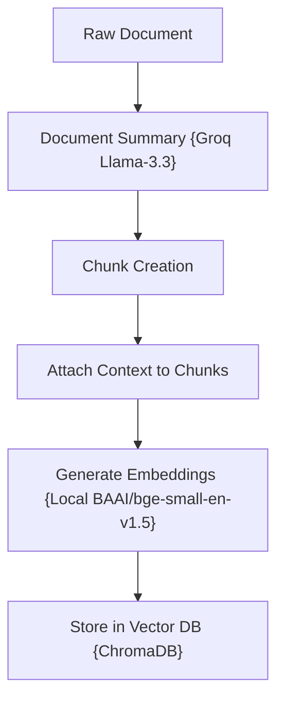
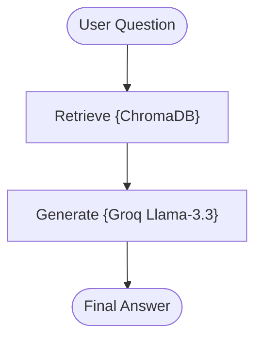

# Contextual RAG with LangGraph + Groq + Context Enrichment

A stateful, zero-cost, and production-structured implementation of the **Contextual Retrieval-Augmented Generation (Contextual RAG)** pattern, inspired by Anthropic’s Contextual Retrieval strategy.

---

## 📖 What is Contextual RAG?

In traditional RAG pipelines, long documents are split into isolated, individual chunks before indexing. While this is necessary due to model context length limitations, it introduces a severe vulnerability: **Loss of Global Context**.

If a single chunk says: *"The framework supports conditional edges."* in isolation, the embedding model has no idea which "framework" is being discussed. 

**Contextual RAG** solves this by generating a high-level **Document Context Summary** for the parent document and appending it directly to *every single chunk* before generating embeddings:

```text
Document Context:
"LangGraph is a framework for orchestrating stateful AI workflows."

Chunk:
"The framework supports conditional edges."
```

This dramatically improves retrieval recall and semantic density because every chunk's vector representation encodes its relationship to the parent document.

---

## 🏗️ Architecture & State Workflow

### 1. Contextual Ingestion Flow
Before indexing, raw documents pass through a pre-processing pipeline to attach parent context summaries:



### 2. RAG Execution Flow
Once contextualized chunks are stored, retrieval matches documents with extremely high accuracy:



---

## 📁 Project Structure

The codebase is highly modularized and clean:

```bash
03_Contextual_RAG/
│
├── app.py               # Main CLI interactive loop entrypoint
├── requirements.txt     # Local project packages
│
├── data/
│   └── sample.txt       # Seed raw data files
│
└── src/
    ├── __init__.py      # Package initialization
    ├── state.py         # GraphState schema using TypedDict
    ├── prompts.py       # Fact-grounded prompt templates
    ├── ingestion.py     # Contextual loader and vector store creator
    ├── contextualizer.py# Document summary generation helper (Groq)
    ├── retriever.py     # Chroma vector store retriever coordinator
    └── graph.py         # LangGraph workflow builder
```

---

## ⚡ Quick Start

### 1. Prerequisites
Ensure you have configured the **centralized `.env`** file in the root folder of the repository workspace:
```env
GROQ_API_KEY=your_actual_groq_api_key_here
```

### 2. Install Dependencies
Navigate to this directory and install the required modules:
```bash
pip install -r requirements.txt
```

### 3. Run the Sandbox
Boot the interactive application:
```bash
python app.py
```

---

## ⚖️ Capability Comparison

| Problem | Standard RAG | Contextual RAG Fix |
| :--- | :---: | :--- |
| **Ambiguous Chunks** | ❌ (Isolated sentences lack meaning) | **✅ (Rich document context attached directly)** |
| **Semantic Vector Density**| ❌ (Weak indexing of technical terms) | **✅ (Rich dense embeddings representing parent context)** |
| **Lost Global Context** | ❌ (Omit overall topic hierarchy) | **✅ (Maintains global document information)** |
| **Retrieval Accuracy** | Baseline | **Extremely High Semantic Accuracy** |
