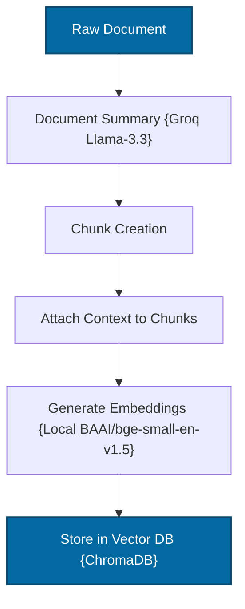
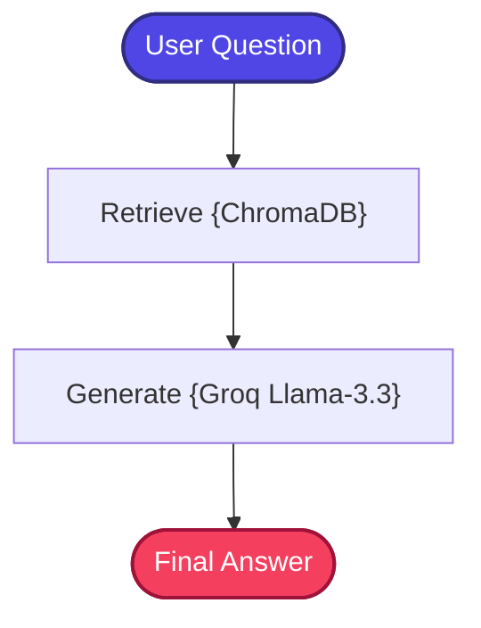

# Contextual RAG

A stateful, zero-cost, and production-structured implementation of the **Contextual Retrieval-Augmented Generation (Contextual RAG)** pattern, inspired by Anthropic's Contextual Retrieval strategy.

---

## 📖 What is Contextual RAG?

Contextual RAG addresses one of the most fundamental weaknesses in standard RAG pipelines: **loss of global context during chunking**.

In traditional RAG, long documents are split into isolated, individual chunks before indexing. While necessary due to model context length limitations, this introduces a severe vulnerability. If a single chunk says *"The framework supports conditional edges"* in isolation, the embedding model has no idea which "framework" is being discussed — the chunk has been severed from its parent document's meaning.

**Contextual RAG** solves this by generating a high-level **Document Context Summary** for the parent document and prepending it directly to *every single chunk* before generating embeddings:

```text
Document Context:
"LangGraph is a framework for orchestrating stateful AI workflows."

Chunk:
"The framework supports conditional edges."
```

This dramatically improves retrieval recall and semantic density because every chunk's vector representation encodes its relationship to the parent document. The result: far more accurate retrieval, especially for technical documents with shared terminology.

---

## 🏗️ Architecture & State Workflow

### 1. Contextual Ingestion Flow
Before indexing, raw documents pass through a pre-processing pipeline to attach parent context summaries:



### 2. RAG Execution Flow
Once contextualized chunks are stored, retrieval matches documents with extremely high accuracy:



---

## ⚙️ Key Components

| Component | File | Role |
| :--- | :--- | :--- |
| **State Schema** | `src/state.py` | Defines `GraphState` TypedDict carrying question, context, and answer through the workflow |
| **Contextualizer** | `src/contextualizer.py` | Generates a concise document-level summary using Groq LLM and prepends it to each chunk before embedding |
| **Document Ingestion** | `src/ingestion.py` | Orchestrates the contextual loading pipeline: summarize → chunk → attach context → embed → store in ChromaDB |
| **Retriever** | `src/retriever.py` | Wraps ChromaDB vector store as a LangChain retriever for context-enriched semantic similarity search |
| **Prompt Templates** | `src/prompts.py` | Fact-grounded system prompts that constrain the LLM to answer from retrieved context only |
| **Workflow Graph** | `src/graph.py` | Builds and compiles the LangGraph StateGraph connecting Retrieve → Generate nodes |
| **Application Entry** | `app.py` | Interactive CLI loop for querying the contextual RAG pipeline |

---

## 🔄 How It Works

### Ingestion Phase (One-Time)
1. **Document Loading** — Raw documents are loaded from the shared `_data/` directory.
2. **Context Summary Generation** — For each document, the Groq LLM generates a concise summary capturing the document's overarching topic and scope.
3. **Chunking** — The document is split into standard-sized chunks using `RecursiveCharacterTextSplitter`.
4. **Context Attachment** — The document summary is prepended to every chunk, enriching each fragment with global context.
5. **Embedding & Indexing** — Enriched chunks are embedded using `BAAI/bge-small-en-v1.5` and stored in ChromaDB.

### Query Phase (Per Question)
1. **Semantic Retrieval** — The user's question is embedded and searched against the context-enriched ChromaDB index.
2. **LLM Generation** — Retrieved contextualized chunks and the user query are assembled into a prompt and sent to Groq's `llama-3.3-70b-versatile`.
3. **Response Delivery** — The factually grounded answer is returned to the user.

---

## 📁 Project Structure

```bash
03_Contextual_RAG/
│
├── app.py               # Main CLI interactive loop entrypoint
├── requirements.txt     # Local project packages
│
│
└── src/
    ├── __init__.py      # Package initialization
    ├── state.py         # GraphState schema using TypedDict
    ├── prompts.py       # Fact-grounded prompt templates
    ├── ingestion.py     # Contextual loader and vector store creator
    ├── contextualizer.py# Document summary generation helper (Groq)
    ├── retriever.py     # Chroma vector store retriever coordinator
    └── graph.py         # LangGraph workflow builder
```

---

## ✅ Advantages

- **Eliminates Context Loss**: Every chunk retains awareness of its parent document, solving the "orphaned chunk" problem that plagues standard RAG.
- **Higher Retrieval Accuracy**: Context-enriched embeddings produce denser, more discriminative vectors, leading to significantly improved recall.
- **No Retrieval Architecture Changes**: The query-time pipeline remains identical to Standard RAG — all improvements happen at ingestion time.
- **Handles Technical Ambiguity**: Chunks with ambiguous pronouns or domain-specific terms are disambiguated by the attached context.
- **Inspired by Production Research**: Based on Anthropic's published Contextual Retrieval methodology.

## ⚠️ Limitations

- **Higher Ingestion Cost**: Generating document summaries requires an LLM call per document during the one-time ingestion phase, increasing setup time and API usage.
- **Increased Token Count**: Prepending context summaries to every chunk increases the total text stored and embedded, consuming more storage.
- **Summary Quality Dependency**: Retrieval quality is sensitive to the accuracy of the generated document summary — a poor summary could mislead embeddings.
- **Single-Pass Retrieval**: Like Standard RAG, there is no query rewriting or retrieval validation loop at query time.
- **Not Ideal for Heterogeneous Corpora**: Works best when documents have clear, coherent topics; mixed-content documents may produce vague summaries.

---

## 🎯 Ideal Use Cases

- **Long Technical Documents** — API documentation, research papers, or specifications where chunks frequently reference concepts defined elsewhere in the document.
- **Corporate Policy Manuals** — Multi-section documents where individual paragraphs depend heavily on the document's overall topic.
- **Legal & Regulatory Text** — Statute or contract sections that reference overarching legal frameworks.
- **Educational Content** — Textbook chapters where individual sections assume knowledge of the chapter's subject matter.
- **Knowledge Bases with Shared Terminology** — Corpora where the same terms appear in different contexts across multiple documents.

---

## ⚖️ Comparison with Standard RAG

| Problem | Standard RAG | Contextual RAG |
| :--- | :---: | :--- |
| **Ambiguous Chunks** | ❌ Isolated sentences lack meaning | **✅ Rich document context attached directly** |
| **Semantic Vector Density**| ❌ Weak indexing of technical terms | **✅ Dense embeddings representing parent context** |
| **Lost Global Context** | ❌ Omits overall topic hierarchy | **✅ Maintains global document information** |
| **Retrieval Accuracy** | Baseline | **Significantly higher semantic accuracy** |
| **Ingestion Complexity** | Low | Moderate (requires LLM summarization step) |
