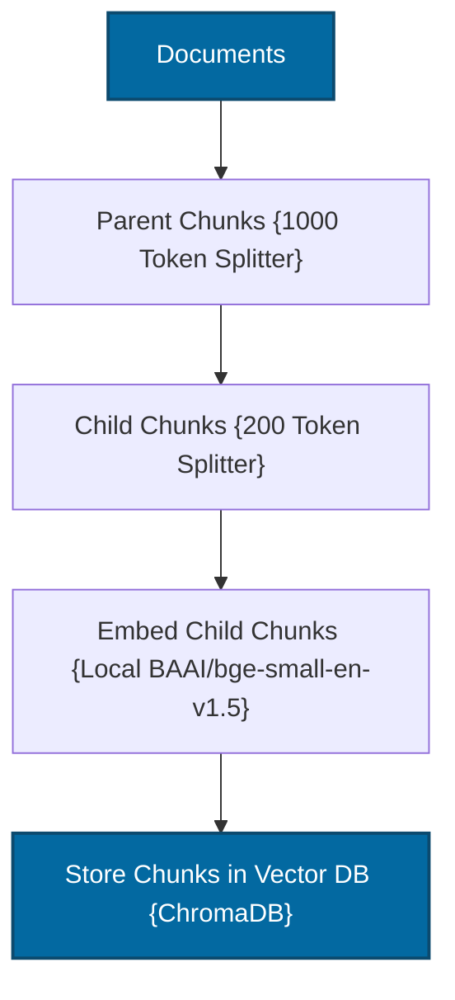

# Hierarchical RAG

A stateful, zero-cost, and production-structured implementation of the **Hierarchical Retrieval-Augmented Generation (Hierarchical RAG)** pattern, also known as Parent-Child RAG.

---

## 📖 What is Hierarchical RAG?

Hierarchical RAG solves a fundamental trade-off in traditional RAG systems: **search precision vs. context sufficiency**.

Traditional RAG pipelines retrieve small, isolated document chunks (e.g., 200–500 tokens) to fit within LLM context limitations. However, small chunks frequently suffer from **lost context** — missing surrounding arguments, fragmented definitions, or weak reasoning chains. Conversely, retrieving very large chunks introduces excessive noise, driving up latency and reducing the signal-to-noise ratio.

**Hierarchical RAG** (Parent-Child RAG) resolves this by organizing documents into two structural levels:
1.  **Child Chunks (200 tokens)**: Small, highly focused segments optimized for vector similarity search — these are what get matched during retrieval.
2.  **Parent Chunks (1000 tokens)**: Larger surrounding document context containing the complete structural argument — these are what get sent to the LLM.

During query execution, the system **retrieves relevant child chunks** via vector search, but then **automatically expands them to their larger parent context** before sending them to the LLM. This combines the search precision of small chunks with the comprehensive grounding of large parent documents.

```text
Document
   ├── Parent Sections (Large)
   │       ├── Child Chunks (Small) ← search targets
   │       ├── Child Chunks (Small) ← search targets
   │       └── Child Chunks (Small) ← search targets
```

---

## 🏗️ Architecture & State Workflow

### 1. Hierarchical Ingestion Flow
Splits parent documents, generates child segments with UUID relation keys, and indexes only child vectors:



### 2. Hierarchical Retrieval Flow
Finds matching children, maps their metadata `parent_id` keys to parent sections, and expands the prompt context:


---

## ⚙️ Key Components

| Component | File | Role |
| :--- | :--- | :--- |
| **State Schema** | `src/state.py` | Defines `GraphState` TypedDict carrying question, context, and answer across all nodes |
| **Hierarchical Ingestion** | `src/ingestion.py` | Implements the two-level chunking strategy: splits documents into parent chunks (1000 tokens), then subdivides each parent into child chunks (200 tokens) with UUID parent-child mapping |
| **Parent-Child Retriever** | `src/retriever.py` | Retrieves matching child chunks from ChromaDB, resolves their `parent_id` metadata, and expands context to the full parent chunk |
| **Prompt Templates** | `src/prompts.py` | Fact-grounded system prompts constraining the LLM to answer from expanded parent context |
| **Workflow Graph** | `src/graph.py` | Builds and compiles the LangGraph StateGraph connecting Retrieve → Expand → Generate nodes |
| **Application Entry** | `app.py` | Interactive CLI loop for querying the hierarchical RAG pipeline |

---

## 🔄 How It Works

### Ingestion Phase (One-Time)
1. **Parent Chunking** — Raw documents are split into large parent chunks (~1000 tokens) that preserve complete arguments and context.
2. **Child Chunking** — Each parent chunk is further subdivided into small child chunks (~200 tokens) optimized for vector similarity matching.
3. **UUID Mapping** — Each child chunk stores a `parent_id` metadata field linking it back to its parent chunk. A `parent_map` dictionary maintains the full parent text indexed by UUID.
4. **Embedding & Indexing** — Only child chunks are embedded using `BAAI/bge-small-en-v1.5` and stored in ChromaDB.

### Query Phase (Per Question)
1. **Child Retrieval** — The user query is searched against child chunk embeddings in ChromaDB, returning the most precisely relevant small segments.
2. **Parent Expansion** — The `parent_id` of each matched child chunk is used to look up the full parent chunk from the `parent_map`.
3. **Context Assembly** — Deduplicated parent chunks are assembled as the context, providing the LLM with complete surrounding arguments.
4. **LLM Generation** — The expanded parent context is sent to Groq's `llama-3.3-70b-versatile` for grounded answer generation.

---

## 📁 Project Structure

```bash
04_Hierarchical_RAG/
│
├── app.py               # Main CLI interactive loop entrypoint
├── requirements.txt     # Local project packages
│
│
└── src/
    ├── __init__.py      # Package initialization
    ├── state.py         # GraphState schema using TypedDict
    ├── prompts.py       # Fact-grounded prompt templates
    ├── ingestion.py     # Hierarchical parser and Chroma indexer
    ├── retriever.py     # Child-to-Parent expansion retriever coordinator
    └── graph.py         # LangGraph workflow builder and compiler
```

---

## ✅ Advantages

- **High Search Precision**: Small child chunks produce precise vector matches, avoiding the noise of large-chunk retrieval.
- **Rich Context for Generation**: The LLM receives complete parent-level context, ensuring sufficient information for coherent reasoning.
- **Reduced Hallucination**: Complete arguments and surrounding context minimize the chance of the LLM fabricating missing details.
- **Scalable Design**: The parent-child mapping is maintained in memory via UUIDs, making the architecture simple and fast.
- **Best of Both Chunk Sizes**: Achieves the precision of small chunks and the completeness of large chunks simultaneously.

## ⚠️ Limitations

- **Higher Memory Usage**: Both child chunks (in ChromaDB) and the full parent map (in memory) must be maintained, increasing memory requirements.
- **Complex Ingestion Logic**: The two-pass chunking with UUID mapping adds complexity compared to flat chunking.
- **Fixed Chunk Boundaries**: Parent and child chunk sizes are predefined — suboptimal boundaries may split important content.
- **No Relevance Grading**: Like Standard RAG, there is no mechanism to assess whether retrieved parents are actually relevant before generation.
- **Single-Pass Retrieval**: No query rewriting or iterative retrieval if the initial child match is poor.

---

## 🎯 Ideal Use Cases

- **Long-Form Technical Documents** — API references, specifications, or research papers where individual sentences need surrounding context to make sense.
- **Legal Contracts** — Clause-level search where the surrounding section provides critical legal context.
- **Medical Records** — Finding specific symptoms or diagnoses while retaining the full clinical context.
- **Codebase Documentation** — Function-level search with automatic expansion to the full module or class context.
- **Academic Research** — Retrieving specific findings while providing the full methodology or experimental context.

---

## ⚖️ Comparison with Standard RAG

| Metric | Standard RAG | Hierarchical RAG |
| :--- | :---: | :--- |
| **Retrieval Focus** | Medium/Large chunks | **Small child chunks (high search precision)** |
| **Context Sufficiency** | ❌ Surrounding context lost | **✅ Context expanded to parent boundaries** |
| **Coherence & Reasoning** | Baseline | **Significantly improved factual grounding** |
| **Hallucination Risk** | Higher (partial info) | **Lower (complete facts provided)** |
| **Ingestion Complexity** | Simple | Moderate (two-pass chunking + UUID mapping) |
