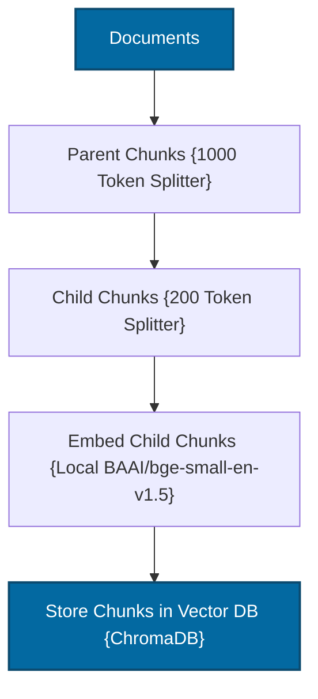
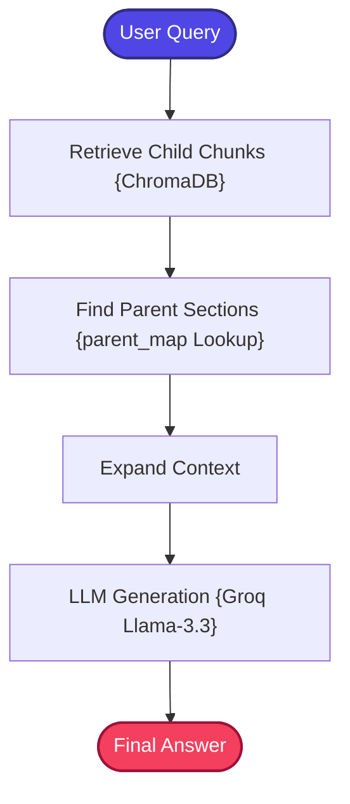

# Hierarchical RAG using LangGraph + Groq + Parent-Child Retrieval

A stateful, zero-cost, and production-structured implementation of the **Hierarchical Retrieval-Augmented Generation (Hierarchical RAG)** pattern.

---

## 📖 What is Hierarchical RAG?

Traditional RAG pipelines retrieve small, isolated document chunks (e.g., 200–500 tokens) to fit within LLM context limitations. However, small chunks frequently suffer from **lost context** (missing surrounding arguments, fragmented definitions, or weak reasoning). Conversely, retrieving very large chunks introduces excessive noise, driving up latency and model confusion.

**Hierarchical RAG** (Parent-Child RAG) resolves this trade-off by organizing documents into multiple structural levels:
1.  **Child Chunks (200 tokens)**: Small, highly focused segments optimized for vector similarity search.
2.  **Parent Chunks (1000 tokens)**: Larger surrounding document context containing the complete structural argument.

During query execution, the system **retrieves relevant child chunks**, but then **automatically expands them to their larger parent context** before sending them to the LLM. This combines the search precision of small chunks with the comprehensive grounding of large parent documents.

```text
Document
   ├── Parent Sections (Large)
   │       ├── Child Chunks (Small)
   │       ├── Child Chunks (Small)
   │       └── Child Chunks (Small)
```

---

## 🏗️ Architecture & State Workflow

### 1. Hierarchical Ingestion Flow
Splits parent documents, generates child segments with UUID relation keys, and indexes only child vectors:



### 2. Hierarchical Retrieval Flow
Finds matching children, maps their metadata `parent_id` keys to parent sections, and expands the prompt context:



---

## 📁 Project Structure

The codebase is highly modularized and clean:

```bash
04_Hierarchical_RAG/
│
├── app.py               # Main CLI interactive loop entrypoint
├── requirements.txt     # Local project packages
│
├── data/
│   └── sample.txt       # Seed raw data files
│
└── src/
    ├── __init__.py      # Package initialization
    ├── state.py         # GraphState schema using TypedDict
    ├── prompts.py       # Fact-grounded prompt templates
    ├── ingestion.py     # Hierarchical parser and Chroma indexer
    ├── retriever.py     # Child-to-Parent expansion retriever coordinator
    └── graph.py         # LangGraph workflow builder and compiler
```

---

## ⚡ Quick Start

### 1. Prerequisites
Ensure you have configured the **centralized `.env`** file in the root folder of the repository workspace:
```env
GROQ_API_KEY=your_actual_groq_api_key_here
```

### 2. Install Dependencies
Navigate to this directory and install the required modules:
```bash
pip install -r requirements.txt
```

### 3. Run the Sandbox
Boot the interactive application:
```bash
python app.py
```

---

## ⚖️ Capability Comparison

| Metric | Traditional RAG | Hierarchical RAG Fix |
| :--- | :---: | :--- |
| **Retrieval Focus** | Medium/Large chunks | **Small child chunks (high search precision)** |
| **Context Sufficiency** | ❌ (Surrounding context lost) | **✅ (Context expanded to parent boundaries)** |
| **Coherence & Reasoning** | Baseline | **Extremely High Factual grounding** |
| **Hallucination Risk** | High (due to partial info) | **Extremely Low (complete facts provided)** |
