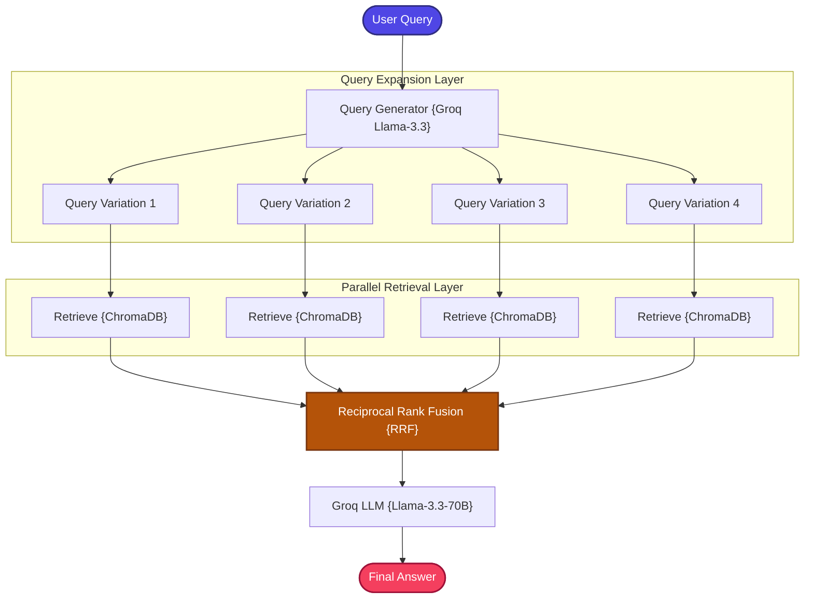

# Fusion RAG

A production-structured implementation of the **Fusion RAG (Multi-Query Retrieval Fusion)** pattern that overcomes the single-query limitations of standard retrieval.

---

## 📖 What is Fusion RAG?

Fusion RAG improves retrieval quality by automatically generating **multiple semantic variations** of a user's query, executing parallel retrievals for all variations, and combining the results using the **Reciprocal Rank Fusion (RRF)** algorithm to select the highest-quality context documents.

Users often submit search terms that are too generic, ambiguous, or miss key semantic synonyms. A single query vector can only capture one perspective of the user's intent. Fusion RAG addresses this by expanding the query space:

```text
Original: "What is ReAct?"

Expanded Variations:
  → "How do reasoning agents work?"
  → "What is the ReAct prompting framework?"
  → "How do LLMs use tool-calling with planning?"
  → "What is the thought-action-observation loop?"
```

Each variation retrieves a different set of potentially relevant documents. The RRF algorithm then fuses these ranked lists, promoting documents that consistently appear across multiple query perspectives — a strong signal of true relevance.

### The RRF Formula

$$RRF(d) = \sum_{q \in Q} \frac{1}{k + r_q(d)}$$

Where $Q$ is the set of query variations, $r_q(d)$ is the rank of document $d$ in retrieval query $q$, and $k$ is a smoothing constant (typically $60$).

---

## 🏗️ Architecture & State Workflow



---

## ⚙️ Key Components

| Component | File | Role |
| :--- | :--- | :--- |
| **State Schema** | `src/state.py` | Defines `GraphState` TypedDict carrying question, query variations, context, and answer |
| **Document Ingestion** | `src/ingestion.py` | Loads and chunks documents, builds the ChromaDB vector index with `BAAI/bge-small-en-v1.5` embeddings |
| **RRF Fusion Engine** | `src/fusion.py` | Implements the Reciprocal Rank Fusion algorithm to merge ranked lists from multiple parallel retrievals |
| **Multi-Query Retriever** | `src/retriever.py` | Generates multiple query variations via Groq LLM and executes parallel ChromaDB retrievals for each variation |
| **Prompt Templates** | `src/prompts.py` | System instruction templates for both query expansion and fact-grounded answer generation |
| **Workflow Graph** | `src/graph.py` | LangGraph node configurations connecting query expansion → parallel retrieval → fusion → generation |
| **Application Entry** | `app.py` | CLI entrypoint loop for interactive querying |

---

## 🔄 How It Works

1. **Document Ingestion** — Documents are loaded, chunked, and indexed into ChromaDB with dense embeddings.

2. **Query Expansion** — The user's original query is sent to Groq's LLM with a specialized prompt that instructs it to generate 4 semantically diverse variations of the query, each approaching the topic from a different angle.

3. **Parallel Retrieval** — Each query variation (plus the original query) is independently searched against ChromaDB, producing multiple ranked result lists.

4. **Reciprocal Rank Fusion** — All ranked lists are fed into the RRF algorithm. Documents that appear highly across multiple query variations receive boosted scores, while documents that appear in only one list are deprioritized.

5. **Context Selection** — The top-ranked documents from the fused list are selected as the final retrieval context.

6. **LLM Generation** — The fused context and original query are compiled into a prompt and sent to Groq's `llama-3.3-70b-versatile` for answer generation.

---

## 📁 Project Structure

```bash
05_Fusion_RAG/
├── app.py              # CLI Entrypoint loop
├── requirements.txt    # Phase-specific dependencies
└── src/
    ├── __init__.py     # Package initialization marker
    ├── ingestion.py    # Vector database builder (ChromaDB)
    ├── fusion.py       # Reciprocal Rank Fusion (RRF) core algorithm
    ├── retriever.py    # Multi-query variations generator & parallel retriever
    ├── prompts.py      # System instructions template
    ├── state.py        # LangGraph State Schema (TypedDict)
    └── graph.py        # LangGraph node configurations & compilation
```

---

## ✅ Advantages

- **Robust to Poor Phrasing**: Automatically compensates for vague, incomplete, or single-perspective user queries by generating diverse reformulations.
- **Higher Recall**: Casting a wider search net across multiple query angles retrieves documents that a single query would miss.
- **Mathematically Sound Ranking**: RRF provides a principled, proven method for merging heterogeneous ranked lists without requiring score normalization.
- **No Additional Infrastructure**: All query variations use the same ChromaDB index — no extra databases or search engines needed.
- **Transparent Process**: The generated query variations are visible in the output, making the retrieval process explainable and debuggable.

## ⚠️ Limitations

- **Higher Latency**: Generating query variations requires an additional LLM call, and parallel retrievals multiply the search workload.
- **Increased API Usage**: The query expansion step consumes additional LLM tokens for every user question.
- **Variation Quality Dependency**: Poor query variations (e.g., redundant or off-topic) can introduce noise rather than improving retrieval.
- **No Relevance Grading**: Retrieved documents are passed to the LLM without quality assessment — fusion improves ranking but doesn't filter irrelevance.
- **Overkill for Simple Queries**: Straightforward factual lookups don't benefit from query expansion and incur unnecessary overhead.

---

## 🎯 Ideal Use Cases

- **Exploratory Research Questions** — Broad queries where the user may not know the exact terminology (e.g., "How do AI agents plan?").
- **Ambiguous Domain Queries** — Questions where key concepts have multiple valid names or descriptions across the corpus.
- **Academic & Scientific Search** — Research topics where different papers use different terminology for the same concepts.
- **Customer Support** — Users describing problems in their own words, which may not match internal documentation phrasing.
- **Cross-Domain Knowledge Bases** — Corpora spanning multiple subjects where a single query perspective is insufficient.

---

## ⚖️ Comparison with Standard RAG

| Capability | Standard RAG | Fusion RAG |
| :--- | :--- | :--- |
| **Query Sensitivity** | High (dependent on user phrasing) | Low (robust to query phrasing) |
| **Semantic Coverage** | Limited to single search vector | Expanded across multiple angles & synonyms |
| **Retrieval Recall** | Moderate | High / Superior |
| **Parallel Processing** | None | Concurrent vector retrievals |
| **Re-ranking Mechanics** | None | Reciprocal Rank Fusion (RRF) |
| **Latency** | Lower | Higher (extra LLM call + parallel searches) |
