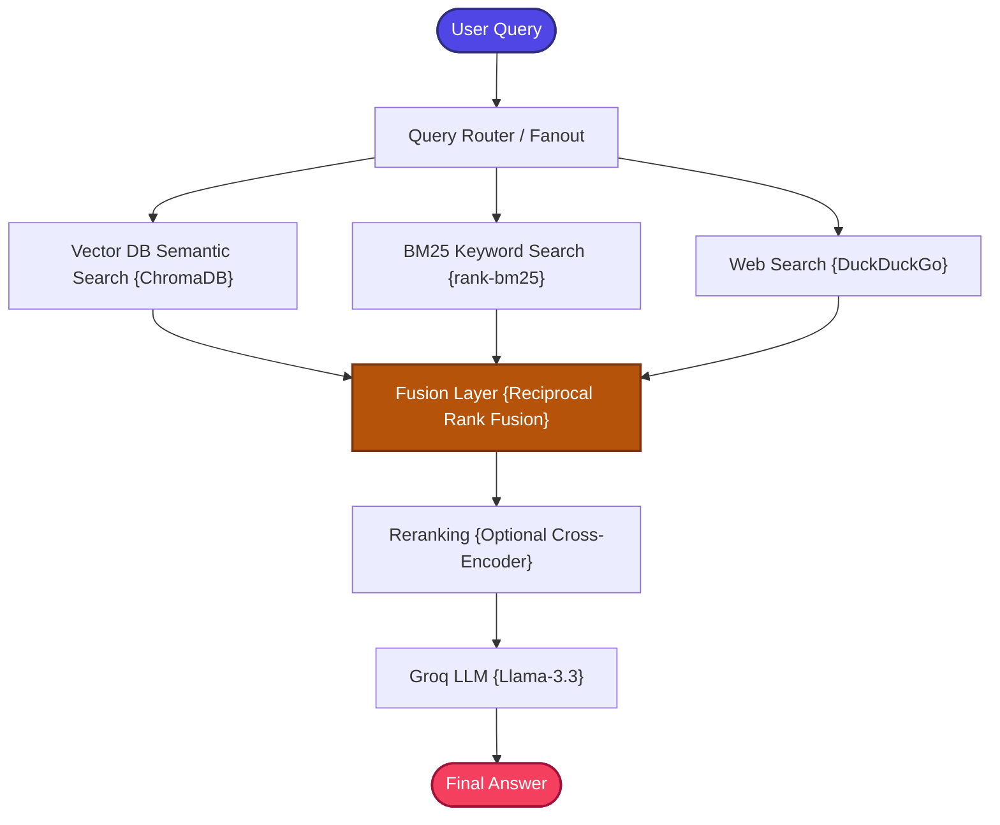

# Multi-Source RAG using LangGraph + Groq + Multi-Retriever Fusion

A stateful, zero-cost, and production-structured implementation of the **Multi-Source Retrieval-Augmented Generation (Multi-Source RAG)** pattern.

---

## 📖 What is Multi-Source RAG?

In production enterprise applications, knowledge is rarely confined to a single database. Critical data is dispersed across heterogeneous sources (e.g., local file indexes, SQL servers, APIs, public websites, and shared document directories). 

Relying on a single search index leads to incomplete context coverage, fragmented reasoning, and poor factual answers.

**Multi-Source RAG** solves this by querying **multiple heterogeneous sources concurrently**:
1.  **Semantic Vector Index**: Matches conceptual context in local records.
2.  **Lexical BM25 Index**: Pulls high-precision exact keyword strings.
3.  **External Web Search Crawler**: Fetches real-time, up-to-date public facts from the open web.

All candidate segments are fused together using **Reciprocal Rank Fusion (RRF)** and reranked, giving the generator a highly grounded, multi-perspective context block.

---

## 🏗️ Architecture & State Workflow

The workflow executes query fanout, retrieves documents concurrently from three distinct channels, and fuses them into a structured output state:



### Flow Breakdown
1.  **Query Router / Fanout**: User query triggers concurrent invocations to the Vector Retriever, BM25 Lexical Retriever, and DDG Web Search.
2.  **Fusion Layer (RRF)**: Merges distinct rankings into a unified order based on their rank reciprocals:
    $$RRF(d) = \sum_{r \in R} \frac{1}{k + r(d)}$$
3.  **LLM Generation**: The top 5 fused document blocks are passed as structured prompt context to Groq's high-efficiency `llama-3.3-70b-versatile` LLM to compile the final response.

---

## 📁 Project Structure

The codebase is highly modularized and clean:

```bash
06_MultiSource_RAG/
│
├── app.py               # Main CLI interactive loop entrypoint
├── requirements.txt     # Local project packages
│
│
└── src/
    ├── __init__.py      # Package initialization
    ├── state.py         # GraphState schema using TypedDict
    ├── prompts.py       # Fact-grounded prompt templates
    ├── ingestion.py     # Document parser and Chroma indexer
    ├── vector_retriever.py# Semantic vector database interface
    ├── bm25_retriever.py# Lexical BM25 keyword index interface
    ├── web_retriever.py # DuckDuckGo web snippet crawler
    ├── fusion.py        # Reciprocal Rank Fusion (RRF) algorithm
    └── graph.py         # LangGraph workflow builder and compiler
```

---

## ⚡ Quick Start

### 1. Prerequisites
Ensure you have configured the **centralized `.env`** file in the root folder of the repository workspace:
```env
GROQ_API_KEY=your_actual_groq_api_key_here
```

### 2. Install Dependencies
Navigate to this directory and install the required modules:
```bash
pip install -r requirements.txt
```

### 3. Run the Sandbox
Boot the interactive application:
```bash
python app.py
```

---

## ⚖️ Strategic Advantage

| Single-Source RAG | Multi-Source RAG |
| :--- | :--- |
| ❌ Limited search coverage (Vector DB only) | **✅ Dynamic coverage (Vector DB + Web + BM25)** |
| ❌ Weak keyword matching | **✅ BM25 high-precision lexical matching** |
| ❌ Out-of-date static database knowledge | **✅ Live Web Search queries for fresh facts** |
| ❌ Isolated context | **✅ RRF-fused comprehensive grounding** |
