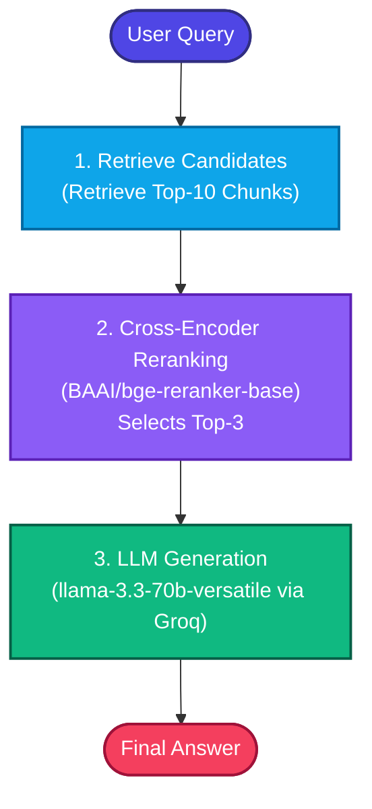

# Reranker-Centric RAG using LangGraph + Groq + BGE Reranker

Reranker-Centric RAG is a highly performant and widely adopted production-grade RAG architecture. Modern RAG systems often realize significantly larger improvements in accuracy, relevance, and semantic precision by using a high-quality cross-encoder reranker than by switching or upgrading embedding models.

Instead of traditional vector search that feeds approximate candidates directly to an LLM:
```text
Retrieve Top-K -> LLM
```

Reranker-Centric RAG implements a two-stage pipeline:
```text
Retrieve Many Documents -> Cross-Encoder Reranker -> Top-3 Best Documents -> LLM
```

This strategy dramatically improves retrieval precision, context quality, hallucination reduction, and answer relevance.

---

## 1. Why Rerankers Matter

Vector search is fast but mathematically approximate. Embedding-based retrievers map queries and documents into a shared space, prioritizing overall semantic proximity over exact, deep semantic matching. Consequently, the top-k retrieved documents often:
* Contain noise or irrelevant metadata
* Be only partially or weakly relevant to the question
* Place the critical answer snippet too deep inside the context, triggering the "Lost in the Middle" LLM phenomena

Cross-Encoder Rerankers process the **query** and **document text** *together* inside the transformer encoder, computing deep attention scores across all tokens in both strings. This produces highly precise relevance scores.

---

## 2. System Architecture

Below is the state graph workflow orchestrated by **LangGraph**:



---

## 3. Retrieval & Reranker Comparison

### Traditional RAG vs Reranker-Centric RAG

| Traditional RAG | Reranker-Centric RAG |
| :--- | :--- |
| **Approximate Retrieval**: Employs single-stage vector cosine similarity. | **Deep Semantic Scoring**: Leverages bidirectional attention between query and doc. |
| **More Noise**: Often retrieves irrelevant chunks due to semantic overlap. | **Cleaner Context**: Filters out low-scoring documents before LLM synthesis. |
| **Higher Hallucination**: Flawed documents in top slots lead to bad inferences. | **Lower Hallucination**: Only verified high-scoring chunks enter context window. |
| **Lower Precision**: Prone to the "lost in the middle" context window issue. | **High Precision**: Reorders the most relevant chunks into prime context slots. |

### Capability Comparison Ratings (1-10)

| Metric | Traditional Vector Retrieval | Reranker-Centric Pipeline |
| :--- | :---: | :---: |
| **Precision** | 6 / 10 | **10 / 10** |
| **Context Quality** | 5 / 10 | **9 / 10** |
| **Hallucination Reduction** | 4 / 10 | **9 / 10** |
| **Semantic Accuracy** | 6 / 10 | **10 / 10** |
| **Answer Quality** | 6 / 10 | **10 / 10** |

---

## 4. Setup & Quickstart

### Step 1: Install Dependencies
Create a virtual environment and install the required libraries:
```bash
pip install -r requirements.txt
```

### Step 2: Configure Environment Variables
Ensure you have a `.env` file at your workspace root containing your Groq API key:
```env
GROQ_API_KEY=gsk_your_actual_key_here
```

### Step 3: Run the Application
Execute the command-line interface to build the database and query the engine:
```bash
python app.py
```

### Sample Conversation Trace
```text
Ask Question: What improves retrieval quality?

[Node: Retrieve]
-> Retrieved 5 candidate documents.

[Node: Rerank]
Loading Cross-Encoder Reranker: BAAI/bge-reranker-base...

--- Cross-Encoder Reranking Scores ---
[1] Score: +2.1852 | Snippet: "Rerankers improve retrieval quality significantly...."
[2] Score: -3.8124 | Snippet: "BGE Reranker is a cross-encoder reranker...."
[3] Score: -4.1022 | Snippet: "Hybrid retrieval combines BM25 and vector search...."
[4] Score: -4.8710 | Snippet: "LangGraph enables graph-based AI orchestration...."
[5] Score: -5.1120 | Snippet: "Groq provides ultra-fast inference for LLMs...."
--------------------------------------
-> Selected top 3 most relevant documents.

[Node: Generate]

[Answer]:
According to the provided context, retrieval quality is improved significantly by **Rerankers**.
------------------------------
```
