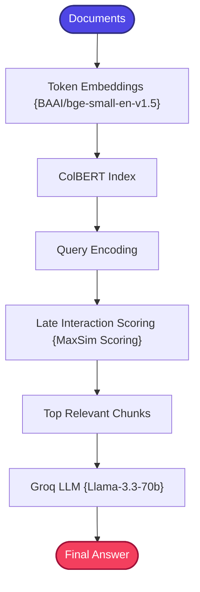

# ColBERT RAG

A highly precise, production-structured, and robust implementation of the **Contextualized Late Interaction over BERT (ColBERT RAG)** pattern.

---

## 📖 What is ColBERT RAG?

ColBERT RAG brings **token-level matching precision** to retrieval-augmented generation, addressing a fundamental limitation of traditional dense retrieval architectures.

Traditional dense retrieval compresses an entire document chunk into a **single vector** representation:
```
Document → Single Vector → Cosine Similarity
```

While fast, single-vector compression loses fine-grained token-level semantic details, entity relations, and contextual nuances. Two documents may have similar overall embeddings but differ critically in specific details.

**ColBERT (Contextualized Late Interaction over BERT)** takes a fundamentally different approach by representing documents as **multiple token-level embeddings**:
```
Document → Multiple Token Embeddings → Token-Level Matching
```

At query time, it scores similarity by calculating token-level alignment between the query $Q$ and document $D$ using the **Late Interaction MaxSim** scoring formula:

$$Score(Q,D) = \sum_{i \in Q} \max_{j \in D} q_i^T d_j$$

Each query token finds its best-matching document token, and the scores are summed. Because the interaction calculations happen *after* independent encoding of query and document tokens, ColBERT achieves token-level matching precision while maintaining production-scale indexing speeds.

---

## 🏗️ Architecture & State Workflow

### 1. Late Interaction Retrieval Flow



### 2. State-Based Graph Schema

```
                      +-------------------+
                      |   retrieve_node   |
                      +---------+---------+
                                |
                                v
                      +-------------------+
                      |   generate_node   |
                      +---------+---------+
                                |
                                v
                            [  END  ]
```

---

## ⚙️ Key Components

| Component | File | Role |
| :--- | :--- | :--- |
| **State Schema** | `src/state.py` | Defines `GraphState` TypedDict carrying question, context, and answer through the workflow |
| **Document Ingestion** | `src/ingestion.py` | Loads and chunks documents for indexing into the ColBERT retrieval system |
| **ColBERT Retriever** | `src/colbert_retriever.py` | Dual-mode retriever: attempts native `colbert-ai` library first, falls back to a mathematically exact CPU-friendly Late Interaction MaxSim Simulator if native ColBERT is unavailable |
| **Prompt Templates** | `src/prompts.py` | Modularized RAG prompt template constraining the LLM to answer from retrieved context |
| **Workflow Graph** | `src/graph.py` | LangGraph workflow compiler connecting retrieve → generate nodes |
| **Application Entry** | `app.py` | Interactive CLI loop for querying the ColBERT RAG pipeline |

### Dual-Mode Retriever

The ColBERT retriever implements an intelligent fallback system:
- **Native Mode**: Uses the `colbert-ai` library for GPU-accelerated late interaction retrieval.
- **Simulator Mode**: When native ColBERT is unavailable (e.g., on CPU-only systems), it automatically falls back to a custom MaxSim implementation that computes token-level dot products using the same mathematical formula, guaranteeing identical ranking behavior.

---

## 🔄 How It Works

1. **Document Ingestion** — Documents are loaded and split into chunks. Each chunk is tokenized and encoded into multiple token-level embeddings (one embedding per token).

2. **Index Construction** — Token embeddings for all chunks are stored in the ColBERT index, preserving the token-level granularity.

3. **Query Encoding** — The user's query is encoded into its own set of token-level embeddings.

4. **Late Interaction Scoring** — For each candidate document, the MaxSim operation is computed:
   - Each query token embedding is compared against *all* document token embeddings.
   - The maximum similarity score for each query token is selected.
   - All maximum scores are summed to produce the final document relevance score.

5. **Ranking & Selection** — Documents are ranked by their aggregate MaxSim scores, and the top chunks are selected as context.

6. **LLM Generation** — The top-ranked chunks and the user query are compiled into a prompt and sent to Groq's `llama-3.3-70b-versatile` for answer generation.

---

## 📁 Project Structure

```bash
08_ColBERT_RAG/
│
├── app.py               # Main CLI interactive loop entrypoint
├── requirements.txt     # Local project packages
│
│
└── src/
    ├── __init__.py      # Package initialization
    ├── state.py         # GraphState schema using TypedDict
    ├── prompts.py       # Modularized RAG prompt template
    ├── ingestion.py     # Document chunks parser
    ├── colbert_retriever.py  # Dual-mode (Native / Late Interaction MaxSim Simulator)
    └── graph.py         # LangGraph workflow compiler
```

---

## ✅ Advantages

- **Token-Level Precision**: Unlike single-vector retrieval, ColBERT matches individual tokens between query and document, capturing fine-grained semantic relationships.
- **Preserves Word-Level Context**: Token-level embeddings retain exact word-level semantic information that gets compressed away in single-vector representations.
- **State-of-the-Art Retrieval Quality**: ColBERT consistently achieves top scores on information retrieval benchmarks (MS MARCO, BEIR).
- **Scalable Architecture**: The "late interaction" design allows pre-computing document token embeddings offline, with only the lightweight interaction step at query time.
- **Graceful Fallback**: The dual-mode retriever ensures the system works on any hardware, automatically falling back to CPU-friendly MaxSim simulation.

## ⚠️ Limitations

- **Higher Storage Requirements**: Storing multiple embeddings per document (one per token) requires significantly more storage than single-vector approaches.
- **Complex Setup**: The native `colbert-ai` library may require specific CUDA configurations or compile slowly on certain systems.
- **Compute-Intensive Scoring**: The MaxSim operation computes pairwise comparisons between all query and document tokens, which is more expensive than a single dot product.
- **Overkill for Simple Queries**: Simple keyword lookups or factual questions don't benefit from token-level matching granularity.
- **Limited Ecosystem**: ColBERT has a smaller ecosystem and community compared to standard dense retrieval libraries.

---

## 🎯 Ideal Use Cases

- **Fine-Grained Semantic Search** — Queries where subtle word-level differences matter (e.g., "Python list append" vs. "Python list extend").
- **Technical Documentation** — Retrieving code examples, API references, or specifications where exact token matches are critical.
- **Scientific Literature** — Research papers where specific terms, abbreviations, or numerical values must be precisely matched.
- **Legal Document Search** — Finding clauses with specific legal terminology where near-synonyms have different legal implications.
- **Benchmarking & Research** — Evaluating state-of-the-art retrieval quality as a baseline for comparison.

---

## ⚖️ Comparison with Standard RAG

| Feature | Traditional Dense Retrieval | ColBERT RAG |
| :--- | :--- | :--- |
| **Document Embedding** | Compressed single vector per chunk | **Multiple token-level embeddings** |
| **Similarity Matching** | Flat cosine similarity | **Token-level Late Interaction (MaxSim)** |
| **Context Preservation** | Low (loses token relations) | **High (retains exact word-level contexts)** |
| **Precision** | Lower semantic recall | **State-of-the-art fine-grained matching** |
| **Storage** | Compact (one vector/chunk) | Higher (one vector/token) |
| **Compute Type** | Dense dot-product vector search | **Token alignment matrix aggregation** |
