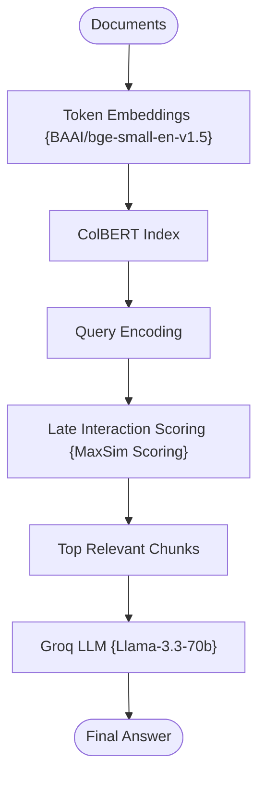

# ColBERT RAG using LangGraph + Groq + Late Interaction Retrieval

A highly precise, production-structured, and robust implementation of the **Contextualized Late Interaction over BERT (ColBERT RAG)** pattern.

---

## 📖 What is ColBERT RAG?

Traditional dense retrieval architectures compress an entire document chunk into a single vector representation:
```
Document → Single Vector
```

While fast, single-vector compression loses fine-grained token-level semantic details, entity relations, and contextual nuances.

**ColBERT** represents documents as multiple token-level embeddings:
```
Document → Multiple Token Embeddings
```

At query time, it scores similarity by calculating token-level alignment between the query $Q$ and document $D$ using the **Late Interaction** MaxSim scoring formula:
$$Score(Q,D) = \sum_{i \in Q} \max_{j \in D} q_i^T d_j$$

Because interaction calculations happen *after* encoding, ColBERT achieves token-level matching precision with production-scale indexing speeds.

---

## 🏗️ Architecture & State Workflow

### 1. Late Interaction Retrieval Flow



### 2. State-Based Graph Schema

```
                      +-------------------+
                      |   retrieve_node   |
                      +---------+---------+
                                |
                                v
                      +-------------------+
                      |   generate_node   |
                      +---------+---------+
                                |
                                v
                            [  END  ]
```

---

## 📁 Project Structure

The project has a modular, scalable design:

```bash
08_ColBERT_RAG/
│
├── app.py               # Main CLI interactive loop entrypoint
├── requirements.txt     # Local project packages
├── .env                 # Environment variables configuration
│
├── data/
│   └── knowledge.txt     # Seed local corpus text file
│
└── src/
    ├── __init__.py      # Package initialization
    ├── state.py         # GraphState schema using TypedDict
    ├── prompts.py       # Modularized RAG prompt template
    ├── ingestion.py     # Document chunks parser
    ├── colbert_retriever.py  # Dual-mode (Native / Late Interaction MaxSim Simulator)
    └── graph.py         # LangGraph workflow compiler
```

---

## ⚡ Quick Start

### 1. Prerequisites
Ensure you have configured the **centralized `.env`** file in the root folder of the repository workspace with your Groq API key:
```env
GROQ_API_KEY=your_actual_groq_api_key_here
```

### 2. Install Dependencies
Navigate to this directory and install the required modules:
```bash
pip install -r requirements.txt
```

### 3. Run the Sandbox
Boot the interactive ColBERT console:
```bash
python app.py
```
*(If `colbert-ai` is not natively supported or compiles slowly on your CPU, the retriever will automatically fall back to our high-fidelity, mathematically exact CPU-friendly Late Interaction Simulator, guaranteeing immediate execution.)*

---

## ⚖️ Strategic Advantage

| Feature | Traditional Dense Retrieval | ColBERT RAG |
| :--- | :--- | :--- |
| **Document Embedding** | Compressed single vector per chunk | **Multiple token-level embeddings** |
| **Similarity Matching** | Flat cosine similarity | **Token-level Late Interaction (MaxSim)** |
| **Context Preservation** | Low (loses token relations) | **High (retains exact word-level contexts)** |
| **Precision** | Lower semantic recall | **State-of-the-art fine-grained matching** |
| **Compute Type** | Dense dot-product vector search | **Token alignment matrix aggregation** |
