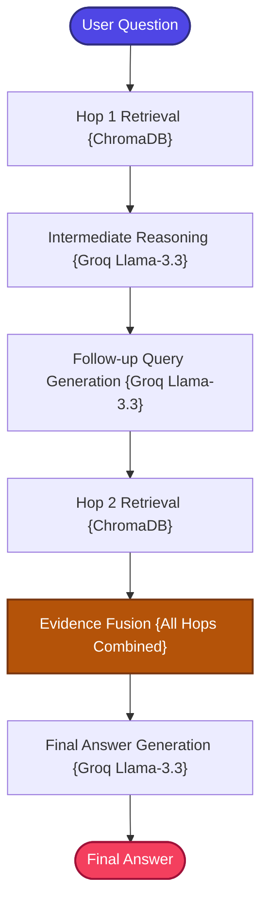

# Multi-Hop RAG

A research-grade, production-structured implementation of the **Multi-Hop Retrieval-Augmented Generation (Multi-Hop RAG)** pattern for iterative reasoning retrieval.

---

## 📖 What is Multi-Hop RAG?

Multi-Hop RAG is designed for **questions that cannot be answered from a single document chunk**. Many real-world questions require chaining multiple pieces of evidence across different documents to arrive at a complete answer.

Standard RAG retrieves once and generates — but what happens when the answer requires connecting two or more separate facts?

```text
Question: "Which database is commonly used for Graph RAG systems?"

Hop 1: "Graph RAG uses knowledge graphs for retrieval."
Hop 2: "Neo4j is one of the most popular graph databases."
Final:  "Graph RAG commonly uses Neo4j."
```

Standard RAG would retrieve only chunks matching "Graph RAG systems" and likely miss the connection to "Neo4j" — because that information lives in a different part of the corpus.

**Multi-Hop RAG** solves this by performing **iterative retrieval hops**:
1.  **First Hop**: Retrieves initial evidence based on the user's original question.
2.  **Intermediate Reasoning**: Analyzes the first-hop evidence and identifies what additional information is needed.
3.  **Follow-Up Query Generation**: Automatically generates a targeted follow-up query to find the missing evidence.
4.  **Second Hop**: Retrieves additional evidence using the generated follow-up query.
5.  **Evidence Fusion**: Combines all gathered evidence from both hops to synthesize a comprehensive, multi-document answer.

---

## 🏗️ Architecture & State Workflow



---

## ⚙️ Key Components

| Component | File | Role |
| :--- | :--- | :--- |
| **State Schema** | `src/state.py` | Defines `GraphState` TypedDict carrying question, context from multiple hops, follow-up queries, and final answer |
| **Document Ingestion** | `src/ingestion.py` | Loads and chunks documents, builds the ChromaDB vector index |
| **Retriever** | `src/retriever.py` | ChromaDB dense retriever used for both first-hop and second-hop searches |
| **Reasoning Engine** | `src/reasoning.py` | LLM-powered intermediate reasoning: generates follow-up queries based on first-hop evidence and synthesizes the final multi-hop answer |
| **Prompt Templates** | `src/prompts.py` | Specialized prompts for intermediate reasoning, follow-up query generation, and final answer synthesis |
| **Workflow Graph** | `src/graph.py` | LangGraph 4-node sequential multi-hop workflow: Hop1 → Reasoning → Hop2 → Generate |
| **Application Entry** | `app.py` | CLI entrypoint loop for interactive querying |

---

## 🔄 How It Works

1. **Document Ingestion** — Documents are loaded, chunked, and indexed into ChromaDB with dense embeddings.

2. **Hop 1 — Initial Retrieval** — The user's original question is searched against ChromaDB, returning the top relevant chunks as initial evidence.

3. **Intermediate Reasoning** — The first-hop evidence is analyzed by Groq's LLM. The model identifies what information is already available and what critical gaps remain. It then generates a targeted follow-up query designed to find the missing evidence.

4. **Hop 2 — Follow-Up Retrieval** — The LLM-generated follow-up query is searched against ChromaDB, retrieving additional evidence that bridges the information gap.

5. **Evidence Fusion** — All evidence from both hops is combined into a comprehensive context block, providing the LLM with a multi-perspective view of the topic.

6. **Final Synthesis** — The fused evidence is sent to Groq's `llama-3.3-70b-versatile` with a synthesis prompt, generating a deep, multi-document answer that connects the dots across both retrieval rounds.

---

## 📁 Project Structure

```bash
09_MultiHop_RAG/
├── app.py              # CLI Entrypoint loop
├── requirements.txt    # Phase dependencies
└── src/
    ├── __init__.py     # Package marker
    ├── ingestion.py    # Vector database builder (ChromaDB)
    ├── retriever.py    # ChromaDB dense retriever
    ├── reasoning.py    # Follow-up query generator & multi-hop answer synthesizer
    ├── prompts.py      # Prompt templates
    ├── state.py        # LangGraph State Schema (TypedDict)
    └── graph.py        # LangGraph 4-node sequential multi-hop workflow
```

---

## ✅ Advantages

- **Deep Reasoning**: Connects evidence across multiple documents, answering complex questions that single-pass retrieval fundamentally cannot handle.
- **Automatic Gap Detection**: The intermediate reasoning step identifies missing information and formulates targeted follow-up searches.
- **Evidence Synthesis**: Combines multi-document evidence into coherent, comprehensive answers rather than relying on a single chunk.
- **No Additional Infrastructure**: Uses the same ChromaDB index for both hops — no extra databases or search engines needed.
- **Transparent Chain of Thought**: The follow-up query generation is visible, making the reasoning process explainable.

## ⚠️ Limitations

- **Higher Latency**: Two retrieval rounds plus intermediate LLM reasoning significantly increase response time compared to single-hop RAG.
- **Increased API Usage**: Multiple LLM calls (reasoning + follow-up generation + final synthesis) consume more tokens per question.
- **Follow-Up Quality Dependency**: If the intermediate reasoning generates a poor follow-up query, the second hop may not retrieve useful evidence.
- **Fixed Hop Count**: The current implementation is limited to 2 hops — questions requiring 3+ hops of reasoning may still produce incomplete answers.
- **Compounding Errors**: Mistakes in the first hop (irrelevant initial retrieval) can cascade, causing the follow-up query to go in the wrong direction.

---

## 🎯 Ideal Use Cases

- **Complex Research Questions** — Queries requiring evidence synthesis across multiple topics or documents (e.g., "How does technology X compare to technology Y for use case Z?").
- **Enterprise Knowledge Bases** — Questions spanning multiple departments, products, or documentation areas.
- **Scientific Literature Review** — Finding connections between different studies, methods, or findings.
- **Comparative Analysis** — Questions that require understanding relationships between entities described in separate documents.
- **Investigation & Audit** — Tracing chains of events, policies, or decisions across disparate records.

---

## ⚖️ Comparison with Standard RAG

| Feature | Standard RAG | Multi-Hop RAG |
| :--- | :--- | :--- |
| **Retrieval Strategy** | Single pass | Iterative 2-hop chain |
| **Reasoning Depth** | Shallow (flat context) | Deep (chained evidence) |
| **Follow-Up Queries** | None | Auto-generated per hop |
| **Evidence Fusion** | None | All hops merged |
| **Complex QA Capability** | Limited | Excellent |
| **Latency** | Low | Higher (multiple LLM + retrieval rounds) |
