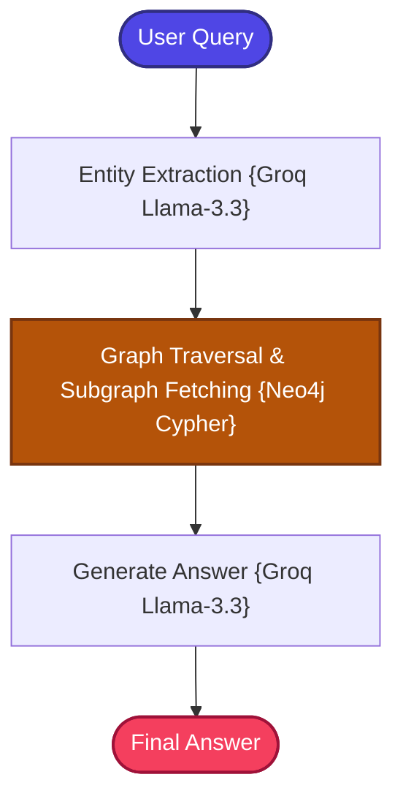

# Graph RAG

A state-of-the-art, production-structured implementation of the **Graph RAG (Knowledge Graph Traversal RAG)** pattern using Neo4j graph database.

---

## 📖 What is Graph RAG?

Graph RAG fundamentally transforms how information is stored and retrieved by modeling unstructured data as a **structured Knowledge Graph** of connected entities and relationships.

Standard RAG performs flat vector proximity searches over isolated text chunks — it can find documents containing similar words but completely misses the **semantic connections** between concepts. When a user asks "How is technology A related to technology B?", flat chunk retrieval may find separate chunks about A and B but fail to connect them.

**Graph RAG** resolves this by:
1. **Entity Extraction**: Using LLMs to extract named entities (people, technologies, concepts) from documents.
2. **Relationship Mapping**: Identifying and storing explicit relationships between entities as graph edges.
3. **Graph Traversal**: At query time, extracting entities from the user's question and traversing the knowledge graph to find relevant connected subgraphs via Cypher queries.

Instead of retrieving isolated text chunks, Graph RAG retrieves **structured subgraphs** — connected paths of entities and relationships that provide rich, relational context for the LLM.

```text
Standard RAG: "Chunk about A" + "Chunk about B" → No connection
Graph RAG:    A --[uses]--> C --[enables]--> B → Clear relationship path
```

---

## 🏗️ Architecture & State Workflow



---

## ⚙️ Key Components

| Component | File | Role |
| :--- | :--- | :--- |
| **State Schema** | `src/state.py` | Defines `GraphState` TypedDict carrying question, extracted entities, graph context, and answer |
| **Document Ingestion** | `src/ingestion.py` | Orchestrates the triplet extraction pipeline and seeds Neo4j with entity-relationship data |
| **Graph Builder** | `src/graph_builder.py` | Uses Groq LLM to extract (Subject, Predicate, Object) triplets from documents and stores them as nodes and edges in Neo4j |
| **Graph Retriever** | `src/graph_retriever.py` | Extracts entities from user queries and executes case-insensitive Cypher queries against Neo4j to retrieve relevant subgraphs. Includes a mock database fallback for offline development |
| **Prompt Templates** | `src/prompts.py` | Templates for entity extraction, triplet extraction, and fact-grounded answer generation |
| **Workflow Graph** | `src/graph.py` | LangGraph node configurations connecting entity extraction → graph traversal → generation |
| **Application Entry** | `app.py` | CLI entrypoint loop for interactive querying |

---

## 🔄 How It Works

### Ingestion Phase (One-Time)
1. **Document Loading** — Raw documents are loaded from the shared data directory.
2. **Triplet Extraction** — Groq LLM processes each document to extract (Subject, Predicate, Object) triplets representing entity relationships.
3. **Graph Construction** — Extracted entities are created as Neo4j nodes, and relationships are created as directed edges connecting them.
4. **Index Building** — Neo4j indexes entities for fast case-insensitive lookup.

### Query Phase (Per Question)
1. **Entity Extraction** — The user's question is analyzed by Groq LLM to identify key entities (e.g., "Graph RAG", "Neo4j").
2. **Cypher Query Execution** — For each extracted entity, a case-insensitive Cypher query traverses the Neo4j graph to find connected subgraphs (nodes and relationships within 1-2 hops).
3. **Subgraph Assembly** — Retrieved relationship paths are formatted as structured context strings (e.g., `"GraphRAG --[USES]--> Neo4j"`).
4. **LLM Generation** — The graph context and user query are sent to Groq's `llama-3.3-70b-versatile` for answer generation grounded in relational knowledge.

> **Note**: If Neo4j is offline or not installed, the application automatically falls back to an intelligent local mock triplet matcher, letting you test the entire pipeline without a live database.

---

## 📁 Project Structure

```bash
10_Graph_RAG/
├── app.py              # CLI Entrypoint loop
├── requirements.txt    # Phase dependencies
└── src/
    ├── __init__.py     # Package marker
    ├── ingestion.py    # Triplets extractor & Neo4j clear/seed pipeline
    ├── graph_builder.py# Entity extractor & Neo4j store class
    ├── graph_retriever.py# Case-insensitive Cypher retriever (with mock database fallback)
    ├── prompts.py      # Prompt templates
    ├── state.py        # LangGraph State Schema (TypedDict)
    └── graph.py        # LangGraph node configurations & compilation
```

---

## ✅ Advantages

- **Relationship-Aware Retrieval**: Unlike flat chunk retrieval, Graph RAG understands and leverages explicit connections between entities.
- **Multi-Hop Traversal**: Naturally supports multi-hop reasoning by traversing graph paths across multiple entity connections.
- **High Explainability**: Relationship paths are explicit and auditable — you can trace exactly how the system connected two concepts.
- **Structured Domain Modeling**: Ideal for domains with clear entity hierarchies (organizations, technologies, biological systems).
- **Robust Development Mode**: The built-in mock fallback allows full pipeline testing without requiring a Neo4j installation.

## ⚠️ Limitations

- **External Database Dependency**: Requires a running Neo4j instance for production use, adding infrastructure complexity.
- **Extraction Quality**: The quality of the knowledge graph depends entirely on the LLM's ability to accurately extract entities and relationships.
- **Cold Start Problem**: The knowledge graph must be built from scratch during ingestion — there is no pre-existing graph to bootstrap from.
- **Schema Rigidity**: The triplet format (Subject-Predicate-Object) may not capture complex, multi-arity relationships.
- **Scaling Challenges**: Very large document corpora can produce extremely dense graphs that are expensive to traverse.

---

## 🎯 Ideal Use Cases

- **Enterprise Knowledge Management** — Mapping relationships between products, teams, technologies, and processes across an organization.
- **Scientific Discovery** — Exploring connections between genes, proteins, diseases, and treatments in biomedical research.
- **Fraud Detection** — Identifying hidden connections between entities (people, accounts, transactions) in financial investigations.
- **Competitive Intelligence** — Mapping relationships between companies, products, patents, and market segments.
- **Technical Architecture Analysis** — Understanding how components, services, and dependencies relate in complex systems.

---

## ⚖️ Comparison with Standard RAG

| Feature | Standard RAG | Graph RAG |
| :--- | :--- | :--- |
| **Data Model** | Flat, unstructured text chunks | **Structured entity-relationship graph** |
| **Query Mechanism** | Vector cosine similarity | **Cypher graph traversal** |
| **Multi-Hop Reasoning** | Poor (fails to span chunks) | **Excellent (traverses relationship paths)** |
| **Relationship Awareness** | None | **Explicit entity connections** |
| **Explainability** | Low (hard to audit vector indices) | **High (relationship paths are traceable)** |
| **Infrastructure** | ChromaDB (local) | Neo4j (external database) |
