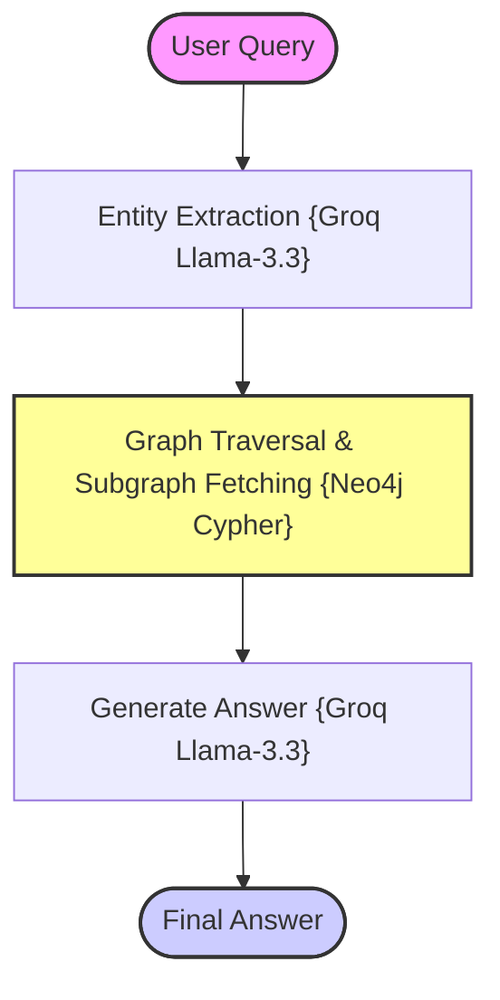

# Phase 10: Graph RAG (Knowledge Graph Traversal RAG)

Graph RAG is a state-of-the-art retrieval architecture that models unstructured data as a structured Knowledge Graph of connected entities and relationships. Instead of performing flat vector proximity searches over isolated text chunks, Graph RAG traverses semantic relationships within a graph database (Neo4j) to build structured, multi-hop subgraphs containing highly relevant contextual paths.

---

## 🏗️ Architecture & State Workflow



---

## ⚡ Why Graph RAG Matters

Standard vector retrieval is limited by "flat chunking." It searches for chunks that contain similar words but completely misses:
1. **Semantic Connections:** The relationship between disconnected details.
2. **Multi-Hop Traversal:** Finding a connection that spans multiple entities (e.g., A is connected to B, and B is connected to C).
3. **Structured Domain Understanding:** Clear enterprise entity maps.

CRAG and Fusion RAG optimize search query formulations, but **Graph RAG** fundamentally transforms how information is connected, making it ideal for deep reasoning, scientific discovery, and complex enterprise knowledge bases.

---

## 📊 Capability Comparison

The table below contrasts flat vector search against graph-based semantic retrievals:

| Feature | Traditional RAG | Graph RAG |
| :--- | :---: | :---: |
| **Multi-hop reasoning** | 3/10 | 9/10 |
| **Relationship awareness** | 2/10 | 10/10 |
| **Context understanding** | 5/10 | 9/10 |
| **Enterprise knowledge** | 4/10 | 10/10 |
| **Semantic traversal** | 3/10 | 9/10 |

---

## 📁 Project Structure

```bash
10_Graph_RAG/
├── app.py              # CLI Entrypoint loop
├── requirements.txt    # Phase dependencies
├── data/
│   └── sample.txt      # Source text corpus
└── src/
    ├── __init__.py     # Package marker
    ├── ingestion.py    # Triplets extractor & Neo4j clear/seed pipeline
    ├── graph_builder.py# Entity extractor & Neo4j store class
    ├── graph_retriever.py# Case-insensitive Cypher retriever (with mock database fallback)
    ├── prompts.py      # Prompt templates
    ├── state.py        # LangGraph State Schema (TypedDict)
    └── graph.py        # LangGraph node configurations & compilation
```

---

## 🚀 Quick Start & Neo4j Configuration

### 1. Run Neo4j Database locally
Ensure you have Neo4j Community Edition installed and running:
```bash
neo4j console
```
Default connection parameters:
* **URI:** `bolt://localhost:7687`
* **Username:** `neo4j`
* **Password:** `password`

### 2. Configure Environment Variables
Ensure you have a `.env` file at the root of the **entire repository** (`RAG-Design-Patterns/.env`) containing your credentials:
```env
GROQ_API_KEY=your_groq_api_key

NEO4J_URI=bolt://localhost:7687
NEO4J_USERNAME=neo4j
NEO4J_PASSWORD=password
```

### 3. Install Phase Dependencies
```bash
pip install -r requirements.txt
```

### 4. Run the Application
Execute the interactive console application:
```bash
python app.py
```
> [!TIP]
> **Robust Development Mode:** If local Neo4j is offline or not installed, the application automatically triggers an intelligent, local mock triplet fallback. This matches entity keywords locally, letting you test the entire LangGraph pipeline even without a live Neo4j database!
