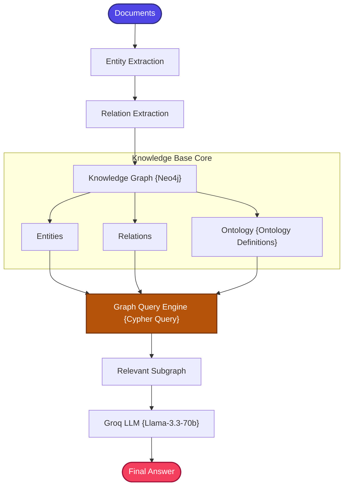

# KG-RAG (Knowledge Graph RAG)

A stateful, production-structured, and highly explainable implementation of the **Knowledge Graph Retrieval-Augmented Generation (KG-RAG)** pattern using Neo4j and ontology-driven extraction.

---

## 📖 What is KG-RAG?

KG-RAG extends Graph RAG with **formal ontological structure** and a more rigorous knowledge representation framework.

While Graph RAG extracts free-form entity triplets from documents, KG-RAG introduces a **predefined ontology** — a formal schema defining which entity types and relationship types are valid. This brings structure, consistency, and domain specificity to the knowledge graph.

Traditional RAG retrieves unstructured, flat text chunks based on semantic proximity:
```
Question → Chunks → Answer
```

KG-RAG models structured knowledge graphs with ontological constraints to traverse entity links and semantic relations:
```
Question → Entity Linking → KG Traversal (Ontology-Guided) → Context Subgraph → LLM
```

By traversing explicit connections in Neo4j with ontology-guided extraction, KG-RAG provides unparalleled **explainability**, robust **multi-hop reasoning**, and strict **factual grounding**. Every retrieved fact can be traced back through a chain of named relationships.

### KG-RAG vs. Graph RAG

| Aspect | Graph RAG | KG-RAG |
| :--- | :--- | :--- |
| **Extraction** | Free-form triplets | Ontology-constrained entities & relations |
| **Schema** | Implicit | Explicit ontology definitions |
| **Consistency** | Variable | High (enforced by ontology) |
| **Domain Modeling** | General-purpose | Domain-specific |

---

## 🏗️ Architecture & State Workflow

### 1. Information Extraction & Retrieval Flow



### 2. State-Based Graph Schema

```
                      +-------------------+
                      |   retrieve_node   |
                      +---------+---------+
                                |
                                v
                      +-------------------+
                      |   generate_node   |
                      +---------+---------+
                                |
                                v
                            [  END  ]
```

---

## ⚙️ Key Components

| Component | File | Role |
| :--- | :--- | :--- |
| **State Schema** | `src/state.py` | Defines `GraphState` TypedDict carrying question, graph context, and answer |
| **Ontology Definitions** | `src/ontology.py` | Defines valid entity types (e.g., Technology, Framework, Concept) and relationship types (e.g., USES, ENABLES, IMPLEMENTS) that constrain knowledge extraction |
| **KG Builder** | `src/kg_builder.py` | Extracts ontology-constrained semantic relations from documents using Groq LLM and merges them into Neo4j as typed nodes and edges |
| **KG Retriever** | `src/kg_retriever.py` | Executes localized, case-insensitive Cypher subgraph queries against Neo4j to retrieve relevant entity neighborhoods |
| **Document Ingestion** | `src/ingestion.py` | Orchestrates document loading and triggers the KG builder pipeline |
| **Prompt Templates** | `src/prompts.py` | Modularized RAG prompt templates for entity extraction and answer generation |
| **Workflow Graph** | `src/graph.py` | LangGraph workflow compiler connecting retrieve → generate nodes |
| **Application Entry** | `app.py` | Interactive CLI loop for querying the KG-RAG pipeline |

---

## 🔄 How It Works

### Ingestion Phase (One-Time)
1. **Document Loading** — Raw documents are loaded from the shared data directory.
2. **Ontology-Guided Extraction** — Groq LLM processes each document, extracting entities and relationships constrained to the predefined ontology. Only valid entity types and relationship types are accepted.
3. **Graph Construction** — Extracted entities are created as typed Neo4j nodes, and relationships are created as labeled directed edges. Duplicate entities are merged to maintain graph consistency.
4. **Ontology Validation** — The resulting graph conforms to the domain ontology, ensuring structured and consistent knowledge representation.

### Query Phase (Per Question)
1. **Entity Linking** — Key entities are identified from the user's question.
2. **Cypher Subgraph Query** — Case-insensitive Cypher queries traverse the Neo4j graph, retrieving the local neighborhood of matched entities (connected nodes and relationships).
3. **Context Assembly** — Retrieved subgraph paths are formatted as structured relationship statements for the LLM.
4. **LLM Generation** — The graph context and user query are sent to Groq's `llama-3.3-70b-versatile` for ontology-grounded answer generation.

> **Note**: If Neo4j is offline or unreachable, the system outputs clean descriptive warnings and continues to run gracefully.

---

## 📁 Project Structure

```bash
11_KG_RAG/
│
├── app.py               # Main CLI interactive loop entrypoint
├── requirements.txt     # Local project packages
│
│
└── src/
    ├── __init__.py      # Package initialization
    ├── state.py         # GraphState schema using TypedDict
    ├── prompts.py       # Modularized RAG prompt template
    ├── ontology.py      # Ontological definitions (Entities & Relations)
    ├── kg_builder.py    # Extracts semantic relations and merges into Neo4j
    ├── kg_retriever.py  # Localized Cypher subgraph query retriever
    ├── ingestion.py     # Document loader and builder executor
    └── graph.py         # LangGraph workflow compiler
```

---

## ✅ Advantages

- **Ontology-Driven Consistency**: Predefined entity and relationship types ensure a clean, consistent, and domain-appropriate knowledge graph.
- **Explicit Symbolic Reasoning**: Relationships are named and typed, enabling precise, auditable reasoning chains.
- **High Explainability**: Every answer can be traced back through explicit relationship paths in the graph.
- **Multi-Hop Traversal**: Naturally supports complex queries spanning multiple entity connections via recursive Cypher traversal.
- **Merge-Safe Ingestion**: Duplicate entities are merged rather than duplicated, maintaining graph integrity across multiple document ingestions.

## ⚠️ Limitations

- **Neo4j Dependency**: Requires a running Neo4j instance, adding infrastructure setup and maintenance overhead.
- **Ontology Design Effort**: Creating an effective ontology requires domain expertise and upfront design work.
- **Extraction Accuracy**: LLM-based extraction may miss entities, create incorrect relationships, or hallucinate non-existent connections.
- **Ontology Rigidity**: A too-narrow ontology may miss important relationships; a too-broad ontology may introduce noise.
- **Cold Start**: The knowledge graph must be fully built before queries can be answered — no incremental bootstrapping.

---

## 🎯 Ideal Use Cases

- **Domain-Specific Knowledge Systems** — Medical ontologies (diseases, symptoms, treatments), legal taxonomies (statutes, precedents, jurisdictions), or financial hierarchies (instruments, markets, regulations).
- **Enterprise Architecture Documentation** — Modeling relationships between systems, services, teams, and processes with formal definitions.
- **Regulatory Compliance** — Tracing which regulations apply to which products, processes, or jurisdictions through explicit relationship paths.
- **Scientific Research** — Building structured knowledge bases of experimental methods, findings, and citations with typed relationships.
- **Supply Chain Management** — Mapping supplier → component → product → customer relationships with formal ontological constraints.

---

## ⚖️ Comparison with Standard RAG

| Feature | Standard RAG | KG-RAG |
| :--- | :--- | :--- |
| **Data Format** | Unstructured, flat text chunks | **Structured entities & relationships** |
| **Query Mechanism** | Vector cosine similarity search | **Case-insensitive Cypher subgraph traversal** |
| **Reasoning Model** | Implicit semantic association | **Explicit symbolic reasoning** |
| **Explainability** | Low (hard to audit vector indices) | **High (relationships are traced and auditable)** |
| **Multi-Hop Traversal** | Very poor (fails to span chunks) | **Excellent (scales recursively across graph paths)** |
| **Schema** | None | **Formal ontology definitions** |
