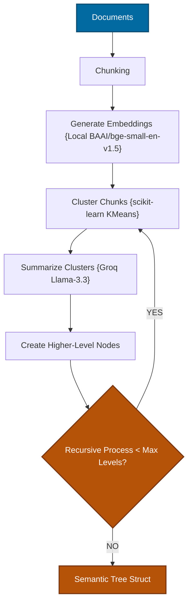
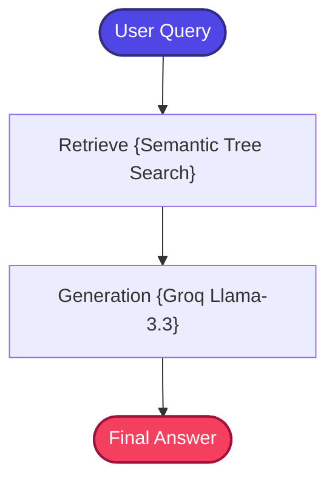

# RAPTOR RAG

A stateful, zero-cost, and production-structured implementation of the **Recursive Abstractive Processing for Tree-Organized Retrieval (RAPTOR RAG)** pattern.

---

## 📖 What is RAPTOR RAG?

RAPTOR RAG addresses a fundamental limitation of flat retrieval: the inability to answer questions that require **global document understanding**.

Standard RAG retrieves static, flat text chunks matching a user query. While effective for localized fact lookups ("What is X?"), flat retrieval fails when addressing queries that require thematic summarization, multi-section synthesis, or understanding of a document's overall argument.

For example, asking *"What is the main thesis of this research paper?"* requires understanding the entire document — not just one matching chunk.

**RAPTOR RAG** resolves this by constructing a **hierarchical semantic abstraction tree** over documents through a recursive process:
1.  **Clustering**: Recursively groups semantically related document chunks using KMeans clustering.
2.  **Abstractive Summarization**: Runs cluster-level summarization via LLM to generate high-level "meta-nodes" that capture the theme of each cluster.
3.  **Recursive Tree Building**: Continues clustering and summarizing upwards until reaching a root meta-summary.

```text
Root Summary (Global document theme)
   ├── Section Summaries (Chapter themes)
   │       ├── Chunk Summaries (Focused section context)
   │       └── Chunk Summaries
   └── Section Summaries
           ├── Chunk Summaries
           └── Chunk Summaries
```

During retrieval, queries are matched against **both raw chunks and higher-level summary nodes**, ensuring the generator receives both precise details and thematic global context.

---

## 🏗️ Architecture & State Workflow

### 1. RAPTOR Ingestion Flow
Recursively clusters and summarizes document chunks to build a semantic abstraction tree:



### 2. RAPTOR Retrieval & Generation Flow
Leverages tree-organized retrieval to pull grounded evidence across multiple semantic layers:



---

## ⚙️ Key Components

| Component | File | Role |
| :--- | :--- | :--- |
| **State Schema** | `src/state.py` | Defines `GraphState` TypedDict carrying question, context, and answer |
| **Document Ingestion** | `src/ingestion.py` | Loads documents and triggers the tree compilation pipeline |
| **Tree Builder** | `src/tree_builder.py` | Core algorithm: recursively clusters chunks using KMeans, generates cluster-level summaries via Groq LLM, and builds the hierarchical semantic tree |
| **Retriever** | `src/retriever.py` | Semantic tree recursive crawler — searches across all tree levels (raw chunks + summary nodes) to find the most relevant context |
| **Prompt Templates** | `src/prompts.py` | Fact-grounded system prompts for cluster summarization and answer generation |
| **Workflow Graph** | `src/graph.py` | LangGraph state-routing workflow compiler connecting Retrieve → Generate nodes |
| **Application Entry** | `app.py` | Interactive CLI loop for querying the RAPTOR pipeline |

---

## 🔄 How It Works

### Ingestion Phase (One-Time)
1. **Document Loading & Chunking** — Raw documents are loaded and split into standard-sized chunks.
2. **Embedding Generation** — Chunks are embedded using `BAAI/bge-small-en-v1.5`.
3. **Level 0 — Leaf Clustering** — Chunks are grouped into semantically related clusters using KMeans (from scikit-learn).
4. **Abstractive Summarization** — For each cluster, Groq LLM generates a concise summary capturing the cluster's theme. These summaries become Level 1 nodes.
5. **Recursive Ascent** — Level 1 summary nodes are re-embedded, re-clustered, and re-summarized to produce Level 2 nodes. This continues until the maximum tree depth is reached or a single root summary remains.
6. **Tree Storage** — All levels (raw chunks + summary nodes at each level) are stored in ChromaDB for unified retrieval.

### Query Phase (Per Question)
1. **Multi-Level Retrieval** — The user's query is searched across all tree levels simultaneously — matching against both raw chunks (for specific details) and summary nodes (for thematic context).
2. **Context Assembly** — The most relevant nodes from any tree level are selected as context.
3. **LLM Generation** — The multi-level context and query are sent to Groq's `llama-3.3-70b-versatile` for comprehensive answer generation.

---

## 📁 Project Structure

```bash
12_RAPTOR_RAG/
│
├── app.py               # Main CLI interactive loop entrypoint
├── requirements.txt     # Local project packages
│
│
└── src/
    ├── __init__.py      # Package initialization
    ├── state.py         # GraphState schema using TypedDict
    ├── prompts.py       # Fact-grounded system prompts
    ├── ingestion.py     # Document loader and tree compilation trigger
    ├── tree_builder.py  # Recursive KMeans clustering and summarization algorithms
    ├── retriever.py     # Semantic tree recursive crawler and retriever
    └── graph.py         # LangGraph state-routing workflow compiler
```

---

## ✅ Advantages

- **Global Document Understanding**: Summary nodes capture high-level themes that flat chunk retrieval completely misses.
- **Multi-Scale Retrieval**: Queries are matched at the most appropriate level of abstraction — specific facts at the leaf level, broad themes at the root level.
- **Handles "Big Picture" Questions**: Excels at thematic questions like "What are the main arguments?" or "Summarize the key findings."
- **Recursive and Scalable**: The tree-building algorithm works on corpora of any size, automatically determining the appropriate number of levels.
- **Zero External Dependencies**: Uses KMeans (scikit-learn) for clustering and Groq LLM for summarization — no specialized infrastructure needed.

## ⚠️ Limitations

- **Expensive Ingestion**: Building the tree requires multiple rounds of LLM-based summarization, significantly increasing ingestion time and API usage.
- **Summary Quality Cascade**: Poor summaries at lower levels propagate upward, potentially corrupting higher-level representations.
- **Fixed Tree Structure**: Once built, the tree is static — adding new documents requires rebuilding the tree from scratch.
- **Clustering Sensitivity**: KMeans requires choosing the number of clusters (k), which may not be optimal for all document distributions.
- **Higher Storage**: Storing summaries at every level multiplies the total index size compared to flat chunk storage.

---

## 🎯 Ideal Use Cases

- **Document Summarization QA** — Questions about the overall theme, main arguments, or key findings of long documents.
- **Research Paper Analysis** — Understanding the contributions, methodology, and conclusions of academic papers.
- **Book & Report QA** — Answering both detail-level and theme-level questions about long-form content.
- **Legal Brief Analysis** — Understanding both specific legal arguments and the overall case strategy.
- **Corporate Strategy Documents** — Querying both detailed action items and high-level strategic direction.

---

## ⚖️ Comparison with Standard RAG

| Metric | Standard RAG | RAPTOR RAG |
| :--- | :--- | :--- |
| **Retrieval Focus** | Flat isolated chunks | **Hierarchical semantic tree** |
| **Global Theme Queries** | ❌ Often fails (localized search) | **✅ Outstanding global document synthesis** |
| **Abstraction Layers** | None | **Meta-summary nodes generated recursively** |
| **Recall Coverage** | Low semantic density | **High multi-level coverage** |
| **Ingestion Cost** | Low | Higher (recursive LLM summarization) |
