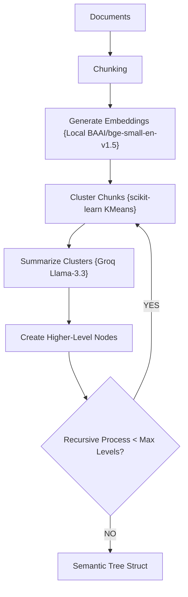
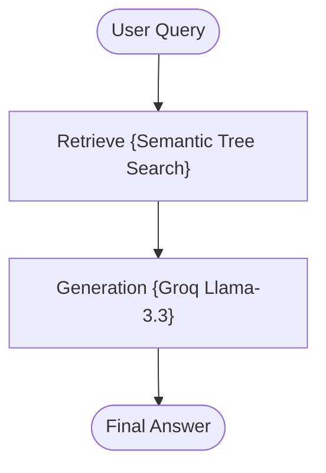

# RAPTOR RAG using LangGraph + Groq + Recursive Hierarchical Summarization

A stateful, zero-cost, and production-structured implementation of the **Recursive Abstractive Processing for Tree-Organized Retrieval (RAPTOR RAG)** pattern.

---

## 📖 What is RAPTOR RAG?

Standard RAG architectures retrieve static, flat text chunks matching a user query. While highly effective for simple fact lookups, flat retrieval fails when addressing queries that require a **global document understanding**, multi-hop reasoning, thematic summarization, or synthesis across very long document scopes.

**RAPTOR RAG** resolves this by constructing a **hierarchical semantic abstraction tree** over documents:
1.  **Clustering**: Recursively groups semantically related document chunks using KMeans.
2.  **Abstractive Summarization**: Runs cluster-level summarization via LLM to generate high-level "meta-nodes".
3.  **Recursive Tree Building**: Continues this clustering and summarization loop upwards until it reaches a root meta-summary.

This creates multi-level semantic layers:
```text
Root Summary (Global document theme)
   ├── Section Summaries (Chapter themes)
   │       ├── Chunk Summaries (Focused section context)
   │       └── Chunk Summaries
   └── Section Summaries
```
During retrieval, queries are matched against both raw chunks and higher-level summary nodes, ensuring the generator receives both precise details and thematic global context.

---

## 🏗️ Architecture & State Workflow

### 1. RAPTOR Ingestion Flow
Recursively clusters and summarizes document chunks to build a semantic abstraction tree:



### 2. RAPTOR Retrieval & Generation Flow
Leverages tree-organized retrieval to pull grounded evidence across multiple semantic layers:



---

## 📁 Project Structure

The codebase is highly modularized and clean:

```bash
12_RAPTOR_RAG/
│
├── app.py               # Main CLI interactive loop entrypoint
├── requirements.txt     # Local project packages
│
├── data/
│   └── sample.txt       # Seed raw data files
│
└── src/
    ├── __init__.py      # Package initialization
    ├── state.py         # GraphState schema using TypedDict
    ├── prompts.py       # Fact-grounded system prompts
    ├── ingestion.py     # Document loader and tree compilation trigger
    ├── tree_builder.py  # Recursive KMeans clustering and summarization algorithms
    ├── retriever.py     # Semantic tree recursive crawler and retriever
    └── graph.py         # LangGraph state-routing workflow compiler
```

---

## ⚡ Quick Start

### 1. Prerequisites
Ensure you have configured the **centralized `.env`** file in the root folder of the repository workspace:
```env
GROQ_API_KEY=your_actual_groq_api_key_here
```

### 2. Install Dependencies
Navigate to this directory and install the required modules:
```bash
pip install -r requirements.txt
```

### 3. Run the Sandbox
Boot the interactive application:
```bash
python app.py
```

---

## ⚖️ Strategic Advantage

| Metric | Traditional RAG | RAPTOR RAG |
| :--- | :--- | :--- |
| **Retrieval Focus** | Flat isolated chunks | **Hierarchical Semantic Tree** |
| **Global Theme Queries** | ❌ (Often fails due to localized search) | **✅ (Outstanding global document synthesis)** |
| **Abstraction Layers** | None | **Meta-summary nodes generated recursively** |
| **Recall Coverage** | Low semantic density | **High multi-level coverage** |
