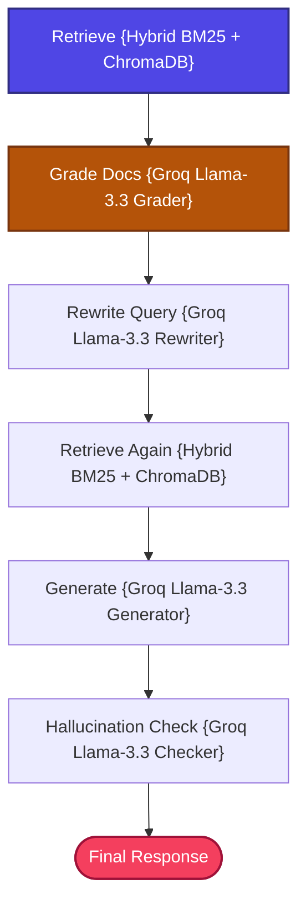

# Self-RAG with LangGraph + Groq + Hybrid Retrieval

A stateful, zero-cost, and production-structured implementation of the **Self-Reflective Retrieval-Augmented Generation (Self-RAG)** pattern.

---

## 📖 What is Self-RAG?

Standard RAG architectures execute a fixed pipeline: **Retrieve once and Generate**. If the initial retrieval is noisy, irrelevant, or empty, the model produces poor answers or hallucinations.

**Self-RAG** introduces **reflection and self-correction** into the generation loop:
1.  **Relevance Assessment**: Grades whether retrieved documents are relevant to the user query.
2.  **Adaptive Routing**: If context is graded poor, the pipeline rewrites the search query and retrieves fresh context.
3.  **Hallucination Protection**: Verifies whether the final response is strictly supported by facts inside the matched documents.

---

## 🏗️ Architecture & State Workflow



### Flow Breakdown
1.  **Retrieve**: Semantic vector + BM25 hybrid search retrieves relevant chunks.
2.  **Grade**: Groq `llama-3.3-70b-versatile` grades the text quality. If zero items are relevant and retries are under the threshold, it triggers **Query Rewriting** and fetches new documents.
3.  **Generate**: Generates a factual grounded response once sufficient context is located.
4.  **Verify**: Performs a self-hallucination check. If not supported, it rewrites the query and loops back to retrieve better sources.

---

## 📁 Project Structure

The codebase is highly modularized and clean:

```bash
13_Self_RAG/
│
├── app.py               # Main CLI interactive loop entrypoint
├── requirements.txt     # Local project packages
│
│
└── src/
    ├── __init__.py      # Package initialization
    ├── state.py         # GraphState schema using TypedDict
    ├── prompts.py       # Evaluation prompt templates
    ├── ingestion.py     # Document parser and Chroma indexer
    ├── retriever.py     # Hybrid BM25 + Vector retriever
    ├── graders.py       # LLM relevance and hallucination reflection nodes
    ├── query_rewriter.py# Query rewriting agent node
    └── graph.py         # Stategraph compiler and router
```

---

## ⚡ Quick Start

### 1. Prerequisites
Ensure you have configured the **centralized `.env`** file in the root folder of the repository workspace:
```env
GROQ_API_KEY=your_actual_groq_api_key_here
```

### 2. Install Dependencies
Navigate to this directory and install the required modules:
```bash
pip install -r requirements.txt
```

### 3. Run the Sandbox
Boot the interactive application:
```bash
python app.py
```

---

## 🔬 Core Grader Prompts

Self-RAG depends on two critical logical reflection gates:
1.  **Retrieval Sufficiency Grader**: Evaluates whether documents match the semantic context of the query (outputs `yes` or `no`).
2.  **Hallucination Grader**: Checks if the answer's assertions are backed by raw context values (outputs `yes` or `no`).
