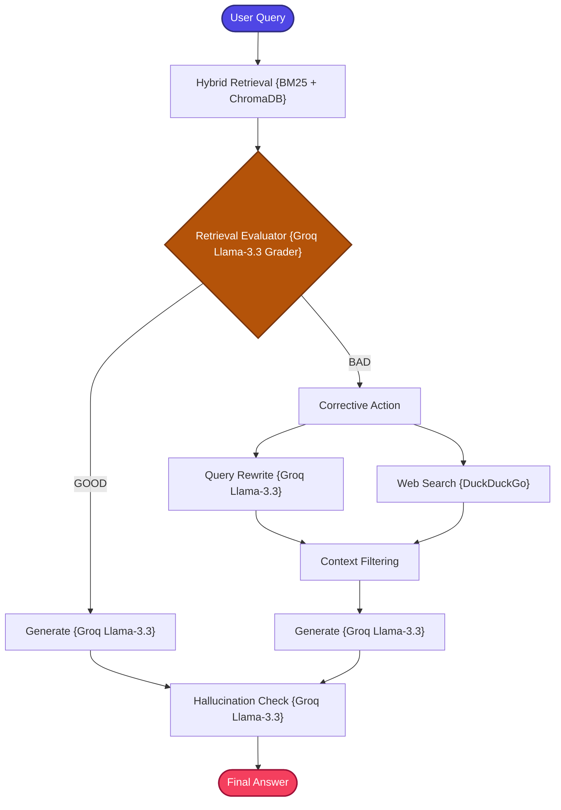

# Corrective RAG (CRAG)

A stateful, zero-cost, and production-structured implementation of the **Corrective Retrieval-Augmented Generation (CRAG)** pattern.

---

## 📖 What is Corrective RAG?

Corrective RAG (CRAG) extends Self-RAG with a critical capability: **external fallback retrieval**. When internal knowledge is insufficient, CRAG doesn't just rewrite the query — it reaches out to the open web for additional context.

Standard RAG architectures depend entirely on internal database records. When the internal index contains zero records matching a user query, the generation layer stalls, leading to factual silence or hallucinations. Self-RAG can rewrite and retry, but is still limited to the same internal knowledge base.

**CRAG** introduces a three-part correction mechanism:
1.  **Retrieval Quality Assessment**: Automatically grades retrieved documents for relevance.
2.  **Fallback Web Search**: If internal retrieval returns insufficient results, the pipeline rewrites the query and executes an external web search via DuckDuckGo.
3.  **Dynamic Context Repair**: Integrates high-quality web context alongside local vector store records before generation, creating a hybrid internal + external context.

```text
Retrieve → Grade → [GOOD: Generate] / [BAD: Rewrite + Web Search → Merge → Generate] → Hallucination Check → Answer
```

This architecture ensures the system can answer questions even when the internal knowledge base has gaps, making it significantly more resilient than Self-RAG.

---

## 🏗️ Architecture & State Workflow



### Flow Breakdown
1.  **Retrieve**: Queries a local hybrid search (BM25 lexical + vector dense).
2.  **Evaluate**: The evaluator node assesses the quality of the matches. 
    *   If **Sufficient (GOOD)**: Routes directly to **Generate**.
    *   If **Insufficient (BAD)**: Routes to **Rewrite**, followed by **Web Search** fallback.
3.  **Web Search**: Leverages a robust local DuckDuckGo search API to pull relevant snippet contexts and appends them to the context state as proper standard document structures.
4.  **Generate & Verify**: Groq `llama-3.3-70b-versatile` drafts a grounded response and runs a final hallucination loop check.

---

## ⚙️ Key Components

| Component | File | Role |
| :--- | :--- | :--- |
| **State Schema** | `src/state.py` | Defines `GraphState` TypedDict carrying question, context, answer, grading results, and web search flag |
| **Document Ingestion** | `src/Ingestion.py` | Loads and chunks documents, builds the ChromaDB vector index |
| **Hybrid Retriever** | `src/retriever.py` | Combines BM25 keyword search and ChromaDB vector search for dual-engine internal retrieval |
| **Graders** | `src/graders.py` | LLM-powered evaluation: **Retrieval Quality Grader** (assesses document relevance) and **Hallucination Grader** (verifies answer factual support) |
| **Query Rewriter** | `src/query_rewriter.py` | LLM agent that reformulates the query to optimize it for external web search performance |
| **Web Search** | `src/web_search.py` | DuckDuckGo fallback query crawler — fetches real-time public web snippets and converts them to standard document structures |
| **Prompt Templates** | `src/prompts.py` | Grade and fallback prompt templates for evaluation and generation |
| **Workflow Graph** | `src/graph.py` | LangGraph stategraph compiler with conditional GOOD/BAD routing |
| **Application Entry** | `app.py` | Interactive CLI loop for querying the CRAG pipeline |

---

## 🔄 How It Works

1. **Document Ingestion** — Documents are loaded, chunked, and indexed into both ChromaDB (vector search) and BM25 (keyword search).

2. **Hybrid Retrieval** — The user's query triggers both BM25 and vector search, returning a combined set of candidate chunks from the internal knowledge base.

3. **Retrieval Quality Assessment** — Groq LLM grades the retrieved documents for relevance. The evaluator classifies the overall retrieval quality as GOOD or BAD.

4. **Conditional Routing**:
   - **GOOD Path**: Retrieved context is sufficient → proceed directly to generation.
   - **BAD Path**: Retrieved context is insufficient → trigger corrective action.

5. **Corrective Action (BAD Path)**:
   - **Query Rewriting**: The LLM reformulates the query, removing domain-specific jargon and optimizing it for public search engines.
   - **Web Search**: DuckDuckGo fetches real-time web snippets for the rewritten query.
   - **Context Merging**: Web results are merged with any partially relevant local results to form a comprehensive context.

6. **LLM Generation** — The assembled context (local, web, or both) is sent to Groq's `llama-3.3-70b-versatile` for answer generation.

7. **Hallucination Verification** — The generated answer is checked against the source context to ensure factual support.

---

## 📁 Project Structure

```bash
14_Corrective_RAG/
│
├── app.py               # Main CLI interactive loop entrypoint
├── requirements.txt     # Local project packages
│
│
└── src/
    ├── __init__.py      # Package initialization
    ├── state.py         # GraphState schema using TypedDict
    ├── prompts.py       # Grade and fallback prompt templates
    ├── Ingestion.py     # Document parser and Chroma indexer
    ├── retriever.py     # Hybrid BM25 + Vector retriever
    ├── graders.py       # Grounding evaluation reflections
    ├── web_search.py    # DuckDuckGo fallback query crawler
    ├── query_rewriter.py# Query rewriting agent node
    └── graph.py         # Stategraph compiler and router
```

---

## ✅ Advantages

- **External Fallback**: Unlike Self-RAG, CRAG can escape the limitations of the internal knowledge base by reaching out to the web.
- **Hybrid Internal + External Context**: Merges local database knowledge with real-time web information for comprehensive answers.
- **Quality-Gated Routing**: Only triggers the expensive web search fallback when internal retrieval is actually insufficient.
- **Hallucination Protection**: Post-generation verification ensures factual grounding regardless of the context source.
- **Resilient to Knowledge Gaps**: Questions about current events, missing documentation, or out-of-domain topics can still be answered.

## ⚠️ Limitations

- **Network Dependency**: Web search requires internet access, introducing latency and potential failure points.
- **Web Content Quality**: DuckDuckGo snippets may contain irrelevant, outdated, or misleading information.
- **Higher Latency on BAD Path**: The corrective path (rewrite + web search + merge) adds significant processing time.
- **Multiple LLM Calls**: Grading + rewriting + generation + hallucination check = 4+ LLM invocations per question.
- **One-Shot Correction**: The current implementation executes the corrective action once — if the web search also fails, there is no further fallback.

---

## 🎯 Ideal Use Cases

- **Mixed Knowledge Domains** — Questions that may span internal documentation and general public knowledge.
- **Evolving Knowledge Bases** — Systems where the internal index may not yet contain recently added information.
- **Customer Support** — Handling queries that go beyond the product documentation into general troubleshooting.
- **News & Current Events QA** — Applications where users ask about recent events not yet in the internal database.
- **Research Assistants** — Tools that need to supplement internal papers with the latest public research.

---

## ⚖️ Comparison with Related Patterns

| Feature | Standard RAG | Self-RAG | Corrective RAG (CRAG) |
| :--- | :---: | :---: | :---: |
| **Hybrid Retrieval** | ❌ | ✅ | **✅** |
| **Query Rewriting** | ❌ | ✅ | **✅** |
| **Grounding Verification** | ❌ | ✅ | **✅** |
| **Retrieval Assessment** | ❌ | ❌ | **✅** |
| **External Web Fallback** | ❌ | ❌ | **✅** |
| **Context Integration** | Static | Stateful Loop | **Dynamic Hybrid Repair** |
