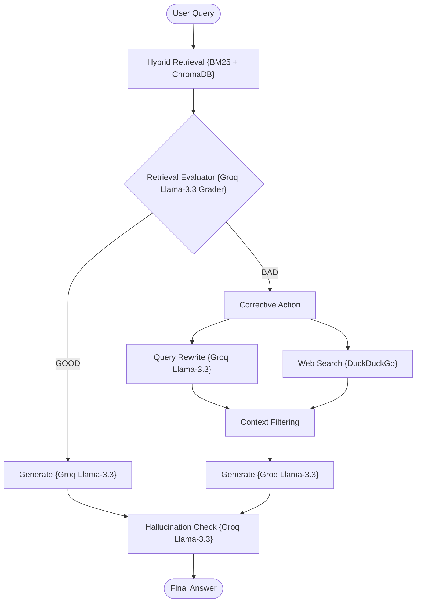

# Corrective RAG (CRAG) using LangGraph + Groq + Hybrid Retrieval

A stateful, zero-cost, and production-structured implementation of the **Corrective Retrieval-Augmented Generation (CRAG)** pattern.

---

## 📖 What is Corrective RAG (CRAG)?

Standard RAG architectures depend entirely on internal database records. When the internal index contains zero records matching a user query, the generation layer stalls, leading to factual silence or hallucinations.

**Corrective RAG (CRAG)** fixes this vulnerability by introducing **external correction fallbacks**:
1.  **Retrieval Quality Assessment**: Automatically assesses retrieved documents.
2.  **Fallback Web Search**: If internal retrieval returns insufficient or low-relevance results, the pipeline rewrites the query and executes an external web search.
3.  **Dynamic Context Repair**: Automatically integrates high-quality public web context alongside local vector store records before calling generation.

---

## 🏗️ Architecture & State Workflow



### Flow Breakdown
1.  **Retrieve**: Queries a local hybrid search (BM25 lexical + vector dense).
2.  **Evaluate**: The evaluator node assesses the quality of the matches. 
    *   If **Sufficient (GOOD)**: Routes directly to **Generate**.
    *   If **Insufficient (BAD)**: Routes to **Rewrite**, followed by **Web Search** fallback.
3.  **Web Search**: Leverages a robust local DuckDuckGo search API to pull relevant snippet contexts and appends them to the context state as proper standard document structures.
4.  **Generate & Verify**: Groq `llama-3.3-70b-versatile` drafts a grounded response and runs a final hallucination loop check.

---

## 📁 Project Structure

The codebase is highly modularized and clean:

```bash
14_Corrective_RAG/
│
├── app.py               # Main CLI interactive loop entrypoint
├── requirements.txt     # Local project packages
│
├── data/
│   └── sample.txt       # Seed raw data files
│
└── src/
    ├── __init__.py      # Package initialization
    ├── state.py         # GraphState schema using TypedDict
    ├── prompts.py       # Grade and fallback prompt templates
    ├── Ingestion.py     # Document parser and Chroma indexer
    ├── retriever.py     # Hybrid BM25 + Vector retriever
    ├── graders.py       # Grounding evaluation reflections
    ├── web_search.py    # DuckDuckGo fallback query crawler
    ├── query_rewriter.py# Query rewriting agent node
    └── graph.py         # Stategraph compiler and router
```

---

## ⚡ Quick Start

### 1. Prerequisites
Ensure you have configured the **centralized `.env`** file in the root folder of the repository workspace:
```env
GROQ_API_KEY=your_actual_groq_api_key_here
```

### 2. Install Dependencies
Navigate to this directory and install the required modules:
```bash
pip install -r requirements.txt
```

### 3. Run the Sandbox
Boot the interactive application:
```bash
python app.py
```

---

## ⚖️ Capability Comparison Matrix

| Feature | Standard RAG | Self-RAG | Corrective RAG (CRAG) |
| :--- | :---: | :---: | :---: |
| **Hybrid Retrieval** | ❌ | ✅ | **✅** |
| **Query Rewriting** | ❌ | ✅ | **✅** |
| **Grounding Verification** | ❌ | ✅ | **✅** |
| **Local Retrieval Assessment** | ❌ | ❌ | **✅** |
| **External Fallback (Web Search)** | ❌ | ❌ | **✅** |
| **Context Integration** | Static | Stateful Loop | **Dynamic Hybrid Repair** |
