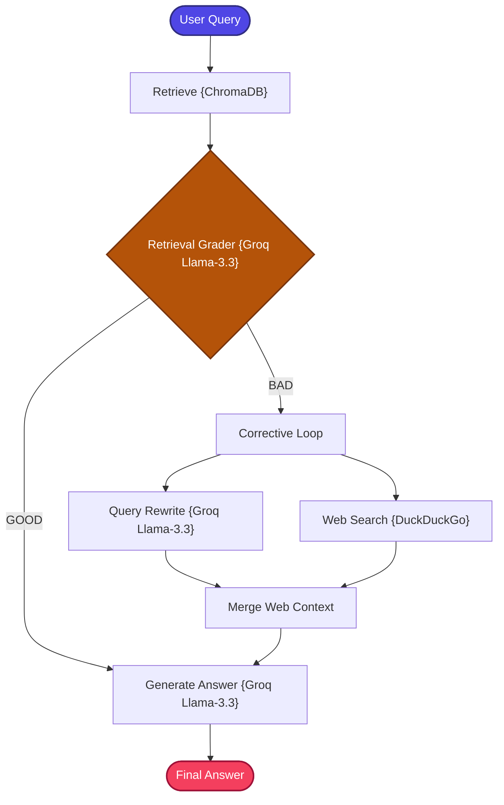

# Corrective Feedback RAG

A production-structured implementation of the **Corrective Feedback RAG** pattern — a self-healing, iterative retrieval architecture with closed-loop correction.

---

## 📖 What is Corrective Feedback RAG?

Corrective Feedback RAG builds on the Corrective RAG (CRAG) concept but introduces a fundamentally different correction model: **closed-loop iterative feedback** instead of one-shot feedforward correction.

While standard CRAG evaluates retrieved documents once and triggers a single corrective action, Corrective Feedback RAG implements a **bidirectional feedback loop** — evaluating both the retrieval quality and the context assembly quality across multiple correction cycles:

1.  **Self-Assessment**: Grades the semantic relevance of retrieved records.
2.  **Query Refinement**: Uses LLM to reconstruct the query, removing ambiguity or local-specific phrasing to optimize public search performance.
3.  **Web Fallback**: Retrieves real-time context from the public web via DuckDuckGo when local results are insufficient.
4.  **Iterative Context Healing**: Merges external information to resolve incomplete local indexes, with the ability to retry correction cycles.

### Corrective RAG vs. Corrective Feedback RAG

| Aspect | Corrective RAG (CRAG) | Corrective Feedback RAG |
| :--- | :--- | :--- |
| **Pipeline Nature** | Feedforward (one-shot correction) | Closed-loop (iterative evaluation & refinement) |
| **Feedback Mechanism** | Unidirectional | Bidirectional (evaluates docs + validates context) |
| **Refinement Cycles** | Single execution branch | Multi-turn correction based on quality scoring |
| **Failure Recovery** | Hard stop if first fallback is poor | Iterative fallback retry and alternative query generation |
| **Retrieval Type** | Hybrid (BM25 + Vector) | Single (Vector DB) |

---

## 🏗️ Architecture & State Workflow



---

## ⚙️ Key Components

| Component | File | Role |
| :--- | :--- | :--- |
| **State Schema** | `src/state.py` | Defines `GraphState` TypedDict carrying question, context, answer, grading results, and correction state |
| **Document Ingestion** | `src/ingestion.py` | Loads and chunks documents, builds the ChromaDB vector database |
| **Retriever** | `src/retriever.py` | Local ChromaDB retriever with integrated DuckDuckGo search fallback capability |
| **Evaluator** | `src/evaluator.py` | LLM-powered document grader (assesses retrieval relevance) and query rewriter (optimizes search terms for web search) |
| **Prompt Templates** | `src/prompts.py` | Prompt templates for grading, rewriting, and generation |
| **Workflow Graph** | `src/graph.py` | LangGraph node routing with conditional GOOD/BAD branching and iterative correction compilation |
| **Application Entry** | `app.py` | CLI entrypoint loop for interactive querying |

---

## 🔄 How It Works

1. **Document Ingestion** — Documents are loaded, chunked, and indexed into ChromaDB with dense embeddings.

2. **Vector Retrieval** — The user's query is searched against ChromaDB, returning the top relevant chunks from the local knowledge base.

3. **Retrieval Grading** — Groq LLM evaluates the semantic relevance of the retrieved documents against the user query. The result is classified as GOOD or BAD.

4. **Conditional Routing**:
   - **GOOD Path**: Retrieved context is relevant → proceed directly to answer generation.
   - **BAD Path**: Context is insufficient → enter the corrective feedback loop.

5. **Corrective Feedback Loop (BAD Path)**:
   - **Query Rewriting**: The LLM reconstructs the query to remove local-specific phrasing and optimize it for web search engines.
   - **Web Search**: DuckDuckGo retrieves real-time public web snippets for the rewritten query.
   - **Context Merging**: Web results are merged with available local context to create a comprehensive, healed context block.
   - **Iterative Refinement**: If context quality remains insufficient, the loop can re-evaluate and retry with further refined queries.

6. **LLM Generation** — The final context (local, web, or merged) is sent to Groq's `llama-3.3-70b-versatile` for answer generation.

---

## 📁 Project Structure

```bash
15_Corrective_Feedback_RAG/
├── app.py              # CLI Entrypoint loop
├── requirements.txt    # Phase dependencies
└── src/
    ├── __init__.py     # Package marker
    ├── ingestion.py    # Vector database builder (ChromaDB)
    ├── retriever.py    # Local retriever & DuckDuckGo search fallback
    ├── evaluator.py    # Document grader & query rewriter
    ├── prompts.py      # Prompt templates
    ├── state.py        # LangGraph State Schema (TypedDict)
    └── graph.py        # LangGraph node routing & compilation
```

---

## ✅ Advantages

- **Iterative Self-Healing**: Unlike one-shot CRAG, the closed-loop design allows multiple correction cycles for challenging queries.
- **Continuous Evaluation**: Both retrieval quality and context assembly are assessed, providing layered quality control.
- **Dynamic Query Refinement**: The LLM actively optimizes search queries across correction iterations, increasing the chance of finding relevant information.
- **Web Fallback Resilience**: Internet-augmented retrieval ensures the system can answer questions beyond the local knowledge base.
- **Simpler Retrieval Base**: Uses single vector retrieval (ChromaDB) as the starting point, with complexity added only when correction is needed.

## ⚠️ Limitations

- **Higher Latency on BAD Path**: Iterative correction cycles with LLM calls and web searches add significant processing time.
- **No Hallucination Check**: Unlike standard CRAG, this variant does not include a post-generation hallucination verification step.
- **Network Dependency**: Web search fallback requires internet access.
- **Iteration Overhead**: Multiple correction cycles consume more API tokens than single-pass or one-shot correction approaches.
- **Web Content Quality**: DuckDuckGo snippets may introduce noise or irrelevant information into the merged context.

---

## 🎯 Ideal Use Cases

- **Incomplete Knowledge Bases** — Systems where the internal index is known to have significant gaps that require web augmentation.
- **Dynamic Information Domains** — Topics where information changes frequently and local indexes may be stale.
- **Exploratory QA** — Users asking broad, open-ended questions where multiple retrieval attempts may be needed.
- **Customer-Facing Chatbots** — Assistants that need to handle unexpected queries beyond the documented FAQ.
- **Research Prototyping** — Quick research assistants that combine internal notes with live web information.

---

## ⚖️ Comparison with Standard RAG

| Feature | Standard RAG | Corrective Feedback RAG |
| :--- | :--- | :--- |
| **Trust Model** | Blind retrieval trust | **Continuous evaluation & validation** |
| **Handling Incomplete Data** | Halts or hallucinates | **Automatically triggers web search fallback** |
| **Search Query Quality** | Limited to original user input | **Dynamic LLM-based search rewriting** |
| **Architecture Routing** | Fixed sequential pipeline | **Adaptive conditional routing with iterative loops** |
| **Correction Style** | None | **Iterative retrieval correction** |
