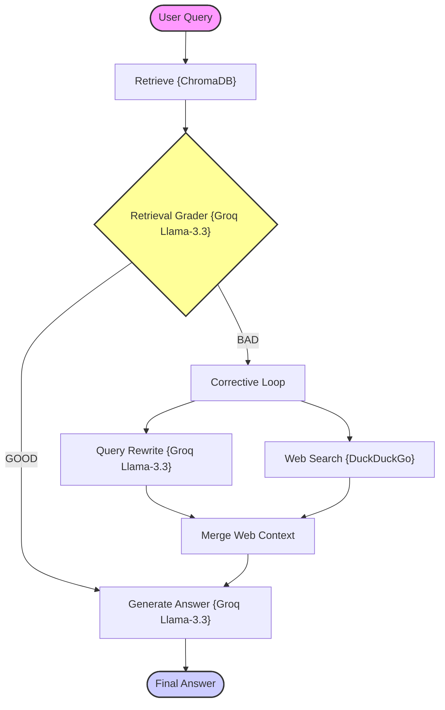

# Phase 15: Corrective Feedback RAG (CRAG)

Corrective Feedback RAG (CRAG) is a self-healing retrieval architecture designed to evaluate the relevance of local search results before calling the generation model. When local vector matches are graded as irrelevant or insufficient, CRAG initiates a corrective feedback loop: it automatically rewrites the search query and triggers a concurrent external web search fallback (DuckDuckGo) to fetch high-quality context records from the web.

---

## 🏗️ Architecture & State Workflow



---

## ⚡ Why Corrective Feedback RAG Matters

Standard RAG architectures suffer from a critical flaw: they blindly trust database retrievals. If the local database index contains zero relevant records, the system produces factual silence or hallucinations.

CRAG builds a robust safety-net:
1. **Self-Assessment:** Grades semantic relevance of retrieved records.
2. **Query Refinement:** Uses LLM to reconstruct the query, removing query ambiguity or specific local phrasing to optimize public search performance.
3. **Web Fallback:** Retrieves real-time context from the public web via DuckDuckGo.
4. **Context Healing:** Merges correct external information to resolve incomplete local indexes.

---

## 📊 Capability Comparison

### 1. Traditional RAG vs. Corrective Feedback RAG

| Feature | Traditional RAG | Corrective Feedback RAG (CRAG) |
| :--- | :--- | :--- |
| **Trust Model** | Blind retrieval trust | Continuous evaluation & validation |
| **Handling Incomplete Data** | Halts or hallucinates | Automatically triggers web search fallback |
| **Search Query Quality** | Limited to original user input | Dynamic LLM-based search rewriting |
| **Architecture Routing** | Fixed sequential pipeline | Adaptive conditional routing loops |

### 2. Standard Corrective RAG (CRAG) vs. Corrective Feedback RAG

| Feature | Corrective RAG (CRAG) | Corrective Feedback RAG |
| :--- | :--- | :--- |
| **Pipeline Nature** | Feedforward (One-shot correction) | Closed-Loop (Iterative evaluation & refinement) |
| **Feedback Mechanism** | Unidirectional (Evaluates retrieved docs once) | Bidirectional (Evaluates docs + validates generated answer) |
| **Refinement Cycles** | Single execution branch | Multi-turn correction based on quality scoring |
| **Failure Recovery** | Hard stop if first fallback is poor | Iterative fallback retry and alternative query generation |
| **Context Assembly** | Static merging of web search results | Dynamic filtering and self-critique contextual pruning |
| **Retrieval Type** | Hybrid | Single (Docs) |
| **Correction Path** | Query rewrite + Web search | Query rewrite + Web search + Retry retrieval |
| **Hallucination Check** | ✅ Yes | ❌ No |
| **Correction Style** | Post-generation correction | Iterative retrieval correction |

---

## 📁 Project Structure

```bash
15_Corrective_Feedback_RAG/
├── app.py              # CLI Entrypoint loop
├── requirements.txt    # Phase dependencies
├── data/
│   └── sample.txt      # Source text corpus
└── src/
    ├── __init__.py     # Package marker
    ├── ingestion.py    # Vector database builder (ChromaDB)
    ├── retriever.py    # Local retriever & DuckDuckGo search fallback
    ├── evaluator.py    # Document grader & query rewriter
    ├── prompts.py      # Prompt templates
    ├── state.py        # LangGraph State Schema (TypedDict)
    └── graph.py        # LangGraph node routing & compilation
```

---

## 🚀 Quick Start Guide

### 1. Install Phase Dependencies
Make sure you have your virtual environment activated and run:
```bash
pip install -r requirements.txt
```

### 2. Configure Environment Variables
Ensure you have a `.env` file at the root of the **entire repository** (`RAG-Design-Patterns/.env`) containing your credentials:
```env
GROQ_API_KEY=your_groq_api_key
```

### 3. Run the Application
Execute the interactive console application:
```bash
python app.py
```

### 4. Sample Queries to Test
Try asking the engine:
* `"What is CRAG?"` (Will grade as GOOD and generate locally).
* `"Who won the latest Monaco Grand Prix?"` (Will grade as BAD, rewrite the query, run DuckDuckGo fallback web search, and generate using external web context).
