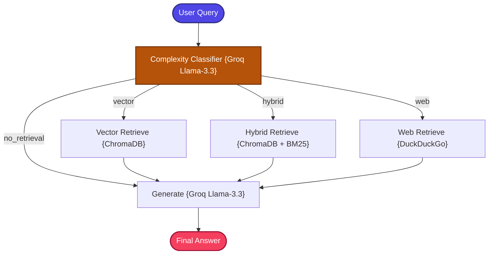

# Adaptive RAG

A production-grade implementation of the **Adaptive RAG (Dynamic Retrieval Routing)** pattern that intelligently selects the optimal retrieval strategy per query.

---

## 📖 What is Adaptive RAG?

Adaptive RAG introduces **intelligent query routing** to the RAG pipeline, solving a fundamental inefficiency: traditional RAG systems execute the same retrieval strategy for every question, regardless of whether it actually needs retrieval at all.

Consider these different query types:
- `"What is 2 + 2?"` — Doesn't need any retrieval. The LLM knows this.
- `"What is LangGraph?"` — Needs local vector search against the knowledge base.
- `"How does ReAct differ from Agentic RAG?"` — Needs comprehensive hybrid search for multi-concept comparison.
- `"Latest Groq model release?"` — Needs real-time web search for current information.

Standard RAG blindly runs vector search for all of these, wasting compute, increasing latency, and risking injecting irrelevant context into questions the LLM already knows the answer to.

**Adaptive RAG** solves this by adding an LLM-powered **complexity classifier** at the front of the pipeline that analyzes each incoming query and dynamically routes it to the optimal retrieval strategy:

1.  **`no_retrieval`** — LLM answers from internal parametric knowledge directly (no retrieval step).
2.  **`vector`** — Dense semantic search against the local ChromaDB index.
3.  **`hybrid`** — Combined vector + BM25 keyword retrieval for comprehensive coverage.
4.  **`web`** — Real-time DuckDuckGo search for fresh, current information.

---

## 🏗️ Architecture & State Workflow



---

## ⚙️ Key Components

| Component | File | Role |
| :--- | :--- | :--- |
| **State Schema** | `src/state.py` | Defines `GraphState` TypedDict carrying question, route classification, context, and answer |
| **Document Ingestion** | `src/ingestion.py` | Loads and chunks documents, builds the ChromaDB vector database |
| **Query Router** | `src/router.py` | LLM-based query complexity classifier — analyzes the incoming query and outputs one of: `no_retrieval`, `vector`, `hybrid`, or `web` |
| **Multi-Strategy Retrievers** | `src/retrievers.py` | Implements three retrieval strategies: ChromaDB vector search, hybrid BM25 + vector search, and DuckDuckGo web search |
| **Prompt Templates** | `src/prompts.py` | Prompt templates for the complexity classifier and fact-grounded generation |
| **Workflow Graph** | `src/graph.py` | LangGraph node routing with conditional edges dispatching to the appropriate retriever based on classifier output |
| **Application Entry** | `app.py` | CLI entrypoint loop for interactive querying |

---

## 🔄 How It Works

1. **Document Ingestion** — Documents are loaded, chunked, and indexed into both ChromaDB (for vector search) and an in-memory BM25 index (for keyword search).

2. **Query Classification** — When a user submits a question, it is first sent to Groq's LLM acting as a complexity classifier. The classifier analyzes the query's nature and selects the optimal retrieval route.

3. **Dynamic Routing** — Based on the classification:
   - **`no_retrieval`**: Skip all retrieval. The query is sent directly to the LLM for generation from parametric knowledge.
   - **`vector`**: Execute a ChromaDB semantic search to find conceptually similar documents.
   - **`hybrid`**: Execute both BM25 keyword search and ChromaDB vector search for maximum coverage.
   - **`web`**: Execute a DuckDuckGo search for real-time information from the public web.

4. **Context Assembly** — Retrieved documents (if any) are formatted as structured context.

5. **LLM Generation** — The context (or empty context for `no_retrieval`) and user query are sent to Groq's `llama-3.3-70b-versatile` for answer generation.

---

## 📁 Project Structure

```bash
16_Adaptive_RAG/
├── app.py              # CLI Entrypoint loop
├── requirements.txt    # Phase dependencies
└── src/
    ├── __init__.py     # Package marker
    ├── ingestion.py    # Vector database builder (ChromaDB)
    ├── router.py       # LLM-based query complexity classifier
    ├── retrievers.py   # Vector / Hybrid BM25 / Web DuckDuckGo retrievers
    ├── prompts.py      # Prompt templates
    ├── state.py        # LangGraph State Schema (TypedDict)
    └── graph.py        # LangGraph node routing & compilation
```

---

## ✅ Advantages

- **Cost Efficient**: Skips retrieval entirely for simple queries, saving compute and API costs.
- **Lower Average Latency**: Simple questions bypass the retrieval step, reducing response time significantly.
- **Multi-Strategy Coverage**: Complex queries get the best retrieval strategy, while simple queries get the fastest path.
- **Prevents Context Pollution**: Avoids injecting irrelevant retrieved context into queries the LLM already knows how to answer.
- **Real-Time Capability**: Web search route handles current events and fresh information without infrastructure changes.

## ⚠️ Limitations

- **Classifier Accuracy**: The quality of routing depends entirely on the LLM classifier's ability to correctly assess query complexity.
- **Misrouting Risk**: A misclassified query (e.g., routing a knowledge-base question to `no_retrieval`) produces incorrect or hallucinated answers.
- **Additional LLM Call**: The classification step adds an extra LLM invocation to every query, even when the routing is obvious.
- **No Self-Correction**: If the selected route produces poor results, there is no fallback to try a different strategy.
- **Binary Classification Limits**: Some queries may benefit from multiple strategies simultaneously, but the router selects only one.

---

## 🎯 Ideal Use Cases

- **Mixed-Intent Chat Interfaces** — Applications where users ask both trivial and complex questions in the same session.
- **Cost-Sensitive Deployments** — Environments where minimizing API calls and compute usage is a priority.
- **Multi-Domain Assistants** — Assistants serving diverse query types (general knowledge, domain-specific, current events).
- **Enterprise Chatbots** — Internal tools where most questions are simple (HR policies, office info) but some require deep retrieval.
- **Latency-Sensitive Applications** — Systems where fast response times for simple queries are as important as accuracy for complex ones.

---

## 🔀 Query Routing Examples

| Query | Route | Strategy |
| :--- | :--- | :--- |
| `"What is 2 + 2?"` | `no_retrieval` | LLM answers directly |
| `"What is LangGraph?"` | `vector` | ChromaDB semantic search |
| `"How does ReAct differ from Agentic RAG?"` | `hybrid` | Vector + BM25 combined |
| `"Latest Groq model release?"` | `web` | DuckDuckGo live search |

---

## ⚖️ Comparison with Standard RAG

| Feature | Standard RAG | Adaptive RAG |
| :--- | :--- | :--- |
| **Retrieval Strategy** | Always vector search | **Dynamically selected per query** |
| **Simple Query Handling** | Over-retrieves (wastes compute) | **Skips retrieval entirely** |
| **Real-Time Queries** | Misses current information | **Routes to live web search** |
| **Latency** | Higher (always retrieves) | **Lower average (skips when unnecessary)** |
| **Cost Efficiency** | Fixed pipeline cost | **Optimized per-query cost** |
| **Retrieval Coverage** | Single strategy | **Multi-strategy adaptive routing** |
