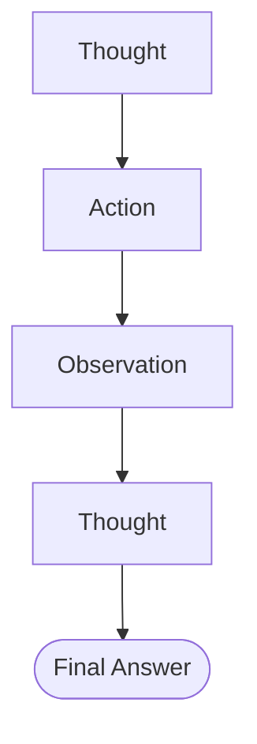
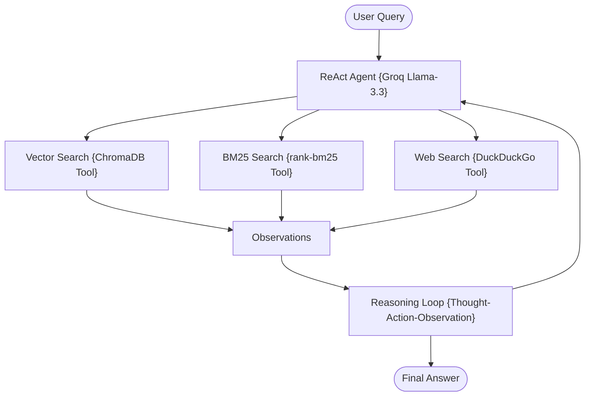

# ReAct RAG using LangGraph + Groq + Tool-Using Agent

A stateful, zero-cost, and production-structured implementation of the **Reasoning and Acting Retrieval-Augmented Generation (ReAct RAG)** pattern.

---

## 📖 What is ReAct RAG?

Traditional RAG architectures follow a rigid, pre-defined execution path: **Retrieve → Generate**. However, complex or multi-step questions frequently require planning, iterative search adjustments, external lookups, or self-guided reasoning loops.

**ReAct RAG** transitions RAG from a static pipeline into an autonomous **reasoning agent**. Based on the ReAct framework, the agent dynamically decides when, how, and which search engines to query by executing an iterative loop:

```text
Thought → Action → Observation → Thought
```

### Key Capabilities
*   **Iterative Reasoning**: The agent decomposes complex user prompts into sub-tasks.
*   **Dynamic Tool Selection**: Decides at runtime to use semantic search, lexical search, or web search.
*   **Multi-Step Problem Solving**: Uses results from one tool search to reformulate subsequent searches.

---

## 🏗️ Architecture & State Workflow

### 1. ReAct Execution Loop
The core cognitive architecture executes a stateful loop until it reaches a final answer:



### 2. ReAct RAG Tool Architecture
The agent dynamically routes workflows through dedicated search tools:



---

## 📁 Project Structure

The codebase is highly modularized and clean:

```bash
17_ReAct_RAG/
│
├── app.py               # Main CLI interactive loop entrypoint
├── requirements.txt     # Local project packages
│
├── data/
│   └── sample.txt       # Seed raw data files
│
└── src/
    ├── __init__.py      # Package initialization
    ├── state.py         # GraphState schema using TypedDict
    ├── prompts.py       # Fact-grounded system prompts
    ├── ingestion.py     # Document parser and Chroma indexer
    ├── tools.py         # Vector search, BM25, and Web search tool definitions
    └── graph.py         # Prebuilt LangGraph ReAct agent compiler
```

---

## ⚡ Quick Start

### 1. Prerequisites
Ensure you have configured the **centralized `.env`** file in the root folder of the repository workspace:
```env
GROQ_API_KEY=your_actual_groq_api_key_here
```

### 2. Install Dependencies
Navigate to this directory and install the required modules:
```bash
pip install -r requirements.txt
```

### 3. Run the Sandbox
Boot the interactive application:
```bash
python app.py
```

---

## ⚖️ Strategic Comparison

| Metric | Traditional RAG | ReAct RAG |
| :--- | :--- | :--- |
| **Execution Style** | Static Linear Pipeline | **Dynamic Stateful Agent** |
| **Retrieval Strategy** | Retrieve Once | **Multi-step, Self-guided Searches** |
| **Tool Integration** | Fixed database query | **Dynamic Tool Choice (Vector / BM25 / Web)** |
| **Multi-Hop Queries** | ❌ (Often fails or returns partial data) | **✅ (Outstanding multi-hop query resolution)** |
| **Planning Capabilities** | None | **Self-correcting Observation loops** |
