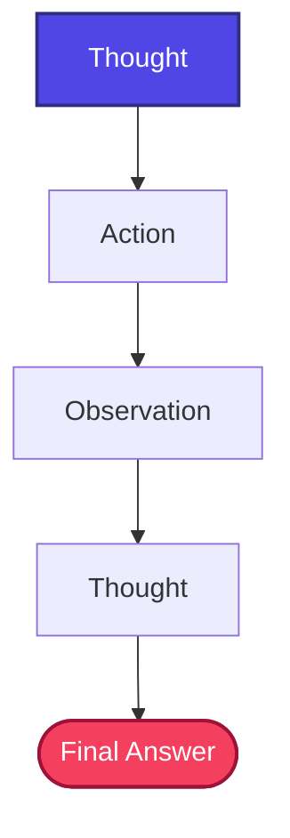
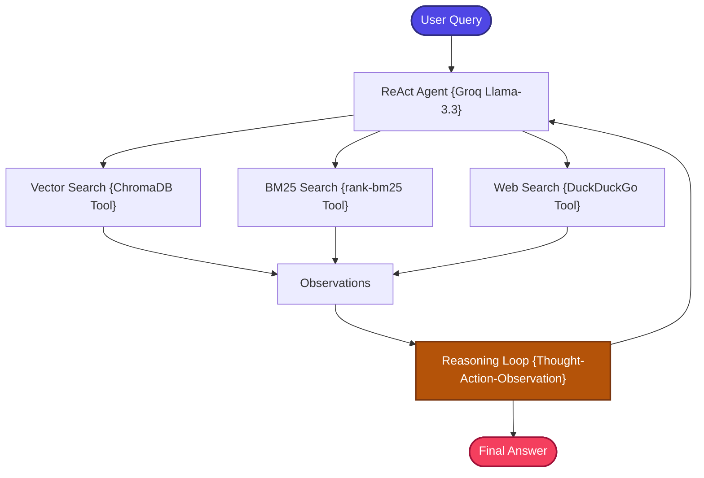

# ReAct RAG

A stateful, zero-cost, and production-structured implementation of the **Reasoning and Acting Retrieval-Augmented Generation (ReAct RAG)** pattern.

---

## 📖 What is ReAct RAG?

ReAct RAG transforms RAG from a static retrieval pipeline into an **autonomous reasoning agent** capable of planning, iterating, and self-correcting its search strategy in real time.

Traditional RAG follows a rigid, pre-defined execution path: **Retrieve → Generate**. But complex or multi-step questions frequently require planning, iterative search adjustments, external lookups, or self-guided reasoning loops that a fixed pipeline cannot handle.

**ReAct RAG** is based on the ReAct (Reasoning + Acting) framework, where the agent executes an iterative cognitive loop:

```text
Thought → Action → Observation → Thought → ... → Final Answer
```

At each iteration:
- **Thought**: The agent reasons about what information it still needs and which tool to use next.
- **Action**: The agent selects and invokes a specific search tool (vector search, keyword search, or web search).
- **Observation**: The agent observes the tool's results and incorporates them into its reasoning.

This loop continues until the agent determines it has sufficient information to produce a final answer. The key insight is that the **agent decides at runtime** which tools to use and how many iterations to perform — no fixed pipeline.

### Key Capabilities
- **Iterative Reasoning**: Decomposes complex user prompts into sub-tasks and addresses each one.
- **Dynamic Tool Selection**: Decides at runtime whether to use semantic search, lexical search, or web search.
- **Multi-Step Problem Solving**: Uses results from one search to reformulate subsequent searches.

---

## 🏗️ Architecture & State Workflow

### 1. ReAct Execution Loop
The core cognitive architecture executes a stateful loop until it reaches a final answer:



### 2. ReAct RAG Tool Architecture
The agent dynamically routes workflows through dedicated search tools:



---

## ⚙️ Key Components

| Component | File | Role |
| :--- | :--- | :--- |
| **State Schema** | `src/state.py` | Defines `GraphState` TypedDict carrying messages, agent scratchpad, and intermediate observations |
| **Document Ingestion** | `src/ingestion.py` | Loads and chunks documents, builds the ChromaDB vector index and BM25 index |
| **Tool Definitions** | `src/tools.py` | Defines three LangChain-compatible tools: **Vector Search** (ChromaDB), **BM25 Search** (rank-bm25), and **Web Search** (DuckDuckGo) — each callable by the ReAct agent |
| **Prompt Templates** | `src/prompts.py` | System prompts that instruct the agent on the ReAct reasoning format and available tools |
| **Workflow Graph** | `src/graph.py` | Builds the LangGraph workflow using `create_react_agent` prebuilt agent, connecting the LLM with the tool set |
| **Application Entry** | `app.py` | Interactive CLI loop for querying the ReAct agent |

---

## 🔄 How It Works

1. **Document Ingestion** — Documents are loaded, chunked, and indexed into both ChromaDB (vector search) and an in-memory BM25 index (keyword search).

2. **Agent Initialization** — The ReAct agent is created using LangGraph's `create_react_agent` with Groq's `llama-3.3-70b-versatile` and the three search tools.

3. **Reasoning Loop** — When a user submits a question:
   - **Thought 1**: The agent analyzes the question and decides which tool to invoke first.
   - **Action 1**: The agent calls the selected tool (e.g., Vector Search).
   - **Observation 1**: The tool returns results, which the agent examines.
   - **Thought 2**: The agent evaluates whether the results are sufficient or whether additional searches are needed.
   - **Action 2** (if needed): The agent invokes another tool (e.g., Web Search) to fill gaps.
   - This loop continues until the agent has sufficient evidence.

4. **Answer Generation** — Once the agent determines it has enough information, it synthesizes a final answer from all accumulated observations.

5. **Response Delivery** — The final answer is returned to the user through the CLI.

---

## 📁 Project Structure

```bash
17_ReAct_RAG/
│
├── app.py               # Main CLI interactive loop entrypoint
├── requirements.txt     # Local project packages
│
│
└── src/
    ├── __init__.py      # Package initialization
    ├── state.py         # GraphState schema using TypedDict
    ├── prompts.py       # Fact-grounded system prompts
    ├── ingestion.py     # Document parser and Chroma indexer
    ├── tools.py         # Vector search, BM25, and Web search tool definitions
    └── graph.py         # Prebuilt LangGraph ReAct agent compiler
```

---

## ✅ Advantages

- **Autonomous Decision-Making**: The agent independently decides which tools to use and in what order — no hardcoded retrieval strategy.
- **Multi-Step Reasoning**: Can decompose complex questions into sub-queries and search for each part independently.
- **Dynamic Tool Selection**: Chooses the most appropriate search engine (vector, keyword, or web) based on the question's nature.
- **Self-Correcting Iterations**: If initial search results are insufficient, the agent can reformulate and retry with different tools.
- **Prebuilt Agent Architecture**: Leverages LangGraph's `create_react_agent` for robust, well-tested agent execution.

## ⚠️ Limitations

- **Unpredictable Latency**: The number of reasoning iterations is determined at runtime, making response time variable and hard to predict.
- **Higher Token Usage**: Multiple thought-action-observation cycles consume significantly more LLM tokens than fixed pipelines.
- **Agent Reasoning Errors**: The LLM may make poor tool selection decisions, use tools incorrectly, or enter reasoning loops.
- **Tool Definition Sensitivity**: The agent's effectiveness depends heavily on how clearly the tools are described in the system prompt.
- **Debugging Complexity**: The non-deterministic reasoning loop is harder to debug than a deterministic pipeline.

---

## 🎯 Ideal Use Cases

- **Complex Multi-Part Questions** — Queries requiring information from multiple sources or multiple search steps (e.g., "Compare X and Y and explain how they relate to Z").
- **Research Assistants** — Open-ended research tasks where the optimal search strategy isn't known in advance.
- **Technical Troubleshooting** — Debugging queries that require iteratively searching for related error messages, solutions, and documentation.
- **Exploratory Analysis** — Investigative questions where each answer leads to new follow-up queries.
- **Multi-Domain QA** — Questions spanning local knowledge, web resources, and specific keyword lookups.

---

## ⚖️ Comparison with Standard RAG

| Metric | Standard RAG | ReAct RAG |
| :--- | :--- | :--- |
| **Execution Style** | Static linear pipeline | **Dynamic stateful agent** |
| **Retrieval Strategy** | Retrieve once | **Multi-step, self-guided searches** |
| **Tool Integration** | Fixed database query | **Dynamic tool choice (Vector / BM25 / Web)** |
| **Multi-Hop Queries** | ❌ Often fails or returns partial data | **✅ Outstanding multi-hop resolution** |
| **Planning Capabilities** | None | **Self-correcting observation loops** |
| **Latency** | Predictable | Variable (depends on iterations) |
