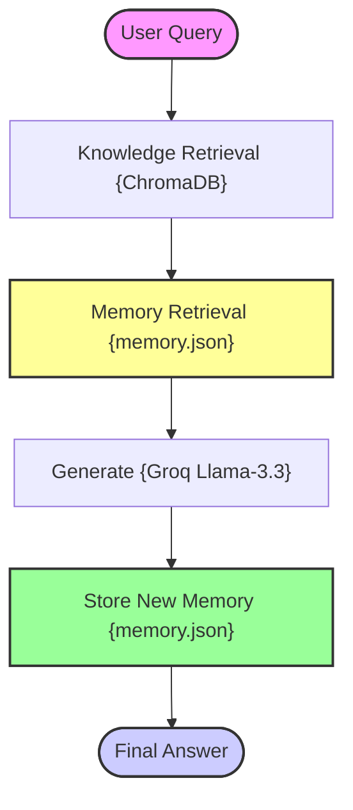

# Phase 18: Memory-Augmented RAG (Long-Term Conversational Memory)

Memory-Augmented RAG extends standard RAG by adding a **persistent long-term memory layer**. Instead of treating each conversation turn independently, it extracts important facts from every interaction, stores them to disk, and retrieves relevant memories in future queries — enabling personalized, contextually aware AI responses that persist across sessions.

---

## 🏗️ Architecture & State Workflow



---

## 🧠 Memory Types

| Memory Type | Purpose | Implementation |
| :--- | :--- | :--- |
| **Short-Term** | Current conversation window | LangGraph state |
| **Long-Term** | Persistent across sessions | `memory/memory.json` |
| **Episodic** | Past interaction facts | Extracted by Groq LLM |
| **Semantic** | Knowledge base facts | ChromaDB retrieval |
| **Working** | Temporary reasoning context | Combined prompt context |

---

## ⚡ Why Memory-Augmented RAG Matters

Traditional RAG forgets everything after each session:

```text
Session 1: "My favorite database is Neo4j."
Session 2: "What graph database should I use?"
→ Traditional RAG: No memory, generic answer
→ Memory RAG:     Remembers Neo4j preference, personalized answer
```

Memory-Augmented RAG builds persistent context over time — the longer users interact, the more personalized the responses become.

---

## 📊 Capability Comparison

| Feature | Traditional RAG | Memory-Augmented RAG |
| :--- | :--- | :--- |
| **State** | Stateless | Persistent across sessions |
| **Personalization** | None | Deep user-specific context |
| **Continuity** | Session-only | Long-term memory |
| **Context** | Document chunks only | Documents + memories |
| **Use Cases** | Basic QA | AI Assistants, Copilots, Agents |

---

## 💾 Memory Flow Example

```text
User: "My favorite database is Neo4j."
         ↓ LLM extracts memory
Store: "User prefers Neo4j as their graph database."
         ↓ (persisted to memory/memory.json)

Later query: "What graph database should I use?"
         ↓ Memory retrieved
Context: "User prefers Neo4j" → Personalized answer generated
```

---

## 📁 Project Structure

```bash
18_Memory_Augmented_RAG/
├── app.py                  # CLI Entrypoint loop
├── requirements.txt        # Phase dependencies
├── memory/
│   └── memory.json         # Persistent long-term memory store
├── data/
│   └── sample.txt          # Source text corpus
└── src/
    ├── __init__.py         # Package marker
    ├── ingestion.py        # Vector database builder (ChromaDB)
    ├── memory_store.py     # JSON-based persistent memory I/O
    ├── retriever.py        # ChromaDB dense retriever
    ├── memory_manager.py   # Memory retrieval, extraction, and update
    ├── prompts.py          # Dual-context (knowledge + memory) prompt
    ├── state.py            # LangGraph State Schema (TypedDict)
    └── graph.py            # LangGraph 4-node memory-augmented workflow
```

---

## 🚀 Quick Start Guide

### 1. Install Phase Dependencies
```bash
pip install -r requirements.txt
```

### 2. Configure Environment Variables
Ensure you have a `.env` file at the root of the **entire repository** (`RAG-Design-Patterns/.env`):
```env
GROQ_API_KEY=your_groq_api_key
```

### 3. Run the Application
```bash
python app.py
```

### 4. Sample Conversation Flow
```text
Session 1:
  Ask: "My favorite database is Neo4j."
  → Memory stored: "User prefers Neo4j."

Session 2 (restart app):
  Ask: "What graph database should I use?"
  → Memory retrieved → Personalized answer referencing Neo4j
```

---

## 🔧 Production Upgrade Path

| Current | Production Upgrade |
| :--- | :--- |
| `memory.json` (JSON file) | Redis, PostgreSQL, MongoDB |
| Keyword matching | Semantic vector search over memories |
| Flat memory list | Episodic memory with timestamps + importance scores |
| Simple extraction | Structured memory with entities, relations, preferences |
