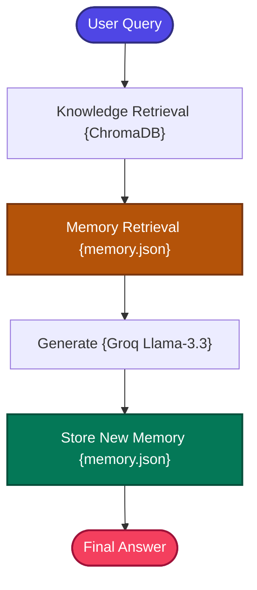

# Memory-Augmented RAG

A production-structured implementation of the **Memory-Augmented RAG (Long-Term Conversational Memory)** pattern that adds persistent personalization to retrieval-augmented generation.

---

## 📖 What is Memory-Augmented RAG?

Memory-Augmented RAG extends standard RAG by adding a **persistent long-term memory layer** that accumulates knowledge about users across conversations.

Traditional RAG systems are stateless — every conversation turn is treated independently. The system forgets everything after each session:

```text
Session 1: "My favorite database is Neo4j."
Session 2: "What graph database should I use?"
→ Standard RAG: No memory, gives a generic answer
→ Memory RAG:   Remembers Neo4j preference, gives a personalized answer
```

**Memory-Augmented RAG** solves this by adding a memory pipeline alongside the standard retrieval pipeline:
1.  **Memory Extraction**: After each interaction, the LLM extracts important facts (preferences, decisions, context) from the conversation.
2.  **Memory Storage**: Extracted memories are persisted to disk (`memory.json`) so they survive across sessions.
3.  **Memory Retrieval**: Before generating an answer, relevant memories are retrieved and injected alongside the document context.
4.  **Dual-Context Generation**: The LLM generates answers informed by both knowledge base documents and user-specific memories.

The longer users interact with the system, the more personalized and contextually aware the responses become.

---

## 🏗️ Architecture & State Workflow



---

## ⚙️ Key Components

| Component | File | Role |
| :--- | :--- | :--- |
| **State Schema** | `src/state.py` | Defines `GraphState` TypedDict carrying question, knowledge context, memory context, and answer |
| **Document Ingestion** | `src/ingestion.py` | Loads and chunks documents, builds the ChromaDB vector database for knowledge retrieval |
| **Memory Store** | `src/memory_store.py` | JSON-based persistent memory I/O — handles reading and writing memory entries to `memory/memory.json` |
| **Memory Manager** | `src/memory_manager.py` | Orchestrates memory retrieval (finds relevant past memories), extraction (identifies new facts to remember), and update (persists new memories) |
| **Retriever** | `src/retriever.py` | ChromaDB dense retriever for document knowledge retrieval |
| **Prompt Templates** | `src/prompts.py` | Dual-context prompt template that integrates both knowledge base context and memory context |
| **Workflow Graph** | `src/graph.py` | LangGraph 4-node workflow: Knowledge Retrieve → Memory Retrieve → Generate → Store Memory |
| **Application Entry** | `app.py` | CLI entrypoint loop for interactive querying with persistent memory |

---

## 🔄 How It Works

1. **Document Ingestion** — Documents are loaded, chunked, and indexed into ChromaDB for knowledge base retrieval.

2. **Knowledge Retrieval** — The user's query is searched against ChromaDB, returning relevant document chunks from the knowledge base.

3. **Memory Retrieval** — The system searches the persistent memory store (`memory/memory.json`) for memories relevant to the current query. Matching is based on keyword overlap between the query and stored memory facts.

4. **Dual-Context Generation** — Both knowledge base context and relevant memories are compiled into a unified prompt. The LLM generates an answer informed by:
   - **Factual knowledge** from the document corpus.
   - **Personal context** from past user interactions.

5. **Memory Extraction** — After generating the response, the LLM extracts any new important facts from the current conversation turn (e.g., user preferences, decisions, or stated requirements).

6. **Memory Persistence** — Newly extracted memories are appended to `memory/memory.json` on disk, ensuring they are available in future sessions.

---

## 🧠 Memory Types

| Memory Type | Purpose | Implementation |
| :--- | :--- | :--- |
| **Short-Term** | Current conversation window | LangGraph state |
| **Long-Term** | Persistent across sessions | `memory/memory.json` |
| **Episodic** | Past interaction facts | Extracted by Groq LLM |
| **Semantic** | Knowledge base facts | ChromaDB retrieval |
| **Working** | Temporary reasoning context | Combined prompt context |

---

## 💾 Memory Flow Example

```text
User: "My favorite database is Neo4j."
         ↓ LLM extracts memory
Store: "User prefers Neo4j as their graph database."
         ↓ (persisted to memory/memory.json)

Later query: "What graph database should I use?"
         ↓ Memory retrieved
Context: "User prefers Neo4j" → Personalized answer generated
```

---

## 📁 Project Structure

```bash
18_Memory_Augmented_RAG/
├── app.py                  # CLI Entrypoint loop
├── requirements.txt        # Phase dependencies
├── memory/
│   └── memory.json         # Persistent long-term memory store
└── src/
    ├── __init__.py         # Package marker
    ├── ingestion.py        # Vector database builder (ChromaDB)
    ├── memory_store.py     # JSON-based persistent memory I/O
    ├── retriever.py        # ChromaDB dense retriever
    ├── memory_manager.py   # Memory retrieval, extraction, and update
    ├── prompts.py          # Dual-context (knowledge + memory) prompt
    ├── state.py            # LangGraph State Schema (TypedDict)
    └── graph.py            # LangGraph 4-node memory-augmented workflow
```

---

## ✅ Advantages

- **Persistent Personalization**: Responses improve over time as the system accumulates knowledge about the user's preferences and context.
- **Cross-Session Continuity**: Users don't need to repeat context — the system remembers past interactions across separate sessions.
- **Dual-Context Generation**: Combining knowledge base facts with personal memories produces more relevant, tailored answers.
- **Simple Persistence**: JSON-based storage makes the memory system easy to inspect, debug, and modify.
- **No External Database**: Memory storage uses flat files — no additional database infrastructure required.

## ⚠️ Limitations

- **Keyword-Based Memory Search**: Current memory retrieval uses simple keyword matching rather than semantic similarity, which may miss relevant memories phrased differently.
- **Memory Growth**: The flat JSON file grows unbounded over time, potentially impacting retrieval performance.
- **No Memory Prioritization**: All memories are treated equally — there is no importance scoring, decay, or recency weighting.
- **Extraction Accuracy**: The LLM may extract incorrect or overly broad facts from conversations.
- **Single-User Design**: The current implementation doesn't distinguish between different users — all memories are stored in a single file.

---

## 🎯 Ideal Use Cases

- **Personal AI Assistants** — Assistants that learn user preferences, working styles, and frequently asked topics over time.
- **Customer Support Copilots** — Tools that remember past customer interactions, previous issues, and stated preferences.
- **Learning Companions** — Educational assistants that track what a student has learned and adapt explanations accordingly.
- **Project Management Assistants** — Tools that accumulate context about project decisions, team preferences, and ongoing tasks.
- **Health & Wellness Coaches** — Applications that remember dietary preferences, fitness goals, and medical history.

---

## 🔧 Production Upgrade Path

| Current | Production Upgrade |
| :--- | :--- |
| `memory.json` (JSON file) | Redis, PostgreSQL, MongoDB |
| Keyword matching | Semantic vector search over memories |
| Flat memory list | Episodic memory with timestamps + importance scores |
| Simple extraction | Structured memory with entities, relations, preferences |

---

## ⚖️ Comparison with Standard RAG

| Feature | Standard RAG | Memory-Augmented RAG |
| :--- | :--- | :--- |
| **State** | Stateless | **Persistent across sessions** |
| **Personalization** | None | **Deep user-specific context** |
| **Continuity** | Session-only | **Long-term memory** |
| **Context Sources** | Document chunks only | **Documents + personal memories** |
| **Use Cases** | Basic QA | **AI Assistants, Copilots, Agents** |
