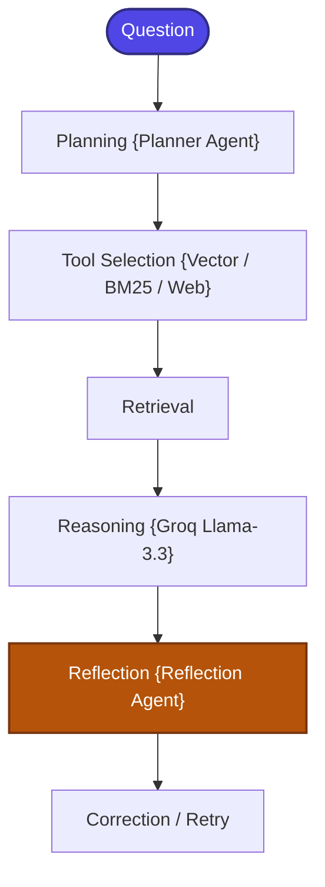
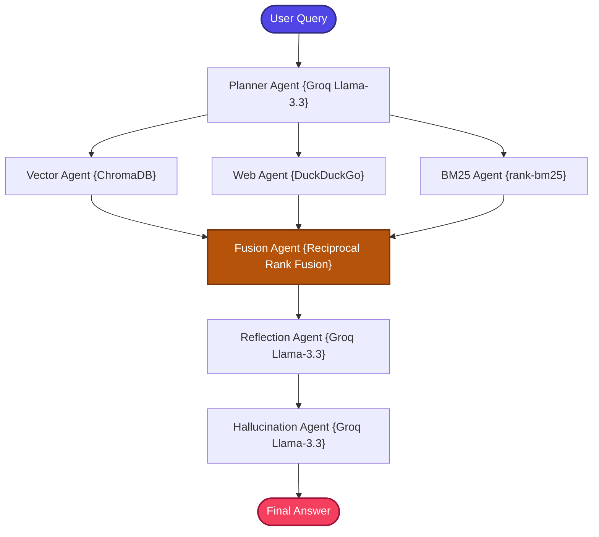

# Agentic RAG using LangGraph + Groq + Multi-Agent Retrieval System

A stateful, zero-cost, and production-structured implementation of the **Autonomous Agentic Retrieval-Augmented Generation (Agentic RAG)** pattern.

---

## 📖 What is Agentic RAG?

Standard RAG pipelines query a static retriever, inject results into a prompt, and generate an answer in a linear, blind execution. They lack the capacity to make planning choices, dynamically route queries based on domain, reflect on generation quality, or self-correct errors.

**Agentic RAG** transforms RAG from a passive data-delivery mechanism into a team of **collaborative, specialized agents** coordinated by a central plan:
1.  **Planner Agent**: Analyzes user questions to select the optimal search strategy (Vector DB, BM25 keyword index, Web crawler, or Hybrid).
2.  **Specialized retrievers**: Individual agents dedicated to querying a single source.
3.  **Reflection & Hallucination Agents**: Critique the answer grounding. If a generated answer fails verification, they trigger a retry loop, adjusting the query parameters dynamically.

---

## 🏗️ Architecture & State Workflow

### 1. Agentic Decision Flow
The system processes questions through planning, routing, tool execution, and reflective critique:



### 2. Multi-Agent RAG Architecture
Heterogeneous resources are coordinated under a fanned-out team of specialized agents:



---

## 📁 Project Structure

The codebase is highly modularized and clean:

```bash
19_Agentic_RAG/
│
├── app.py               # Main CLI interactive loop entrypoint
├── requirements.txt     # Local project packages
│
│
└── src/
    ├── __init__.py      # Package initialization
    ├── state.py         # GraphState schema using TypedDict
    ├── prompts.py       # Fact-grounded system prompts
    ├── ingestion.py     # Document parser and Chroma indexer
    ├── tools.py         # Vector, BM25, and Web search tool definitions
    ├── agents.py        # Planner, specialized vector/BM25/web, and reflection agents
    └── graph.py         # LangGraph state-routing workflow compiler
```

---

## ⚡ Quick Start

### 1. Prerequisites
Ensure you have configured the **centralized `.env`** file in the root folder of the repository workspace:
```env
GROQ_API_KEY=your_actual_groq_api_key_here
```

### 2. Install Dependencies
Navigate to this directory and install the required modules:
```bash
pip install -r requirements.txt
```

### 3. Run the Sandbox
Boot the interactive application:
```bash
python app.py
```

---

## ⚖️ Strategic Advantage

| Feature | Traditional RAG | Agentic RAG |
| :--- | :--- | :--- |
| **Pipeline Type** | Linear, pre-defined | **Dynamic, self-directed** |
| **Routing Decisions** | Static | **LLM Planner Agent routing** |
| **Task Delegation** | Monolithic retrieve | **Specialized agent delegation** |
| **Grounding Checks** | None | **Stateful Reflection Grader agent loops** |
| **Failsafe Correction** | None | **Self-guided correction retry logic** |
