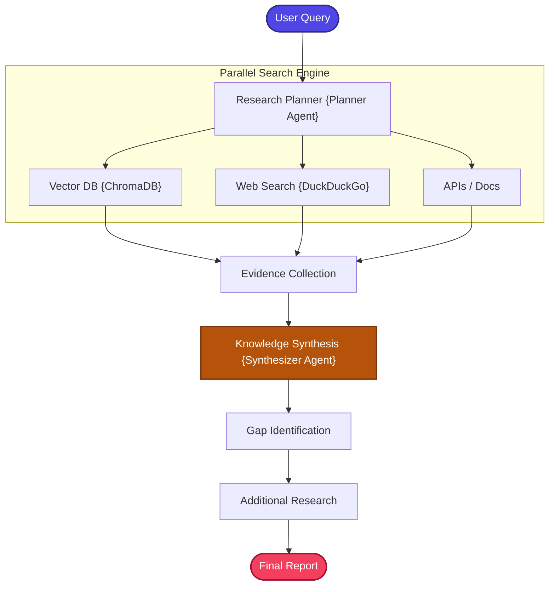

# Deep Research RAG

A highly stateful, production-structured, and zero-cost implementation of the **Deep Research Retrieval-Augmented Generation (Deep Research RAG)** pattern.

---

## 📖 What is Deep Research RAG?

Deep Research RAG is the most advanced and autonomous RAG pattern in this collection — the architecture behind modern **autonomous AI research agents** (such as those powering OpenAI Deep Research and Google Gemini Deep Research).

Standard RAG executes a linear, single-hop lookup to answer user queries:
```
Retrieve → Answer
```

But complex analysis queries require much more: multi-step reasoning, evidence synthesis across disparate sources, research planning, knowledge gap detection, and iterative investigation. A simple retrieve-and-answer pipeline fundamentally cannot handle questions like *"Provide a comprehensive analysis of how different RAG patterns handle hallucination reduction."*

**Deep Research RAG** transforms the RAG pipeline into a **structured, multi-step research investigation**:

1.  **Research Planning**: A central planner agent decomposes the complex target task into discrete, highly targeted sub-questions — essentially creating a research agenda.
2.  **Autonomous Investigation**: A multi-source researcher concurrently queries internal vector storage (ChromaDB) and the live web (DuckDuckGo) for each sub-question, gathering evidence from multiple perspectives.
3.  **Knowledge Synthesis**: A synthesizer agent combines all pieces of evidence into a highly formatted, multi-perspective analyst report with structured sections (Overview, Comparisons, Key Insights, Conclusions).

The output is not a simple text answer — it's a **structured research report**.

---

## 🏗️ Architecture & State Workflow

### 1. Agentic Decision Flow



### 2. State-Based Graph Schema

```
                      +-------------------+
                      |    planning_node  |
                      +---------+---------+
                                |
                                v
                      +-------------------+
                      |   research_node   |
                      +---------+---------+
                                |
                                v
                      +-------------------+
                      |   synthesis_node  |
                      +---------+---------+
                                |
                                v
                            [  END  ]
```

---

## ⚙️ Key Components

| Component | File | Role |
| :--- | :--- | :--- |
| **State Schema** | `src/state.py` | Defines `GraphState` TypedDict carrying question, research plan (sub-questions), gathered evidence, and final report |
| **Document Ingestion** | `src/ingestion.py` | Loads documents and builds the ChromaDB vector database for internal knowledge retrieval |
| **Retriever** | `src/retriever.py` | Dual-channel retrieval: vector search against ChromaDB and live web search via DuckDuckGo |
| **Research Planner** | `src/planner.py` | Uses Groq LLM to decompose the user's complex question into a structured list of targeted sub-questions that form the research agenda |
| **Researcher** | `src/researcher.py` | Executes the research plan: for each sub-question, concurrently queries both the vector database and web search, merging all evidence |
| **Synthesizer** | `src/synthesizer.py` | Compiles accumulated evidence from all sub-questions into a structured, formatted analyst report with multiple sections |
| **Prompt Templates** | `src/prompts.py` | Modularized prompts for the planner (sub-question generation) and synthesizer (report compilation) |
| **Application Entry** | `app.py` | Interactive CLI loop for deep research queries |

---

## 🔄 How It Works

1. **Document Ingestion** — Documents are loaded, chunked, and indexed into ChromaDB for internal knowledge retrieval.

2. **Research Planning** — The user's complex question is sent to the Planner Agent (Groq LLM), which breaks it down into 3-5 targeted sub-questions. Each sub-question addresses a specific aspect of the original query.

   ```text
   Original: "How do different RAG patterns handle hallucination?"
   Sub-Questions:
     1. "What retrieval techniques reduce hallucination?"
     2. "How does Self-RAG detect hallucination?"
     3. "What role do rerankers play in context quality?"
   ```

3. **Parallel Research** — For each sub-question, the Researcher concurrently:
   - Queries **ChromaDB** for relevant internal document chunks.
   - Queries **DuckDuckGo** for real-time public web information.
   - Collects and labels all evidence with its source.

4. **Evidence Accumulation** — All evidence from all sub-questions is accumulated into a comprehensive evidence corpus.

5. **Knowledge Synthesis** — The Synthesizer Agent processes the entire evidence corpus and generates a structured analyst report containing:
   - **Overview**: High-level summary of findings.
   - **Detailed Analysis**: Section-by-section coverage of each sub-question.
   - **Key Insights**: Cross-cutting observations and patterns.
   - **Conclusions**: Synthesized recommendations and takeaways.

6. **Report Delivery** — The formatted research report is presented to the user.

---

## 📁 Project Structure

```bash
20_Deep_Research_RAG/
│
├── app.py               # Main CLI interactive loop entrypoint
├── requirements.txt     # Local project packages
│
│
└── src/
    ├── __init__.py      # Package initialization
    ├── state.py         # GraphState schema using TypedDict
    ├── prompts.py       # Modularized prompts (Planner & Synthesizer)
    ├── ingestion.py     # Document loaders and Chroma vector database setup
    ├── retriever.py     # Vector retrieval and Live DuckDuckGo search wrappers
    ├── planner.py       # Orchestrates LLM research plan creation
    ├── researcher.py    # Merges vector DB evidence and web search results
    └── synthesizer.py   # Compiles accumulated insights into structured reports
```

---

## ✅ Advantages

- **Comprehensive Analysis**: Produces structured, multi-section research reports rather than simple text answers.
- **Question Decomposition**: Automatically breaks complex queries into manageable sub-questions, ensuring thorough coverage.
- **Multi-Source Evidence**: Combines internal knowledge base with live web search for comprehensive, up-to-date research.
- **Structured Output**: The report format (Overview → Analysis → Insights → Conclusions) provides clear, professional-grade output.
- **Scalable Research Depth**: The number of sub-questions can be adjusted to control research depth and breadth.

## ⚠️ Limitations

- **Highest Latency**: Multiple LLM calls (planning + per-sub-question research + synthesis) make this the slowest pattern in the collection.
- **Highest Token Usage**: The multi-step pipeline with parallel research and report synthesis consumes significantly more tokens than all other patterns.
- **Planning Quality**: The research quality depends heavily on the planner's ability to decompose the question into meaningful sub-questions.
- **Evidence Overload**: Large volumes of gathered evidence may overwhelm the synthesizer, leading to overly generic reports.
- **Not for Simple Questions**: The overhead of planning, research, and synthesis is unnecessary and wasteful for straightforward factual queries.

---

## 🎯 Ideal Use Cases

- **Market Research** — Comprehensive analysis of markets, competitors, and trends combining internal data with public information.
- **Technical Due Diligence** — Deep investigation of technologies, architectures, or vendor solutions with structured comparison reports.
- **Literature Reviews** — Academic or professional reviews synthesizing findings across multiple documents and sources.
- **Strategic Planning** — Generating analyst-grade reports to support business decisions with multi-perspective evidence.
- **Competitive Intelligence** — Comprehensive profiles combining internal knowledge with real-time public information.

---

## ⚖️ Comparison with Standard RAG

| Feature | Standard RAG | Deep Research RAG |
| :--- | :--- | :--- |
| **Search Depth** | Single query | **Multi-step, targeted sub-queries** |
| **Search Sources** | Vector database only | **Hybrid (Vector DB + Live Web)** |
| **Reasoning Model** | Direct generation | **Structured planner & synthesizer agents** |
| **Output Format** | Simple text response | **Formatted analyst report** |
| **Failure Tolerance** | Fails on out-of-vocabulary terms | **Web search covers missing local context** |
| **Complexity** | Low | Highest (most autonomous pattern) |
