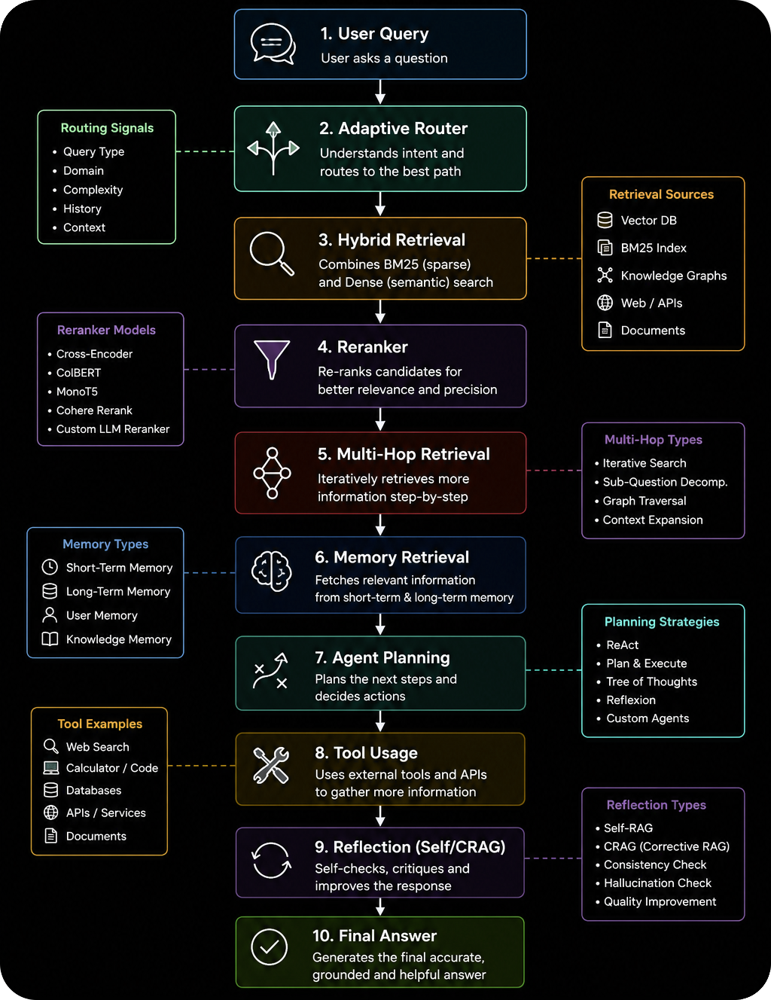
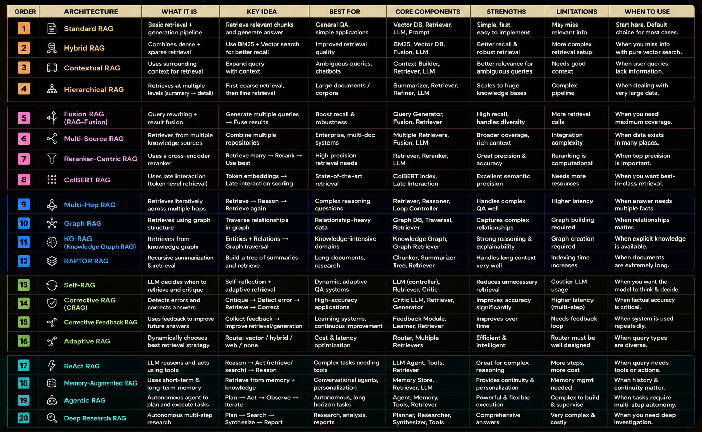

<div align="center">

  <h1>⚡ RAG Design Patterns</h1>

  <p>
    <b>A comprehensive, production-ready collection of 20 Retrieval-Augmented Generation (RAG) architecture implementations using Python & LangChain.</b>
  </p>

  <!-- Badges -->
  <p>
    <a href="https://github.com/mohd-faizy/RAG-Design-Patterns/blob/main/LICENSE">
      
    </a>
    <a href="https://github.com/mohd-faizy/RAG-Design-Patterns/stargazers">
      
    </a>
    <a href="https://github.com/mohd-faizy/RAG-Design-Patterns/network/members">
      
    </a>
    
    
    
    
    
    
    
    
  </p>

  <br/>

</div>

---

## 📖 Overview

This repository is a **comprehensive reference implementation** of **20 RAG (Retrieval-Augmented Generation) design patterns**, built with **Python** and **LangChain**. Each architecture is implemented as a clean, well-documented Jupyter Notebook — covering everything from the foundational Standard RAG to cutting-edge Agentic and Deep Research RAG systems.

It serves as both a **learning curriculum** and a **production-ready reference** for AI engineers and researchers who want to deeply understand, compare, and deploy the right RAG strategy for their use case.

> 💡 **What is RAG?**
> Retrieval-Augmented Generation (RAG) combines the power of large language models with external knowledge retrieval, enabling LLMs to access up-to-date, domain-specific information at inference time — dramatically reducing hallucinations and improving factual accuracy.

---

## 🗺️ RAG Architecture Roadmap

<p align="center">
  <b>🗺️ RAG Architecture Roadmap</b><br>
  
</p>

The 20 architectures are organized into **5 progressive learning phases**, from foundational patterns to fully autonomous agentic systems:

```
Phase 1: Fundamentals         →  Standard, Hybrid, Contextual, Hierarchical RAG
Phase 2: Better Retrieval     →  Fusion, Multi-Source, Reranker-Centric, ColBERT RAG
Phase 3: Better Reasoning     →  Multi-Hop, Graph, KG-RAG, RAPTOR RAG
Phase 4: Self-Improving       →  Self-RAG, Corrective (CRAG), Feedback, Adaptive RAG
Phase 5: Agentic Systems      →  ReAct, Memory-Augmented, Agentic, Deep Research RAG
```

---

## 🏗️ The 20 RAG Architectures

### 🟢 Phase 1 — Fundamentals

| # | Architecture | Category | Key Idea | Best For | Importance |
|:---:|:---|:---|:---|:---|:---:|
| 01 | **Standard RAG** | Foundation | Retrieve relevant chunks → Generate answer | General Q&A, simple apps | ⭐⭐⭐⭐⭐ |
| 02 | **Hybrid RAG** | Retrieval Enhancement | BM25 (sparse) + Vector (dense) search | Improved retrieval quality | ⭐⭐⭐⭐⭐ |
| 03 | **Contextual RAG** | Context Optimization | Expand query with surrounding context | Ambiguous queries, chatbots | ⭐⭐⭐⭐ |
| 04 | **Hierarchical RAG** | Large Corpus Retrieval | Coarse retrieval → Fine retrieval | Large documents, corpora | ⭐⭐⭐⭐ |

### 🔵 Phase 2 — Better Retrieval

| # | Architecture | Category | Key Idea | Best For | Importance |
|:---:|:---|:---|:---|:---|:---:|
| 05 | **Fusion RAG** | Query Expansion | Multiple queries → Fuse results | Boost recall & robustness | ⭐⭐⭐⭐⭐ |
| 06 | **Multi-Source RAG** | Multi-Repository | Combine multiple knowledge sources | Enterprise, multi-doc systems | ⭐⭐⭐⭐ |
| 07 | **Reranker-Centric RAG** | Precision Retrieval | Retrieve many → Rerank → Use best | High-precision retrieval needs | ⭐⭐⭐⭐⭐ |
| 08 | **ColBERT RAG** | Advanced Retrieval | Token-level late interaction scoring | State-of-the-art retrieval | ⭐⭐⭐⭐⭐ |

### 🟠 Phase 3 — Better Reasoning

| # | Architecture | Category | Key Idea | Best For | Importance |
|:---:|:---|:---|:---|:---|:---:|
| 09 | **Multi-Hop RAG** | Iterative Reasoning | Retrieve → Reason → Retrieve again | Complex multi-fact questions | ⭐⭐⭐⭐⭐ |
| 10 | **Graph RAG** | Graph-Based Retrieval | Traverse graph relationships | Relationship-heavy data | ⭐⭐⭐⭐⭐ |
| 11 | **KG-RAG** | Knowledge Graphs | Entities + Relations → Graph traversal | Knowledge-intensive domains | ⭐⭐⭐⭐⭐ |
| 12 | **RAPTOR RAG** | Recursive Summarization | Build a tree of summaries → Retrieve | Long documents, research | ⭐⭐⭐⭐⭐ |

### 🟣 Phase 4 — Self-Improving Systems

| # | Architecture | Category | Key Idea | Best For | Importance |
|:---:|:---|:---|:---|:---|:---:|
| 13 | **Self-RAG** | Self-Correcting | LLM decides when & what to retrieve | Dynamic, adaptive QA | ⭐⭐⭐⭐⭐ |
| 14 | **Corrective RAG (CRAG)** | Self-Correcting | Critique → Detect error → Correct | High-accuracy applications | ⭐⭐⭐⭐⭐ |
| 15 | **Corrective Feedback RAG** | Feedback-Driven | Collect feedback → Improve generation | Learning systems | ⭐⭐⭐⭐ |
| 16 | **Adaptive RAG** | Dynamic Routing | Route: vector / hybrid / web / none | Cost & latency optimization | ⭐⭐⭐⭐⭐ |

### 🔴 Phase 5 — Agentic Systems

| # | Architecture | Category | Key Idea | Best For | Importance |
|:---:|:---|:---|:---|:---|:---:|
| 17 | **ReAct RAG** | Reasoning + Acting | Reason → Act (retrieve/search) → Reason | Complex tasks needing tools | ⭐⭐⭐⭐⭐ |
| 18 | **Memory-Augmented RAG** | Persistent Memory | Retrieve from short & long-term memory | Conversational agents | ⭐⭐⭐⭐⭐ |
| 19 | **Agentic RAG** | Autonomous Agents | Plan → Act → Observe → Iterate | Autonomous, long-horizon tasks | ⭐⭐⭐⭐⭐ |
| 20 | **Deep Research RAG** | Autonomous Research | Plan → Search → Synthesize → Report | Research, analysis, reports | ⭐⭐⭐⭐⭐ |

---

## 🔄 Production-Ready RAG Pipeline (2026 Stack)

The optimal modern production agent architecture combines the best of all phases:

```
User Query
    ↓
Adaptive Router          ← [Query Type, Domain, Complexity, History]
    ↓
Hybrid Retrieval         ← [BM25 (sparse) + Dense (semantic) search]
    ↓
Reranker                 ← [Cross-Encoder / ColBERT / Cohere Rerank]
    ↓
Multi-Hop Retrieval      ← [Iterative Search → Sub-Question Decomp.]
    ↓
Memory Retrieval         ← [Short-Term + Long-Term + Knowledge Memory]
    ↓
Agent Planning           ← [ReAct / Plan & Execute / Tree of Thoughts]
    ↓
Tool Usage               ← [Web Search / Code / APIs / Databases]
    ↓
Reflection (Self/CRAG)   ← [Hallucination Check / Consistency Check]
    ↓
Final Answer
```

---

## 🏢 What Top AI Companies Use in Production

| Company / System | Architecture Stack |
|:---|:---|
| 🤖 **OpenAI Deep Research** | Deep Research RAG + Agentic RAG + Memory |
| 🪟 **Microsoft GraphRAG** | Graph RAG + KG-RAG |
| 🔍 **Perplexity AI** | Fusion RAG + Multi-Hop RAG + Rerankers |
| 🧠 **Anthropic Claude** | Agentic RAG + Tool Use + Memory |
| 🌐 **Google Gemini** | Deep Research RAG + Multi-Hop RAG |
| 🦙 **Meta Retrieval** | ColBERT + Hybrid Retrieval |
| 💼 **LinkedIn Search** | ColBERT-style Retrieval |
| 🎬 **Netflix Search** | Graph + Knowledge Retrieval |

---

## 📂 Repository Structure

```
RAG-Design-Patterns/
│
├── 📁 01_Fundamentals/
│   ├── 01_Standard_RAG.ipynb
│   ├── 02_Hybrid_RAG.ipynb
│   ├── 03_Contextual_RAG.ipynb
│   └── 04_Hierarchical_RAG.ipynb
│
├── 📁 02_Better_Retrieval/
│   ├── 05_Fusion_RAG.ipynb
│   ├── 06_MultiSource_RAG.ipynb
│   ├── 07_Reranker_Centric_RAG.ipynb
│   └── 08_ColBERT_RAG.ipynb
│
├── 📁 03_Better_Reasoning/
│   ├── 09_MultiHop_RAG.ipynb
│   ├── 10_Graph_RAG.ipynb
│   ├── 11_KG_RAG.ipynb
│   └── 12_RAPTOR_RAG.ipynb
│
├── 📁 04_Self_Improving/
│   ├── 13_Self_RAG.ipynb
│   ├── 14_Corrective_RAG.ipynb
│   ├── 15_Feedback_RAG.ipynb
│   └── 16_Adaptive_RAG.ipynb
│
├── 📁 05_Agentic_Systems/
│   ├── 17_ReAct_RAG.ipynb
│   ├── 18_Memory_Augmented_RAG.ipynb
│   ├── 19_Agentic_RAG.ipynb
│   └── 20_Deep_Research_RAG.ipynb
│
├── 📁 _assets/                  # Architecture diagrams & cheat sheets
├── 📄 requirements.txt
├── 📄 .env.example
└── 📄 README.md
```

---

## 📓 Notebook Index

| S.No | Notebook | Architecture | Phase | Link |
|:---:|:---|:---|:---|:---:|
| **01** | `01_Standard_RAG.ipynb` | Standard RAG | Fundamentals | [](01_Fundamentals/01_Standard_RAG.ipynb) |
| **02** | `02_Hybrid_RAG.ipynb` | Hybrid RAG | Fundamentals | [](01_Fundamentals/02_Hybrid_RAG.ipynb) |
| **03** | `03_Contextual_RAG.ipynb` | Contextual RAG | Fundamentals | [](01_Fundamentals/03_Contextual_RAG.ipynb) |
| **04** | `04_Hierarchical_RAG.ipynb` | Hierarchical RAG | Fundamentals | [](01_Fundamentals/04_Hierarchical_RAG.ipynb) |
| **05** | `05_Fusion_RAG.ipynb` | Fusion RAG | Better Retrieval | [](02_Better_Retrieval/05_Fusion_RAG.ipynb) |
| **06** | `06_MultiSource_RAG.ipynb` | Multi-Source RAG | Better Retrieval | [](02_Better_Retrieval/06_MultiSource_RAG.ipynb) |
| **07** | `07_Reranker_Centric_RAG.ipynb` | Reranker-Centric RAG | Better Retrieval | [](02_Better_Retrieval/07_Reranker_Centric_RAG.ipynb) |
| **08** | `08_ColBERT_RAG.ipynb` | ColBERT RAG | Better Retrieval | [](02_Better_Retrieval/08_ColBERT_RAG.ipynb) |
| **09** | `09_MultiHop_RAG.ipynb` | Multi-Hop RAG | Better Reasoning | [](03_Better_Reasoning/09_MultiHop_RAG.ipynb) |
| **10** | `10_Graph_RAG.ipynb` | Graph RAG | Better Reasoning | [](03_Better_Reasoning/10_Graph_RAG.ipynb) |
| **11** | `11_KG_RAG.ipynb` | KG-RAG | Better Reasoning | [](03_Better_Reasoning/11_KG_RAG.ipynb) |
| **12** | `12_RAPTOR_RAG.ipynb` | RAPTOR RAG | Better Reasoning | [](03_Better_Reasoning/12_RAPTOR_RAG.ipynb) |
| **13** | `13_Self_RAG.ipynb` | Self-RAG | Self-Improving | [](04_Self_Improving/13_Self_RAG.ipynb) |
| **14** | `14_Corrective_RAG.ipynb` | Corrective RAG (CRAG) | Self-Improving | [](04_Self_Improving/14_Corrective_RAG.ipynb) |
| **15** | `15_Feedback_RAG.ipynb` | Corrective Feedback RAG | Self-Improving | [](04_Self_Improving/15_Feedback_RAG.ipynb) |
| **16** | `16_Adaptive_RAG.ipynb` | Adaptive RAG | Self-Improving | [](04_Self_Improving/16_Adaptive_RAG.ipynb) |
| **17** | `17_ReAct_RAG.ipynb` | ReAct RAG | Agentic Systems | [](05_Agentic_Systems/17_ReAct_RAG.ipynb) |
| **18** | `18_Memory_Augmented_RAG.ipynb` | Memory-Augmented RAG | Agentic Systems | [](05_Agentic_Systems/18_Memory_Augmented_RAG.ipynb) |
| **19** | `19_Agentic_RAG.ipynb` | Agentic RAG | Agentic Systems | [](05_Agentic_Systems/19_Agentic_RAG.ipynb) |
| **20** | `20_Deep_Research_RAG.ipynb` | Deep Research RAG | Agentic Systems | [](05_Agentic_Systems/20_Deep_Research_RAG.ipynb) |

---

## ⚡ Quick Start

### Prerequisites

- **Python 3.9+**
- **Git**
- **API Keys**: OpenAI / HuggingFace / Cohere *(as needed per notebook)*

### Installation

**1. Clone the repository**
```bash
git clone https://github.com/mohd-faizy/RAG-Design-Patterns.git
cd RAG-Design-Patterns
```

**2. Set up the environment**

*Using `uv` (Recommended — fastest):*
```bash
uv venv
source .venv/bin/activate       # macOS/Linux
.venv\Scripts\activate          # Windows
uv add -r requirements.txt
```

*Using `pip`:*
```bash
python -m venv venv
source venv/bin/activate        # macOS/Linux
venv\Scripts\activate           # Windows
pip install -r requirements.txt
```

**3. Configure API keys**
```bash
cp .env.example .env
```
```ini
# .env
OPENAI_API_KEY=sk-...
HUGGINGFACEHUB_API_TOKEN=hf_...
COHERE_API_KEY=...
LANGCHAIN_API_KEY=...
```

**4. Launch Jupyter**
```bash
jupyter notebook
```

### Minimal Standard RAG Example

```python
from langchain.document_loaders import TextLoader
from langchain.text_splitter import RecursiveCharacterTextSplitter
from langchain.vectorstores import FAISS
from langchain.embeddings import OpenAIEmbeddings
from langchain.chains import RetrievalQA
from langchain.chat_models import ChatOpenAI

# 1. Load & Split Documents
loader = TextLoader("data/my_docs.txt")
splitter = RecursiveCharacterTextSplitter(chunk_size=500, chunk_overlap=50)
docs = splitter.split_documents(loader.load())

# 2. Create Vector Store
vectorstore = FAISS.from_documents(docs, OpenAIEmbeddings())

# 3. Build RAG Chain
llm = ChatOpenAI(model="gpt-4o", temperature=0)
rag_chain = RetrievalQA.from_chain_type(
    llm=llm,
    retriever=vectorstore.as_retriever(search_kwargs={"k": 4})
)

# 4. Query
response = rag_chain.run("What is the key concept here?")
print(response)
```

---

## 🛠️ Tech Stack

| Component | Tools |
|:---|:---|
| **Framework** | LangChain, LangGraph |
| **LLMs** | OpenAI GPT-4o, HuggingFace, Ollama |
| **Embeddings** | OpenAI, HuggingFace (BAAI/bge), Cohere |
| **Vector Stores** | FAISS, ChromaDB, Pinecone, Weaviate |
| **Rerankers** | Cohere Rerank, Cross-Encoder, ColBERT |
| **Graph DBs** | Neo4j, NetworkX |
| **Notebooks** | Jupyter, Google Colab |

---

## 📊 Architecture Comparison Matrix

<p align="center">
  <b>📊 RAG Architecture Comparison Matrix</b><br>
  
</p>

| Architecture | Complexity | Accuracy | Latency | Cost | Best For |
|:---|:---:|:---:|:---:|:---:|:---|
| Standard RAG | 🟢 Low | ⭐⭐⭐ | Fast | $ | Starting point |
| Hybrid RAG | 🟡 Medium | ⭐⭐⭐⭐ | Medium | $$ | Better recall |
| Fusion RAG | 🟡 Medium | ⭐⭐⭐⭐ | Medium | $$ | Max coverage |
| Reranker RAG | 🟡 Medium | ⭐⭐⭐⭐⭐ | Medium | $$ | High precision |
| Self-RAG | 🟠 High | ⭐⭐⭐⭐⭐ | Slower | $$$ | Adaptive QA |
| Corrective RAG | 🟠 High | ⭐⭐⭐⭐⭐ | Slower | $$$ | Factual accuracy |
| Graph RAG | 🟠 High | ⭐⭐⭐⭐⭐ | Medium | $$$ | Relational data |
| RAPTOR RAG | 🟠 High | ⭐⭐⭐⭐⭐ | Medium | $$$ | Long documents |
| Agentic RAG | 🔴 V.High | ⭐⭐⭐⭐⭐ | Slowest | $$$ | Autonomous tasks |
| Deep Research | 🔴 V.High | ⭐⭐⭐⭐⭐ | Slowest | $$$$ | Research reports |

---

## ✅ Key Considerations for Production RAG

- **Data Quality** — Keep data fresh and relevant; up-to-date docs are critical
- **Chunking Strategy** — Right chunk size improves retrieval significantly
- **Embedding Model** — Domain-specific embeddings work better
- **Retrieval Strategy** — Hybrid retrieval + reranking is powerful
- **Prompt Engineering** — Clear instructions improve results
- **Evaluation** — Use metrics: Faithfulness, Relevance, Recall
- **Latency vs Accuracy** — Balance query optimization with quality needs
- **Cost Management** — Optimize tokens, caching, and retrieval calls
- **Monitor for Hallucinations** — Implement reflection and self-critique loops

---

## 🤝 Contributing

Contributions are welcome! Whether it's a new architecture variant, improved documentation, or bug fixes — feel free to open an issue or submit a pull request.

```bash
# Fork → Clone → Branch → Commit → PR
git checkout -b feature/your-architecture-improvement
git commit -m "feat: add XYZ improvement to Agentic RAG"
git push origin feature/your-architecture-improvement
```

If you find this repository useful, please consider giving it a ⭐ — it helps others discover it!

---

## 📄 License

Distributed under the **MIT License**. See [`LICENSE`](LICENSE) for more information.

---

<div align="center">

## 🌐 Connect with Me

  <p>
    <a href="https://twitter.com/F4izy">
      
    </a>
    <a href="https://www.linkedin.com/in/mohd-faizy/">
      
    </a>
    <a href="https://github.com/mohd-faizy">
      
    </a>
  </p>

  <p>
    <sub>
      ⭐ If this repository helped you, please star it<br/>
      Made by <a href="https://github.com/mohd-faizy"><b>mohd-faizy</b></a>
    </sub>
  </p>

</div>
